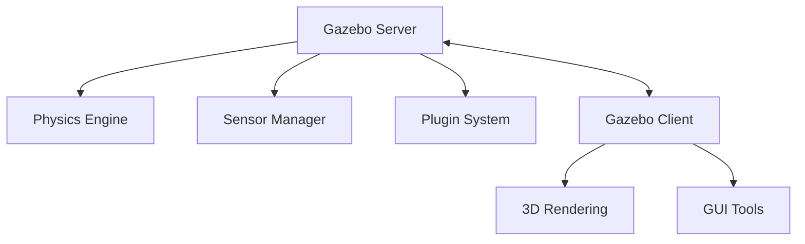

# 2.1 Gazebo Simulation Fundamentals

## Overview

Gazebo is a powerful open-source robotics simulator that provides accurate physics simulation, sensor modeling, and 3D visualization. In this chapter, you'll learn to set up Gazebo environments for humanoid robot simulation.

## Learning Objectives

By the end of this chapter, you will be able to:

- Install and configure Gazebo with ROS 2 Humble
- Understand Gazebo's architecture (physics engines, rendering, plugins)
- Create custom simulation worlds
- Spawn robots and interact with the simulation
- Configure physics parameters for realistic behavior

## Prerequisites

- Completed Module 1 (ROS 2 Fundamentals)
- Ubuntu 22.04 with ROS 2 Humble installed
- Basic understanding of URDF

## 2.1.1 Installing Gazebo for ROS 2

Gazebo Fortress is the recommended version for ROS 2 Humble:

```bash
# Install Gazebo Fortress
sudo apt update
sudo apt install ros-humble-ros-gz

# Verify installation
gz sim --version
```

## 2.1.2 Gazebo Architecture

Gazebo consists of several key components:



### Physics Engines

Gazebo supports multiple physics engines:

| Engine | Use Case | Performance |
|--------|----------|-------------|
| DART | Humanoid robots, articulated bodies | High accuracy |
| Bullet | General robotics, real-time | Fast |
| ODE | Legacy support | Moderate |

### Sensors

Common sensors for humanoid simulation:

- **IMU**: Orientation and acceleration
- **Camera**: RGB, depth, stereo
- **Force/Torque**: Joint and contact forces
- **LIDAR**: Environment mapping

## 2.1.3 Creating Your First World

Create a simple world file for humanoid testing:

```xml
<!-- humanoid_world.sdf -->
<?xml version="1.0" ?>
<sdf version="1.8">
  <world name="humanoid_world">

    <!-- Physics configuration -->
    <physics name="1ms" type="dart">
      <max_step_size>0.001</max_step_size>
      <real_time_factor>1.0</real_time_factor>
    </physics>

    <!-- Lighting -->
    <light type="directional" name="sun">
      <cast_shadows>true</cast_shadows>
      <pose>0 0 10 0 0 0</pose>
      <diffuse>0.8 0.8 0.8 1</diffuse>
      <specular>0.2 0.2 0.2 1</specular>
      <direction>-0.5 0.1 -0.9</direction>
    </light>

    <!-- Ground plane -->
    <model name="ground_plane">
      <static>true</static>
      <link name="link">
        <collision name="collision">
          <geometry>
            <plane>
              <normal>0 0 1</normal>
              <size>100 100</size>
            </plane>
          </geometry>
        </collision>
        <visual name="visual">
          <geometry>
            <plane>
              <normal>0 0 1</normal>
              <size>100 100</size>
            </plane>
          </geometry>
          <material>
            <ambient>0.8 0.8 0.8 1</ambient>
          </material>
        </visual>
      </link>
    </model>

  </world>
</sdf>
```

## 2.1.4 Launching Gazebo with ROS 2

Create a launch file to start Gazebo with your world:

```python
# launch/gazebo_world.launch.py
from launch import LaunchDescription
from launch.actions import IncludeLaunchDescription
from launch.launch_description_sources import PythonLaunchDescriptionSource
from launch_ros.substitutions import FindPackageShare
import os

def generate_launch_description():
    pkg_share = FindPackageShare('my_humanoid_sim').find('my_humanoid_sim')
    world_file = os.path.join(pkg_share, 'worlds', 'humanoid_world.sdf')

    gazebo = IncludeLaunchDescription(
        PythonLaunchDescriptionSource([
            FindPackageShare('ros_gz_sim').find('ros_gz_sim'),
            '/launch/gz_sim.launch.py'
        ]),
        launch_arguments={'gz_args': f'-r {world_file}'}.items()
    )

    return LaunchDescription([gazebo])
```

## 2.1.5 Spawning a Robot

Use the spawn service to add robots to your simulation:

```python
# scripts/spawn_humanoid.py
import rclpy
from rclpy.node import Node
from ros_gz_interfaces.srv import SpawnEntity

class RobotSpawner(Node):
    def __init__(self):
        super().__init__('robot_spawner')
        self.client = self.create_client(SpawnEntity, '/world/humanoid_world/create')

    def spawn_robot(self, urdf_path, name, x, y, z):
        with open(urdf_path, 'r') as f:
            robot_desc = f.read()

        request = SpawnEntity.Request()
        request.name = name
        request.xml = robot_desc
        request.initial_pose.position.x = x
        request.initial_pose.position.y = y
        request.initial_pose.position.z = z

        future = self.client.call_async(request)
        rclpy.spin_until_future_complete(self, future)
        return future.result()
```

## 2.1.6 Physics Tuning for Humanoids

Humanoid simulation requires careful physics tuning:

```xml
<!-- Recommended physics settings for humanoids -->
<physics name="humanoid_physics" type="dart">
  <max_step_size>0.001</max_step_size>
  <real_time_factor>1.0</real_time_factor>
  <dart>
    <collision_detector>bullet</collision_detector>
    <solver>
      <solver_type>dantzig</solver_type>
    </solver>
  </dart>
</physics>
```

### Key Parameters

| Parameter | Humanoid Value | Purpose |
|-----------|----------------|---------|
| max_step_size | 0.001s | Stability for contacts |
| real_time_factor | 1.0 | Real-time simulation |
| collision_detector | bullet | Fast contact detection |

## Hands-On Exercise

1. Install Gazebo Fortress with ROS 2
2. Create a custom world with a flat ground and lighting
3. Write a launch file to start the simulation
4. Experiment with different physics engines

## Summary

In this chapter, you learned:

- Gazebo architecture and its role in robotics simulation
- How to create SDF world files
- Launching Gazebo with ROS 2
- Spawning robots programmatically
- Physics configuration for humanoid simulation

## Next Steps

Continue to [2.2 Unity Integration for Photorealistic Rendering](2.2-unity-integration) to learn how to combine Gazebo physics with Unity's rendering capabilities.
