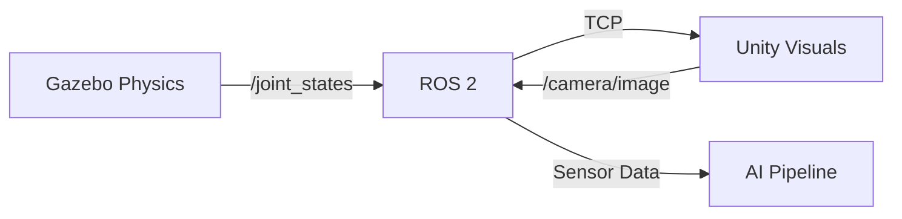

# 2.2 Unity Integration for Photorealistic Rendering

## Overview

While Gazebo excels at physics simulation, Unity provides superior visual rendering for photorealistic digital twins. This chapter covers integrating Unity with ROS 2 to create visually stunning simulations while maintaining accurate physics.

## Learning Objectives

By the end of this chapter, you will be able to:

- Set up Unity with ROS 2 TCP Connector
- Create photorealistic environments in Unity
- Synchronize robot state between Gazebo and Unity
- Generate synthetic training data with realistic visuals
- Use Unity's HDRP for advanced rendering

## Prerequisites

- Completed Chapter 2.1 (Gazebo Basics)
- Unity 2022.3 LTS installed
- Basic familiarity with Unity Editor

## 2.2.1 Why Unity for Robotics?

Unity offers several advantages for robotics simulation:

| Feature | Benefit for Robotics |
|---------|---------------------|
| HDRP Rendering | Photorealistic visuals for computer vision |
| Asset Store | Pre-built environments and objects |
| Cross-platform | Deploy to various hardware |
| C# Scripting | Familiar programming model |
| ROS Integration | Native ROS 2 support via TCP |

## 2.2.2 Setting Up Unity with ROS 2

### Install ROS TCP Connector

1. Create a new Unity project with HDRP template
2. Open Package Manager (Window > Package Manager)
3. Add package from git URL:

```
https://github.com/Unity-Technologies/ROS-TCP-Connector.git?path=/com.unity.robotics.ros-tcp-connector
```

### Configure ROS Settings

```csharp
// In Unity: Robotics > ROS Settings
// Set:
// - ROS IP Address: 127.0.0.1
// - ROS Port: 10000
// - Protocol: ROS2
```

### Install ROS TCP Endpoint (ROS 2 side)

```bash
# In your ROS 2 workspace
cd ~/ros2_ws/src
git clone https://github.com/Unity-Technologies/ROS-TCP-Endpoint.git -b ROS2v0.7.0
cd ..
colcon build --packages-select ros_tcp_endpoint
source install/setup.bash

# Launch the endpoint
ros2 run ros_tcp_endpoint default_server_endpoint --ros-args -p ROS_IP:=127.0.0.1
```

## 2.2.3 Creating a Photorealistic Environment

### HDRP Setup for Robotics

Configure HDRP for realistic lighting:

```csharp
// HDRPRoboticsSettings.cs
using UnityEngine;
using UnityEngine.Rendering.HighDefinition;

public class HDRPRoboticsSettings : MonoBehaviour
{
    void Start()
    {
        // Configure volume for realistic indoor lighting
        var volume = GetComponent<Volume>();
        if (volume.profile.TryGet<IndirectLightingController>(out var indirect))
        {
            indirect.indirectDiffuseLightingMultiplier.value = 1.0f;
        }

        // Enable ray tracing if available
        if (SystemInfo.supportsRayTracing)
        {
            EnableRayTracing();
        }
    }

    void EnableRayTracing()
    {
        // Configure ray-traced global illumination
        // for photorealistic lighting
    }
}
```

### Material Setup

Create physically-based materials for realistic surfaces:

```csharp
// MaterialFactory.cs
public static class MaterialFactory
{
    public static Material CreateFloorMaterial()
    {
        var mat = new Material(Shader.Find("HDRP/Lit"));
        mat.SetFloat("_Metallic", 0.0f);
        mat.SetFloat("_Smoothness", 0.3f);
        mat.SetColor("_BaseColor", new Color(0.7f, 0.7f, 0.7f));
        return mat;
    }

    public static Material CreateRobotMaterial()
    {
        var mat = new Material(Shader.Find("HDRP/Lit"));
        mat.SetFloat("_Metallic", 0.8f);
        mat.SetFloat("_Smoothness", 0.6f);
        mat.SetColor("_BaseColor", new Color(0.2f, 0.2f, 0.2f));
        return mat;
    }
}
```

## 2.2.4 Robot Visualization in Unity

### URDF Importer

Import your humanoid URDF into Unity:

1. Install URDF Importer package:
```
https://github.com/Unity-Technologies/URDF-Importer.git?path=/com.unity.robotics.urdf-importer
```

2. Import URDF:
```csharp
// Assets > Import Robot from URDF
// Select your humanoid.urdf file
// Configure import settings:
// - Axis Type: Z Up (ROS convention)
// - Mesh Decomposer: VHACD
```

### Joint State Subscriber

Subscribe to joint states from ROS 2:

```csharp
// JointStateSubscriber.cs
using Unity.Robotics.ROSTCPConnector;
using RosMessageTypes.Sensor;
using UnityEngine;

public class JointStateSubscriber : MonoBehaviour
{
    public ArticulationBody[] joints;
    private ROSConnection ros;

    void Start()
    {
        ros = ROSConnection.GetOrCreateInstance();
        ros.Subscribe<JointStateMsg>("/joint_states", UpdateJoints);
    }

    void UpdateJoints(JointStateMsg msg)
    {
        for (int i = 0; i < msg.name.Length && i < joints.Length; i++)
        {
            var joint = joints[i];
            var drive = joint.xDrive;
            drive.target = (float)msg.position[i] * Mathf.Rad2Deg;
            joint.xDrive = drive;
        }
    }
}
```

## 2.2.5 Synchronizing Gazebo Physics with Unity Visuals

### Architecture



### State Synchronization Node

```python
# gazebo_unity_sync.py
import rclpy
from rclpy.node import Node
from sensor_msgs.msg import JointState
from geometry_msgs.msg import PoseStamped

class GazeboUnitySync(Node):
    def __init__(self):
        super().__init__('gazebo_unity_sync')

        # Subscribe to Gazebo joint states
        self.joint_sub = self.create_subscription(
            JointState,
            '/gazebo/joint_states',
            self.joint_callback,
            10
        )

        # Publish to Unity
        self.unity_pub = self.create_publisher(
            JointState,
            '/unity/joint_states',
            10
        )

    def joint_callback(self, msg):
        # Forward to Unity with any necessary transformations
        self.unity_pub.publish(msg)

def main():
    rclpy.init()
    node = GazeboUnitySync()
    rclpy.spin(node)
    rclpy.shutdown()
```

## 2.2.6 Synthetic Data Generation

Generate training data for computer vision:

```csharp
// SyntheticDataGenerator.cs
using Unity.Robotics.ROSTCPConnector;
using RosMessageTypes.Sensor;
using UnityEngine;

public class SyntheticDataGenerator : MonoBehaviour
{
    public Camera rgbCamera;
    public Camera depthCamera;
    private ROSConnection ros;
    private RenderTexture rgbTexture;
    private RenderTexture depthTexture;

    void Start()
    {
        ros = ROSConnection.GetOrCreateInstance();
        ros.RegisterPublisher<ImageMsg>("/unity/camera/rgb");
        ros.RegisterPublisher<ImageMsg>("/unity/camera/depth");

        SetupCameras();
        InvokeRepeating("CaptureAndPublish", 0f, 0.033f); // 30 FPS
    }

    void SetupCameras()
    {
        rgbTexture = new RenderTexture(640, 480, 24);
        depthTexture = new RenderTexture(640, 480, 24, RenderTextureFormat.RFloat);

        rgbCamera.targetTexture = rgbTexture;
        depthCamera.targetTexture = depthTexture;
    }

    void CaptureAndPublish()
    {
        // Capture RGB
        var rgbMsg = CaptureImage(rgbTexture, "rgb8");
        ros.Publish("/unity/camera/rgb", rgbMsg);

        // Capture Depth
        var depthMsg = CaptureImage(depthTexture, "32FC1");
        ros.Publish("/unity/camera/depth", depthMsg);
    }

    ImageMsg CaptureImage(RenderTexture rt, string encoding)
    {
        // Convert RenderTexture to ROS Image message
        // Implementation details...
        return new ImageMsg();
    }
}
```

## 2.2.7 Domain Randomization

Improve sim-to-real transfer with domain randomization:

```csharp
// DomainRandomizer.cs
public class DomainRandomizer : MonoBehaviour
{
    public Light[] lights;
    public Renderer[] surfaces;
    public Material[] materials;

    void RandomizeScene()
    {
        // Randomize lighting
        foreach (var light in lights)
        {
            light.intensity = Random.Range(0.5f, 2.0f);
            light.color = Random.ColorHSV(0f, 1f, 0.5f, 1f, 0.8f, 1f);
        }

        // Randomize materials
        foreach (var surface in surfaces)
        {
            surface.material = materials[Random.Range(0, materials.Length)];
        }

        // Randomize camera noise
        // Add post-processing effects
    }
}
```

## Hands-On Exercise

1. Set up Unity HDRP project with ROS TCP Connector
2. Import a humanoid URDF into Unity
3. Create a subscriber to visualize joint states from Gazebo
4. Implement a basic camera publisher for synthetic data

## Summary

In this chapter, you learned:

- Setting up Unity with ROS 2 TCP Connector
- Creating photorealistic environments with HDRP
- Importing and visualizing URDF robots
- Synchronizing physics between Gazebo and Unity
- Generating synthetic training data

## Next Steps

Continue to [2.3 Sensor Simulation and Custom Environments](2.3-sensor-simulation) to learn advanced sensor modeling and environment creation.
