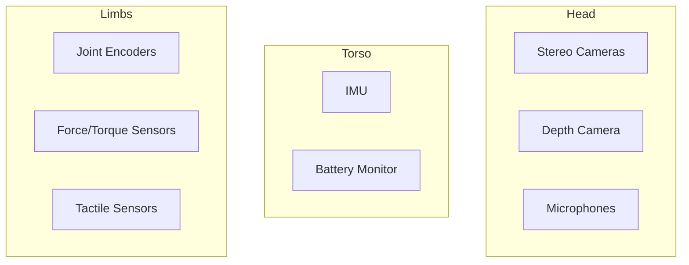

# 2.3 Sensor Simulation and Custom Environments

## Overview

Accurate sensor simulation is critical for developing robust perception systems. This chapter covers simulating various sensors common in humanoid robots and creating custom environments for comprehensive testing.

## Learning Objectives

By the end of this chapter, you will be able to:

- Simulate IMU, cameras, depth sensors, and force/torque sensors
- Add realistic sensor noise models
- Create custom indoor and outdoor environments
- Generate sensor data for training perception models
- Validate sensor configurations before hardware deployment

## Prerequisites

- Completed Chapters 2.1 and 2.2
- Understanding of ROS 2 message types
- Basic knowledge of sensor physics

## 2.3.1 Common Humanoid Sensors

Humanoid robots typically use these sensors:



## 2.3.2 IMU Simulation

### Gazebo IMU Plugin

Add IMU to your URDF:

```xml
<!-- humanoid.urdf - IMU sensor -->
<gazebo reference="torso_link">
  <sensor name="imu_sensor" type="imu">
    <always_on>true</always_on>
    <update_rate>200</update_rate>
    <topic>/humanoid/imu</topic>
    <imu>
      <angular_velocity>
        <x>
          <noise type="gaussian">
            <mean>0.0</mean>
            <stddev>0.0002</stddev>
          </noise>
        </x>
        <y>
          <noise type="gaussian">
            <mean>0.0</mean>
            <stddev>0.0002</stddev>
          </noise>
        </y>
        <z>
          <noise type="gaussian">
            <mean>0.0</mean>
            <stddev>0.0002</stddev>
          </noise>
        </z>
      </angular_velocity>
      <linear_acceleration>
        <x>
          <noise type="gaussian">
            <mean>0.0</mean>
            <stddev>0.017</stddev>
          </noise>
        </x>
        <y>
          <noise type="gaussian">
            <mean>0.0</mean>
            <stddev>0.017</stddev>
          </noise>
        </y>
        <z>
          <noise type="gaussian">
            <mean>0.0</mean>
            <stddev>0.017</stddev>
          </noise>
        </z>
      </linear_acceleration>
    </imu>
  </sensor>
</gazebo>
```

### IMU Noise Characteristics

| Parameter | Typical Value | Unit |
|-----------|---------------|------|
| Gyro Noise Density | 0.0002 | rad/s/√Hz |
| Gyro Bias Instability | 0.00005 | rad/s |
| Accel Noise Density | 0.017 | m/s²/√Hz |
| Accel Bias Instability | 0.0001 | m/s² |

## 2.3.3 Camera Simulation

### RGB-D Camera Configuration

```xml
<!-- Depth camera (RealSense-style) -->
<gazebo reference="head_camera_link">
  <sensor name="rgbd_camera" type="rgbd_camera">
    <update_rate>30</update_rate>
    <topic>/humanoid/camera</topic>
    <camera>
      <horizontal_fov>1.047</horizontal_fov>
      <image>
        <width>640</width>
        <height>480</height>
        <format>R8G8B8</format>
      </image>
      <clip>
        <near>0.1</near>
        <far>10.0</far>
      </clip>
      <depth_camera>
        <clip>
          <near>0.1</near>
          <far>10.0</far>
        </clip>
      </depth_camera>
      <noise>
        <type>gaussian</type>
        <mean>0.0</mean>
        <stddev>0.007</stddev>
      </noise>
    </camera>
  </sensor>
</gazebo>
```

### Camera Bridge to ROS 2

```python
# camera_bridge.py
import rclpy
from rclpy.node import Node
from sensor_msgs.msg import Image, CameraInfo
from cv_bridge import CvBridge

class CameraBridge(Node):
    def __init__(self):
        super().__init__('camera_bridge')
        self.bridge = CvBridge()

        # Subscribe to Gazebo camera
        self.rgb_sub = self.create_subscription(
            Image,
            '/humanoid/camera/image',
            self.rgb_callback,
            10
        )

        self.depth_sub = self.create_subscription(
            Image,
            '/humanoid/camera/depth',
            self.depth_callback,
            10
        )

        # Publish camera info
        self.info_pub = self.create_publisher(
            CameraInfo,
            '/humanoid/camera/camera_info',
            10
        )

    def rgb_callback(self, msg):
        # Process RGB image
        cv_image = self.bridge.imgmsg_to_cv2(msg, 'bgr8')
        # Add post-processing if needed

    def depth_callback(self, msg):
        # Process depth image
        cv_depth = self.bridge.imgmsg_to_cv2(msg, '32FC1')
        # Convert to point cloud if needed
```

## 2.3.4 Force/Torque Sensors

Essential for humanoid balance and manipulation:

```xml
<!-- Force/Torque sensor at ankle -->
<gazebo reference="left_ankle_joint">
  <sensor name="left_ankle_ft" type="force_torque">
    <always_on>true</always_on>
    <update_rate>1000</update_rate>
    <topic>/humanoid/ft/left_ankle</topic>
    <force_torque>
      <frame>child</frame>
      <measure_direction>child_to_parent</measure_direction>
      <force>
        <x>
          <noise type="gaussian">
            <mean>0</mean>
            <stddev>0.1</stddev>
          </noise>
        </x>
        <y>
          <noise type="gaussian">
            <mean>0</mean>
            <stddev>0.1</stddev>
          </noise>
        </y>
        <z>
          <noise type="gaussian">
            <mean>0</mean>
            <stddev>0.1</stddev>
          </noise>
        </z>
      </force>
    </force_torque>
  </sensor>
</gazebo>
```

### F/T Sensor Processing

```python
# ft_processor.py
import rclpy
from rclpy.node import Node
from geometry_msgs.msg import WrenchStamped
import numpy as np

class FTProcessor(Node):
    def __init__(self):
        super().__init__('ft_processor')

        self.left_ft_sub = self.create_subscription(
            WrenchStamped,
            '/humanoid/ft/left_ankle',
            self.left_ft_callback,
            10
        )

        self.right_ft_sub = self.create_subscription(
            WrenchStamped,
            '/humanoid/ft/right_ankle',
            self.right_ft_callback,
            10
        )

        # Center of pressure publisher
        self.cop_pub = self.create_publisher(
            WrenchStamped,
            '/humanoid/center_of_pressure',
            10
        )

        self.left_wrench = None
        self.right_wrench = None

    def left_ft_callback(self, msg):
        self.left_wrench = msg
        self.compute_cop()

    def right_ft_callback(self, msg):
        self.right_wrench = msg
        self.compute_cop()

    def compute_cop(self):
        if self.left_wrench is None or self.right_wrench is None:
            return

        # Compute center of pressure from both feet
        fz_left = self.left_wrench.wrench.force.z
        fz_right = self.right_wrench.wrench.force.z

        total_force = fz_left + fz_right
        if total_force > 10.0:  # Minimum force threshold
            # Calculate CoP position
            cop_x = (fz_left * 0.0 + fz_right * 0.0) / total_force
            cop_y = (fz_left * 0.1 + fz_right * -0.1) / total_force

            self.get_logger().info(f'CoP: ({cop_x:.3f}, {cop_y:.3f})')
```

## 2.3.5 Creating Custom Environments

### Indoor Environment (Lab/Home)

```xml
<!-- indoor_lab.sdf -->
<?xml version="1.0" ?>
<sdf version="1.8">
  <world name="indoor_lab">

    <!-- Room structure -->
    <model name="room">
      <static>true</static>

      <!-- Floor -->
      <link name="floor">
        <collision name="floor_collision">
          <geometry>
            <box><size>10 10 0.1</size></box>
          </geometry>
          <surface>
            <friction>
              <ode>
                <mu>1.0</mu>
                <mu2>1.0</mu2>
              </ode>
            </friction>
          </surface>
        </collision>
        <visual name="floor_visual">
          <geometry>
            <box><size>10 10 0.1</size></box>
          </geometry>
          <material>
            <ambient>0.8 0.8 0.8 1</ambient>
            <diffuse>0.8 0.8 0.8 1</diffuse>
          </material>
        </visual>
      </link>

      <!-- Walls -->
      <link name="wall_north">
        <pose>0 5 1.5 0 0 0</pose>
        <collision name="collision">
          <geometry>
            <box><size>10 0.2 3</size></box>
          </geometry>
        </collision>
        <visual name="visual">
          <geometry>
            <box><size>10 0.2 3</size></box>
          </geometry>
        </visual>
      </link>

      <!-- Add more walls... -->
    </model>

    <!-- Furniture -->
    <include>
      <uri>model://table</uri>
      <pose>2 2 0 0 0 0</pose>
    </include>

    <include>
      <uri>model://chair</uri>
      <pose>2 1 0 0 0 1.57</pose>
    </include>

  </world>
</sdf>
```

### Outdoor Environment (Terrain)

```xml
<!-- outdoor_terrain.sdf -->
<world name="outdoor">

  <!-- Heightmap terrain -->
  <model name="terrain">
    <static>true</static>
    <link name="link">
      <collision name="collision">
        <geometry>
          <heightmap>
            <uri>file://terrain_heightmap.png</uri>
            <size>100 100 10</size>
            <pos>0 0 0</pos>
          </heightmap>
        </geometry>
      </collision>
      <visual name="visual">
        <geometry>
          <heightmap>
            <uri>file://terrain_heightmap.png</uri>
            <size>100 100 10</size>
            <pos>0 0 0</pos>
            <texture>
              <diffuse>file://grass.png</diffuse>
              <normal>file://grass_normal.png</normal>
              <size>1</size>
            </texture>
          </heightmap>
        </geometry>
      </visual>
    </link>
  </model>

  <!-- Skybox and lighting -->
  <scene>
    <ambient>0.4 0.4 0.4 1</ambient>
    <background>0.7 0.7 0.7 1</background>
    <shadows>true</shadows>
  </scene>

</world>
```

## 2.3.6 Environment Randomization for Training

```python
# env_randomizer.py
import random
import xml.etree.ElementTree as ET

class EnvironmentRandomizer:
    def __init__(self, base_world_path):
        self.tree = ET.parse(base_world_path)
        self.root = self.tree.getroot()

    def randomize_lighting(self):
        """Randomize light intensity and color"""
        for light in self.root.findall('.//light'):
            diffuse = light.find('diffuse')
            if diffuse is not None:
                r = random.uniform(0.6, 1.0)
                g = random.uniform(0.6, 1.0)
                b = random.uniform(0.6, 1.0)
                diffuse.text = f'{r} {g} {b} 1'

    def randomize_objects(self, object_list, area_bounds):
        """Place objects randomly in the environment"""
        world = self.root.find('.//world')

        for obj_uri in object_list:
            x = random.uniform(area_bounds[0], area_bounds[1])
            y = random.uniform(area_bounds[2], area_bounds[3])
            yaw = random.uniform(0, 6.28)

            include = ET.SubElement(world, 'include')
            uri = ET.SubElement(include, 'uri')
            uri.text = obj_uri
            pose = ET.SubElement(include, 'pose')
            pose.text = f'{x} {y} 0 0 0 {yaw}'

    def randomize_friction(self, mu_range=(0.5, 1.5)):
        """Randomize floor friction for sim-to-real"""
        for surface in self.root.findall('.//surface/friction/ode'):
            mu = surface.find('mu')
            if mu is not None:
                mu.text = str(random.uniform(*mu_range))

    def save(self, output_path):
        self.tree.write(output_path)

# Usage
randomizer = EnvironmentRandomizer('base_world.sdf')
randomizer.randomize_lighting()
randomizer.randomize_objects(
    ['model://box', 'model://cylinder'],
    area_bounds=[-3, 3, -3, 3]
)
randomizer.save('randomized_world.sdf')
```

## 2.3.7 Sensor Validation Pipeline

```python
# sensor_validator.py
import rclpy
from rclpy.node import Node
from sensor_msgs.msg import Imu, Image
import numpy as np

class SensorValidator(Node):
    def __init__(self):
        super().__init__('sensor_validator')

        self.imu_data = []
        self.image_timestamps = []

        self.imu_sub = self.create_subscription(
            Imu, '/humanoid/imu', self.imu_callback, 10
        )

        self.image_sub = self.create_subscription(
            Image, '/humanoid/camera/image', self.image_callback, 10
        )

        self.create_timer(5.0, self.validate_sensors)

    def imu_callback(self, msg):
        self.imu_data.append({
            'timestamp': msg.header.stamp,
            'accel': [msg.linear_acceleration.x,
                      msg.linear_acceleration.y,
                      msg.linear_acceleration.z],
            'gyro': [msg.angular_velocity.x,
                     msg.angular_velocity.y,
                     msg.angular_velocity.z]
        })

    def image_callback(self, msg):
        self.image_timestamps.append(msg.header.stamp)

    def validate_sensors(self):
        self.get_logger().info('=== Sensor Validation Report ===')

        # IMU validation
        if len(self.imu_data) > 10:
            accels = np.array([d['accel'] for d in self.imu_data[-100:]])
            mean_accel = np.mean(accels, axis=0)
            std_accel = np.std(accels, axis=0)

            self.get_logger().info(
                f'IMU Accel Mean: {mean_accel}, Std: {std_accel}'
            )

            # Check if Z accel is ~9.8 (gravity)
            if abs(mean_accel[2] - 9.8) < 0.5:
                self.get_logger().info('IMU gravity check: PASS')
            else:
                self.get_logger().warn('IMU gravity check: FAIL')

        # Camera validation
        if len(self.image_timestamps) > 10:
            fps = len(self.image_timestamps) / 5.0
            self.get_logger().info(f'Camera FPS: {fps:.1f}')
```

## Hands-On Exercise

1. Add an IMU and RGB-D camera to your humanoid URDF
2. Configure realistic noise parameters
3. Create a custom indoor environment with furniture
4. Implement a sensor validation node
5. Generate 100 randomized environments for training

## Summary

In this chapter, you learned:

- Simulating IMU, cameras, and force/torque sensors
- Adding realistic noise models to sensors
- Creating indoor and outdoor simulation environments
- Environment randomization for robust training
- Validating sensor configurations

## Next Steps

Proceed to [Module 3: NVIDIA Isaac](../module-3-nvidia-isaac/intro) to learn about hardware-accelerated simulation and synthetic data generation at scale.
