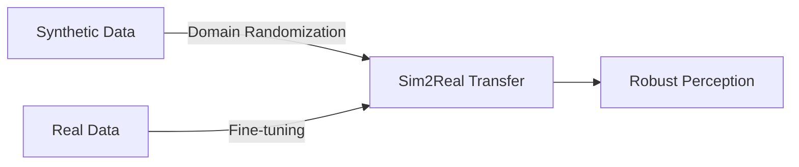

# 3.2 Synthetic Data Generation with Isaac Replicator

## Overview

Isaac Replicator is NVIDIA's synthetic data generation framework that creates diverse, annotated training datasets for computer vision and robotics. This chapter covers generating high-quality synthetic data for humanoid perception systems.

## Learning Objectives

By the end of this chapter, you will be able to:

- Set up Isaac Replicator for synthetic data generation
- Configure domain randomization for robust training
- Generate RGB, depth, and semantic segmentation data
- Create 3D bounding boxes and pose annotations
- Build data pipelines for continuous generation

## Prerequisites

- Completed Chapter 3.1 (Isaac Sim Basics)
- Understanding of computer vision datasets
- Familiarity with data annotation formats (COCO, KITTI)

## 3.2.1 Why Synthetic Data?

Synthetic data solves key challenges in robotics ML:

| Challenge | Synthetic Solution |
|-----------|-------------------|
| Data scarcity | Generate millions of samples |
| Annotation cost | Automatic perfect labels |
| Edge cases | Programmatic rare scenarios |
| Privacy | No real personal data |
| Domain shift | Domain randomization |

### Synthetic vs Real Data



## 3.2.2 Isaac Replicator Setup

### Basic Replicator Script

```python
# replicator_basic.py
import omni.replicator.core as rep

# Initialize replicator
rep.new_layer()

# Create camera
camera = rep.create.camera(
    position=(3, 3, 2),
    look_at=(0, 0, 1)
)

# Create render product
render_product = rep.create.render_product(camera, (640, 480))

# Set up writer
writer = rep.WriterRegistry.get("BasicWriter")
writer.initialize(
    output_dir="/data/synthetic/humanoid",
    rgb=True,
    distance_to_camera=True,
    semantic_segmentation=True,
    instance_segmentation=True,
    bounding_box_2d_tight=True,
    bounding_box_3d=True
)
writer.attach([render_product])

# Run replicator
rep.orchestrator.run()
```

## 3.2.3 Domain Randomization

### Lighting Randomization

```python
# randomize_lighting.py
import omni.replicator.core as rep

def randomize_lights():
    """Randomize scene lighting for robust perception"""

    # Create dome light with randomization
    with rep.new_layer():
        dome_light = rep.create.light(
            light_type="dome",
            rotation=rep.distribution.uniform((0, 0, 0), (0, 0, 360)),
            intensity=rep.distribution.uniform(500, 2000),
            texture=rep.distribution.choice([
                "/textures/hdri/indoor_1.hdr",
                "/textures/hdri/indoor_2.hdr",
                "/textures/hdri/outdoor_1.hdr"
            ])
        )

        # Create directional lights
        for i in range(3):
            rep.create.light(
                light_type="distant",
                intensity=rep.distribution.uniform(100, 1000),
                color=rep.distribution.uniform((0.8, 0.8, 0.8), (1, 1, 1)),
                rotation=rep.distribution.uniform((-90, -180, 0), (0, 180, 0))
            )

    return dome_light
```

### Material Randomization

```python
# randomize_materials.py
import omni.replicator.core as rep

def randomize_robot_materials(robot_prim_path):
    """Randomize robot materials for texture invariance"""

    with rep.new_layer():
        robot = rep.get.prim_at_path(robot_prim_path)

        with robot:
            rep.randomizer.materials(
                materials=[
                    "/materials/metal_brushed",
                    "/materials/metal_painted",
                    "/materials/plastic_matte",
                    "/materials/plastic_glossy"
                ],
                seed=rep.distribution.uniform(0, 1000000)
            )

def randomize_floor_material():
    """Randomize floor texture"""

    floor = rep.get.prim_at_path("/World/Ground")

    with floor:
        rep.randomizer.materials(
            materials=[
                "/materials/wood_floor",
                "/materials/tile_floor",
                "/materials/carpet",
                "/materials/concrete"
            ]
        )
```

### Pose and Position Randomization

```python
# randomize_poses.py
import omni.replicator.core as rep
import numpy as np

def randomize_robot_pose(robot_prim_path):
    """Randomize robot joint positions"""

    with rep.new_layer():
        robot = rep.get.prim_at_path(robot_prim_path)

        # Define joint limits (in radians)
        joint_limits = {
            "shoulder_pitch": (-1.57, 1.57),
            "shoulder_roll": (-0.5, 1.5),
            "elbow": (0, 2.0),
            "hip_pitch": (-0.5, 1.0),
            "hip_roll": (-0.3, 0.3),
            "knee": (0, 2.0),
            "ankle": (-0.5, 0.5)
        }

        # Randomize each joint
        for joint_name, limits in joint_limits.items():
            rep.modify.articulation(
                robot,
                joint_name=joint_name,
                position=rep.distribution.uniform(limits[0], limits[1])
            )

def randomize_camera_viewpoint():
    """Randomize camera position around robot"""

    camera = rep.get.prim_at_path("/World/Camera")

    with camera:
        rep.modify.pose(
            position=rep.distribution.uniform(
                (1.5, -2, 0.5),   # Min bounds
                (4.0, 2, 2.5)     # Max bounds
            ),
            look_at="/World/Humanoid/torso"
        )
```

### Object Distractors

```python
# add_distractors.py
import omni.replicator.core as rep

def add_random_objects():
    """Add random distractor objects to scene"""

    with rep.new_layer():
        # Scatter boxes
        rep.randomizer.scatter_2d(
            rep.create.cube(
                scale=rep.distribution.uniform((0.1, 0.1, 0.1), (0.5, 0.5, 0.5)),
                semantics=[("class", "box")]
            ),
            surface=rep.get.prim_at_path("/World/Ground"),
            num_samples=rep.distribution.uniform(5, 15)
        )

        # Scatter cylinders
        rep.randomizer.scatter_2d(
            rep.create.cylinder(
                scale=rep.distribution.uniform((0.05, 0.05, 0.1), (0.2, 0.2, 0.5)),
                semantics=[("class", "cylinder")]
            ),
            surface=rep.get.prim_at_path("/World/Ground"),
            num_samples=rep.distribution.uniform(3, 10)
        )
```

## 3.2.4 Annotation Types

### Semantic Segmentation

```python
# semantic_labels.py
import omni.replicator.core as rep

def setup_semantic_labels():
    """Configure semantic segmentation classes"""

    # Define semantic classes
    rep.modify.semantics([
        ("class", "humanoid", "/World/Humanoid"),
        ("class", "floor", "/World/Ground"),
        ("class", "wall", "/World/Walls"),
        ("class", "table", "/World/Props/Table"),
        ("class", "chair", "/World/Props/Chair")
    ])

    # Part-level segmentation for humanoid
    rep.modify.semantics([
        ("part", "head", "/World/Humanoid/head"),
        ("part", "torso", "/World/Humanoid/torso"),
        ("part", "left_arm", "/World/Humanoid/left_arm"),
        ("part", "right_arm", "/World/Humanoid/right_arm"),
        ("part", "left_leg", "/World/Humanoid/left_leg"),
        ("part", "right_leg", "/World/Humanoid/right_leg")
    ])
```

### Pose Annotations

```python
# pose_annotations.py
import omni.replicator.core as rep

def setup_pose_writer():
    """Configure writer for humanoid pose annotations"""

    writer = rep.WriterRegistry.get("PoseWriter")
    writer.initialize(
        output_dir="/data/synthetic/poses",
        skeleton_data=True,  # Joint positions in 3D
        joint_2d=True,       # 2D keypoint projections
        joint_visibility=True,
        skeleton_hierarchy="/World/Humanoid"
    )

    # Define keypoint mapping
    keypoints = [
        "head", "neck", "torso",
        "left_shoulder", "left_elbow", "left_wrist",
        "right_shoulder", "right_elbow", "right_wrist",
        "left_hip", "left_knee", "left_ankle",
        "right_hip", "right_knee", "right_ankle"
    ]

    return writer
```

### COCO Format Export

```python
# coco_writer.py
import omni.replicator.core as rep

def setup_coco_writer():
    """Export annotations in COCO format"""

    writer = rep.WriterRegistry.get("CocoWriter")
    writer.initialize(
        output_dir="/data/synthetic/coco",
        semantic_types=["class", "part"],
        colorize_semantic_segmentation=True,
        bbox_height_threshold=10,
        partly_occluded_threshold=0.5
    )

    return writer
```

## 3.2.5 Complete Data Generation Pipeline

```python
# full_pipeline.py
import omni.replicator.core as rep
from omni.isaac.kit import SimulationApp

# Initialize simulation
config = {"headless": True}
simulation_app = SimulationApp(config)

# Import scene
import omni.usd
omni.usd.get_context().open_stage("/scenes/humanoid_lab.usd")

# Replicator setup
with rep.new_layer():
    # Camera setup
    camera = rep.create.camera(
        position=(3, 0, 1.5),
        look_at=(0, 0, 1)
    )
    render_product = rep.create.render_product(camera, (1280, 720))

    # Randomizers
    with rep.trigger.on_frame(num_frames=10000):
        # Randomize lighting
        rep.randomizer.light_randomizer()

        # Randomize robot pose
        with rep.get.prim_at_path("/World/Humanoid"):
            rep.randomizer.pose(
                position=rep.distribution.uniform((-0.5, -0.5, 0), (0.5, 0.5, 0)),
                rotation=rep.distribution.uniform((0, 0, -30), (0, 0, 30))
            )

        # Randomize camera
        with camera:
            rep.modify.pose(
                position=rep.distribution.uniform((2, -2, 1), (4, 2, 2.5)),
                look_at="/World/Humanoid/torso"
            )

        # Randomize materials
        rep.randomizer.material_randomizer()

        # Add distractors
        rep.randomizer.object_scatter()

    # Writers
    basic_writer = rep.WriterRegistry.get("BasicWriter")
    basic_writer.initialize(
        output_dir="/data/synthetic/basic",
        rgb=True,
        distance_to_camera=True,
        semantic_segmentation=True,
        instance_segmentation=True,
        bounding_box_2d_tight=True,
        bounding_box_3d=True,
        camera_params=True
    )
    basic_writer.attach([render_product])

    coco_writer = rep.WriterRegistry.get("CocoWriter")
    coco_writer.initialize(output_dir="/data/synthetic/coco")
    coco_writer.attach([render_product])

# Run generation
rep.orchestrator.run()

simulation_app.close()
```

## 3.2.6 Quality Validation

```python
# validate_data.py
import json
import cv2
import numpy as np
from pathlib import Path

def validate_dataset(data_dir):
    """Validate generated synthetic dataset"""

    data_path = Path(data_dir)
    issues = []

    # Check RGB images
    rgb_files = list(data_path.glob("rgb/*.png"))
    print(f"Found {len(rgb_files)} RGB images")

    for rgb_file in rgb_files[:100]:  # Sample check
        img = cv2.imread(str(rgb_file))
        if img is None:
            issues.append(f"Corrupted: {rgb_file}")
        elif img.mean() < 10 or img.mean() > 245:
            issues.append(f"Bad exposure: {rgb_file}")

    # Check annotations
    anno_file = data_path / "annotations.json"
    if anno_file.exists():
        with open(anno_file) as f:
            annotations = json.load(f)

        for anno in annotations["annotations"][:100]:
            # Check bounding box validity
            bbox = anno["bbox"]
            if bbox[2] <= 0 or bbox[3] <= 0:
                issues.append(f"Invalid bbox in frame {anno['image_id']}")

    # Report
    print(f"Validation complete: {len(issues)} issues found")
    for issue in issues[:10]:
        print(f"  - {issue}")

    return len(issues) == 0
```

## Hands-On Exercise

1. Set up a basic Replicator script with camera and writer
2. Implement lighting and material randomization
3. Configure semantic segmentation for humanoid parts
4. Generate 1000 training images with full annotations
5. Validate the generated dataset

## Summary

In this chapter, you learned:

- Setting up Isaac Replicator for synthetic data generation
- Implementing domain randomization strategies
- Configuring multiple annotation types
- Building end-to-end data generation pipelines
- Validating synthetic dataset quality

## Next Steps

Continue to [3.3 Isaac ROS for Hardware-Accelerated Perception](3.3-isaac-ros) to learn how to deploy perception models on NVIDIA Jetson and accelerate inference.
