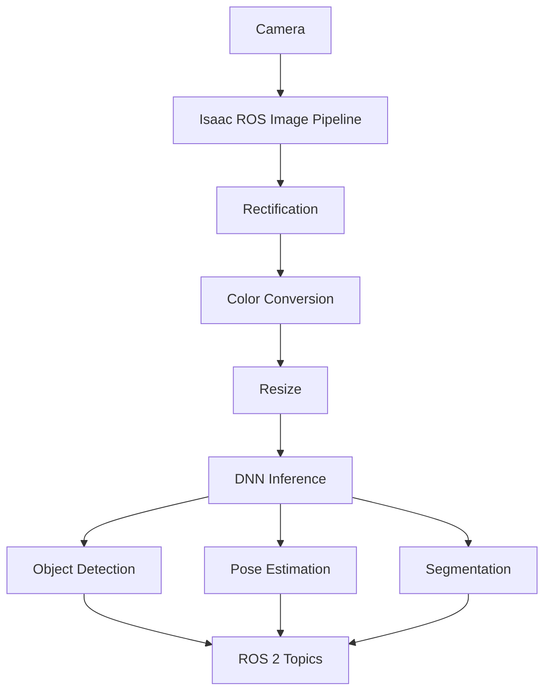

# 3.3 Isaac ROS for Hardware-Accelerated Perception

## Overview

Isaac ROS provides GPU-accelerated ROS 2 packages for perception, navigation, and manipulation. This chapter covers deploying efficient perception pipelines on NVIDIA Jetson and workstations for humanoid robots.

## Learning Objectives

By the end of this chapter, you will be able to:

- Set up Isaac ROS on Jetson and x86 platforms
- Deploy GPU-accelerated perception nodes
- Run real-time object detection and pose estimation
- Implement visual SLAM with Isaac ROS
- Optimize perception pipelines for humanoid robots

## Prerequisites

- Completed Chapter 3.2 (Synthetic Data Generation)
- NVIDIA Jetson (Orin preferred) or RTX GPU
- ROS 2 Humble installed
- Basic understanding of deep learning inference

## 3.3.1 Isaac ROS Overview

Isaac ROS provides hardware-accelerated alternatives to common ROS packages:

| Standard ROS | Isaac ROS | Speedup |
|--------------|-----------|---------|
| image_proc | isaac_ros_image_proc | 10x |
| apriltag | isaac_ros_apriltag | 20x |
| rtabmap | isaac_ros_visual_slam | 5x |
| - | isaac_ros_object_detection | GPU-native |
| - | isaac_ros_pose_estimation | GPU-native |

### Architecture



## 3.3.2 Installation

### Docker-based Setup (Recommended)

```bash
# Clone Isaac ROS common
mkdir -p ~/workspaces/isaac_ros-dev/src
cd ~/workspaces/isaac_ros-dev/src
git clone https://github.com/NVIDIA-ISAAC-ROS/isaac_ros_common.git

# Clone desired packages
git clone https://github.com/NVIDIA-ISAAC-ROS/isaac_ros_image_pipeline.git
git clone https://github.com/NVIDIA-ISAAC-ROS/isaac_ros_object_detection.git
git clone https://github.com/NVIDIA-ISAAC-ROS/isaac_ros_pose_estimation.git
git clone https://github.com/NVIDIA-ISAAC-ROS/isaac_ros_visual_slam.git

# Build and run container
cd ~/workspaces/isaac_ros-dev/src/isaac_ros_common
./scripts/run_dev.sh

# Inside container, build packages
cd /workspaces/isaac_ros-dev
colcon build --symlink-install
source install/setup.bash
```

### Native Installation (Jetson)

```bash
# Add Isaac ROS apt repository
sudo apt-get update
sudo apt-get install -y software-properties-common
sudo add-apt-repository -y ppa:nvidia/isaac-ros

# Install packages
sudo apt-get update
sudo apt-get install -y \
    ros-humble-isaac-ros-image-proc \
    ros-humble-isaac-ros-dnn-inference \
    ros-humble-isaac-ros-detectnet \
    ros-humble-isaac-ros-visual-slam
```

## 3.3.3 GPU-Accelerated Image Pipeline

### Basic Image Processing

```python
# isaac_image_pipeline.launch.py
from launch import LaunchDescription
from launch_ros.actions import ComposableNodeContainer
from launch_ros.descriptions import ComposableNode

def generate_launch_description():
    container = ComposableNodeContainer(
        name='image_container',
        namespace='',
        package='rclcpp_components',
        executable='component_container_mt',
        composable_node_descriptions=[
            # Rectification
            ComposableNode(
                package='isaac_ros_image_proc',
                plugin='nvidia::isaac_ros::image_proc::RectifyNode',
                name='rectify',
                parameters=[{
                    'output_width': 640,
                    'output_height': 480
                }],
                remappings=[
                    ('image_raw', '/camera/image_raw'),
                    ('camera_info', '/camera/camera_info')
                ]
            ),
            # Resize
            ComposableNode(
                package='isaac_ros_image_proc',
                plugin='nvidia::isaac_ros::image_proc::ResizeNode',
                name='resize',
                parameters=[{
                    'output_width': 640,
                    'output_height': 480,
                    'keep_aspect_ratio': True
                }]
            ),
            # Color conversion
            ComposableNode(
                package='isaac_ros_image_proc',
                plugin='nvidia::isaac_ros::image_proc::ImageFormatConverterNode',
                name='format_converter',
                parameters=[{
                    'encoding_desired': 'rgb8'
                }]
            ),
        ],
        output='screen'
    )

    return LaunchDescription([container])
```

## 3.3.4 Object Detection

### DetectNet for Humanoid Perception

```python
# detectnet_humanoid.launch.py
from launch import LaunchDescription
from launch_ros.actions import ComposableNodeContainer
from launch_ros.descriptions import ComposableNode

def generate_launch_description():
    container = ComposableNodeContainer(
        name='detectnet_container',
        namespace='humanoid',
        package='rclcpp_components',
        executable='component_container_mt',
        composable_node_descriptions=[
            # Encoder (preprocessing)
            ComposableNode(
                package='isaac_ros_dnn_image_encoder',
                plugin='nvidia::isaac_ros::dnn_inference::DnnImageEncoderNode',
                name='encoder',
                parameters=[{
                    'input_image_width': 640,
                    'input_image_height': 480,
                    'network_image_width': 640,
                    'network_image_height': 480,
                    'network_image_encoding': 'rgb8'
                }]
            ),
            # TensorRT inference
            ComposableNode(
                package='isaac_ros_tensor_rt',
                plugin='nvidia::isaac_ros::dnn_inference::TensorRTNode',
                name='tensorrt',
                parameters=[{
                    'model_file_path': '/models/detectnet/humanoid_detector.onnx',
                    'engine_file_path': '/models/detectnet/humanoid_detector.plan',
                    'input_tensor_names': ['input_tensor'],
                    'input_binding_names': ['input'],
                    'output_tensor_names': ['output_cov', 'output_bbox'],
                    'output_binding_names': ['output_cov/Sigmoid', 'output_bbox/BiasAdd'],
                    'verbose': False,
                    'force_engine_update': False
                }]
            ),
            # DetectNet decoder
            ComposableNode(
                package='isaac_ros_detectnet',
                plugin='nvidia::isaac_ros::detectnet::DetectNetDecoderNode',
                name='decoder',
                parameters=[{
                    'label_list': ['person', 'humanoid', 'obstacle'],
                    'confidence_threshold': 0.5,
                    'nms_threshold': 0.45
                }]
            ),
        ],
        output='screen'
    )

    return LaunchDescription([container])
```

### Processing Detection Results

```python
# detection_processor.py
import rclpy
from rclpy.node import Node
from vision_msgs.msg import Detection2DArray
from geometry_msgs.msg import PoseStamped

class DetectionProcessor(Node):
    def __init__(self):
        super().__init__('detection_processor')

        self.detection_sub = self.create_subscription(
            Detection2DArray,
            '/humanoid/detectnet/detections',
            self.detection_callback,
            10
        )

        self.target_pub = self.create_publisher(
            PoseStamped,
            '/humanoid/target_pose',
            10
        )

    def detection_callback(self, msg):
        for detection in msg.detections:
            # Get detection class
            if detection.results:
                result = detection.results[0]
                class_id = result.hypothesis.class_id
                confidence = result.hypothesis.score

                if class_id == 'person' and confidence > 0.7:
                    # Extract bounding box center
                    bbox = detection.bbox
                    center_x = bbox.center.position.x
                    center_y = bbox.center.position.y

                    self.get_logger().info(
                        f'Person detected at ({center_x:.0f}, {center_y:.0f}) '
                        f'conf: {confidence:.2f}'
                    )

                    # Convert to 3D pose using depth
                    self.estimate_3d_pose(center_x, center_y)

    def estimate_3d_pose(self, pixel_x, pixel_y):
        # Use depth image to estimate 3D position
        # Publish as target pose for tracking
        pass
```

## 3.3.5 Pose Estimation

### DOPE for Object Pose

```python
# dope_pose.launch.py
from launch import LaunchDescription
from launch_ros.actions import ComposableNodeContainer
from launch_ros.descriptions import ComposableNode

def generate_launch_description():
    return LaunchDescription([
        ComposableNodeContainer(
            name='dope_container',
            namespace='',
            package='rclcpp_components',
            executable='component_container_mt',
            composable_node_descriptions=[
                ComposableNode(
                    package='isaac_ros_dope',
                    plugin='nvidia::isaac_ros::dope::DopeDecoderNode',
                    name='dope_decoder',
                    parameters=[{
                        'object_name': 'tool',
                        'cube_size': [0.1, 0.05, 0.05],  # Object dimensions
                        'camera_matrix': [
                            615.0, 0.0, 320.0,
                            0.0, 615.0, 240.0,
                            0.0, 0.0, 1.0
                        ]
                    }]
                ),
            ],
        )
    ])
```

### FoundationPose for Novel Objects

```python
# foundation_pose_node.py
import rclpy
from rclpy.node import Node
from sensor_msgs.msg import Image, CameraInfo
from geometry_msgs.msg import PoseStamped
from cv_bridge import CvBridge
import torch

class FoundationPoseNode(Node):
    """6-DoF pose estimation for novel objects"""

    def __init__(self):
        super().__init__('foundation_pose')

        self.bridge = CvBridge()

        # Subscribers
        self.rgb_sub = self.create_subscription(
            Image, '/camera/rgb', self.rgb_callback, 10
        )
        self.depth_sub = self.create_subscription(
            Image, '/camera/depth', self.depth_callback, 10
        )
        self.mask_sub = self.create_subscription(
            Image, '/segmentation/mask', self.mask_callback, 10
        )

        # Publisher
        self.pose_pub = self.create_publisher(
            PoseStamped, '/object_pose', 10
        )

        # Load model (runs on GPU)
        self.model = self.load_foundation_pose_model()

        self.rgb_image = None
        self.depth_image = None
        self.mask_image = None

    def load_foundation_pose_model(self):
        # Load FoundationPose model
        # Returns TensorRT-optimized model
        pass

    def estimate_pose(self):
        if all([self.rgb_image, self.depth_image, self.mask_image]):
            # Run inference
            pose = self.model.infer(
                self.rgb_image,
                self.depth_image,
                self.mask_image
            )

            # Publish pose
            pose_msg = PoseStamped()
            pose_msg.header.stamp = self.get_clock().now().to_msg()
            pose_msg.header.frame_id = 'camera_link'
            pose_msg.pose.position.x = pose[0]
            pose_msg.pose.position.y = pose[1]
            pose_msg.pose.position.z = pose[2]
            pose_msg.pose.orientation.x = pose[3]
            pose_msg.pose.orientation.y = pose[4]
            pose_msg.pose.orientation.z = pose[5]
            pose_msg.pose.orientation.w = pose[6]

            self.pose_pub.publish(pose_msg)
```

## 3.3.6 Visual SLAM

### Isaac ROS Visual SLAM Setup

```python
# visual_slam.launch.py
from launch import LaunchDescription
from launch_ros.actions import Node

def generate_launch_description():
    return LaunchDescription([
        Node(
            package='isaac_ros_visual_slam',
            executable='visual_slam_node',
            name='visual_slam',
            parameters=[{
                # Camera configuration
                'num_cameras': 2,  # Stereo
                'enable_imu_fusion': True,
                'gyro_noise_density': 0.0002,
                'accel_noise_density': 0.017,

                # SLAM parameters
                'enable_localization_n_mapping': True,
                'enable_landmarks_view': True,
                'enable_observations_view': True,

                # Performance
                'rectified_images': True,
                'enable_ground_constraint_in_odometry': True,
                'enable_debug_mode': False,

                # Map management
                'map_frame': 'map',
                'odom_frame': 'odom',
                'base_frame': 'base_link',

                # Loop closure
                'enable_loop_closure': True,
                'loop_closure_max_distance': 5.0
            }],
            remappings=[
                ('stereo_camera/left/image', '/camera/left/image_rect'),
                ('stereo_camera/left/camera_info', '/camera/left/camera_info'),
                ('stereo_camera/right/image', '/camera/right/image_rect'),
                ('stereo_camera/right/camera_info', '/camera/right/camera_info'),
                ('visual_slam/imu', '/imu/data')
            ]
        )
    ])
```

### SLAM Data Consumer

```python
# slam_consumer.py
import rclpy
from rclpy.node import Node
from nav_msgs.msg import Odometry
from geometry_msgs.msg import PoseWithCovarianceStamped
from isaac_ros_visual_slam_interfaces.srv import GetAllPoses

class SlamConsumer(Node):
    def __init__(self):
        super().__init__('slam_consumer')

        # Subscribe to visual odometry
        self.odom_sub = self.create_subscription(
            Odometry,
            '/visual_slam/tracking/odometry',
            self.odom_callback,
            10
        )

        # Service client for map poses
        self.get_poses_client = self.create_client(
            GetAllPoses,
            '/visual_slam/get_all_poses'
        )

    def odom_callback(self, msg):
        pos = msg.pose.pose.position
        self.get_logger().info(
            f'Robot position: ({pos.x:.2f}, {pos.y:.2f}, {pos.z:.2f})'
        )

    async def get_trajectory(self):
        """Get full trajectory from SLAM"""
        request = GetAllPoses.Request()
        future = self.get_poses_client.call_async(request)
        response = await future
        return response.poses
```

## 3.3.7 Complete Perception Pipeline

```python
# humanoid_perception.launch.py
from launch import LaunchDescription
from launch_ros.actions import ComposableNodeContainer, Node
from launch_ros.descriptions import ComposableNode

def generate_launch_description():
    # GPU-accelerated perception container
    perception_container = ComposableNodeContainer(
        name='perception_container',
        namespace='humanoid',
        package='rclcpp_components',
        executable='component_container_mt',
        composable_node_descriptions=[
            # Image preprocessing
            ComposableNode(
                package='isaac_ros_image_proc',
                plugin='nvidia::isaac_ros::image_proc::RectifyNode',
                name='rectify'
            ),
            # Object detection
            ComposableNode(
                package='isaac_ros_detectnet',
                plugin='nvidia::isaac_ros::detectnet::DetectNetDecoderNode',
                name='detector'
            ),
            # Segmentation
            ComposableNode(
                package='isaac_ros_unet',
                plugin='nvidia::isaac_ros::unet::UNetDecoderNode',
                name='segmentation'
            ),
        ]
    )

    # Visual SLAM node
    slam_node = Node(
        package='isaac_ros_visual_slam',
        executable='visual_slam_node',
        name='visual_slam'
    )

    return LaunchDescription([
        perception_container,
        slam_node
    ])
```

## Hands-On Exercise

1. Set up Isaac ROS in Docker container
2. Run GPU-accelerated image processing pipeline
3. Deploy DetectNet for person detection
4. Configure Visual SLAM with stereo camera
5. Measure inference latency vs CPU baseline

## Summary

In this chapter, you learned:

- Setting up Isaac ROS on Jetson and workstations
- GPU-accelerated image processing pipelines
- Real-time object detection with DetectNet
- Pose estimation with DOPE and FoundationPose
- Visual SLAM for humanoid localization

## Next Steps

Proceed to [Module 4: Vision-Language-Action](../module-4-vla/intro) to learn how to combine perception with natural language understanding for intelligent robot control.
