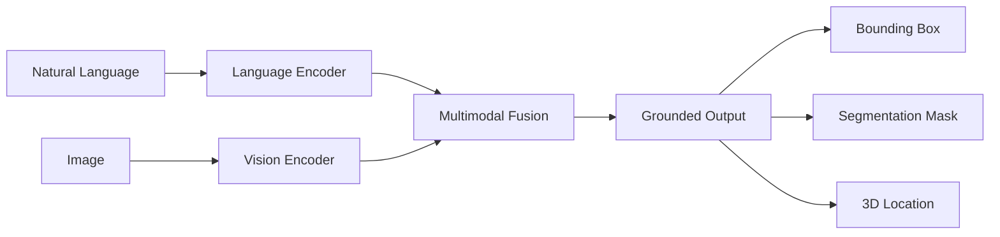

# 4.1 Vision-Language Grounding for Robotics

## Overview

Vision-Language Grounding connects natural language instructions to visual scene understanding, enabling robots to interpret commands like "pick up the red cup on the table." This chapter covers the fundamentals of grounding language in visual perception for humanoid robots.

## Learning Objectives

By the end of this chapter, you will be able to:

- Understand vision-language model architectures
- Implement open-vocabulary object detection
- Ground natural language to spatial locations
- Use referring expression comprehension
- Deploy vision-language models on robots

## Prerequisites

- Completed Module 3 (NVIDIA Isaac)
- Understanding of deep learning and transformers
- Familiarity with PyTorch
- Basic NLP concepts

## 4.1.1 What is Vision-Language Grounding?

Vision-language grounding maps text to visual regions:



### Key Tasks

| Task | Input | Output | Example |
|------|-------|--------|---------|
| Referring Expression | Image + Text | Bounding Box | "the red cup" → bbox |
| Phrase Grounding | Image + Caption | Multiple Boxes | Map all nouns to regions |
| Visual QA | Image + Question | Answer | "What color is the cup?" → "red" |
| Image Captioning | Image | Description | → "A red cup on a wooden table" |

## 4.1.2 Model Architectures

### CLIP: Contrastive Language-Image Pre-training

```python
# clip_grounding.py
import torch
import clip
from PIL import Image

class CLIPGrounding:
    def __init__(self, device="cuda"):
        self.device = device
        self.model, self.preprocess = clip.load("ViT-B/32", device)

    def encode_text(self, texts):
        """Encode text descriptions"""
        tokens = clip.tokenize(texts).to(self.device)
        with torch.no_grad():
            text_features = self.model.encode_text(tokens)
        return text_features / text_features.norm(dim=-1, keepdim=True)

    def encode_image(self, image_path):
        """Encode image"""
        image = self.preprocess(Image.open(image_path)).unsqueeze(0).to(self.device)
        with torch.no_grad():
            image_features = self.model.encode_image(image)
        return image_features / image_features.norm(dim=-1, keepdim=True)

    def similarity(self, image_path, texts):
        """Compute image-text similarity"""
        image_features = self.encode_image(image_path)
        text_features = self.encode_text(texts)

        similarity = (100.0 * image_features @ text_features.T).softmax(dim=-1)
        return similarity.cpu().numpy()[0]

# Usage
grounding = CLIPGrounding()
scores = grounding.similarity(
    "scene.jpg",
    ["a red cup", "a blue bottle", "a wooden table"]
)
print(f"Similarity scores: {scores}")
```

### GroundingDINO: Open-Set Object Detection

```python
# grounding_dino.py
import torch
from groundingdino.util.inference import load_model, predict
import cv2

class GroundingDINODetector:
    def __init__(self, config_path, weights_path, device="cuda"):
        self.model = load_model(config_path, weights_path)
        self.model = self.model.to(device)
        self.device = device

    def detect(self, image_path, text_prompt, box_threshold=0.35, text_threshold=0.25):
        """
        Detect objects matching text prompt

        Args:
            image_path: Path to image
            text_prompt: Object description (e.g., "red cup . blue bottle")
            box_threshold: Confidence threshold for boxes
            text_threshold: Confidence threshold for text matching

        Returns:
            boxes: Detected bounding boxes
            logits: Confidence scores
            phrases: Matched phrases
        """
        image = cv2.imread(image_path)
        image = cv2.cvtColor(image, cv2.COLOR_BGR2RGB)

        boxes, logits, phrases = predict(
            model=self.model,
            image=image,
            caption=text_prompt,
            box_threshold=box_threshold,
            text_threshold=text_threshold
        )

        return boxes, logits, phrases

    def ground_expression(self, image_path, expression):
        """Ground a referring expression to a single box"""
        boxes, logits, phrases = self.detect(image_path, expression)

        if len(boxes) == 0:
            return None

        # Return highest confidence match
        best_idx = logits.argmax()
        return {
            'box': boxes[best_idx].tolist(),
            'confidence': logits[best_idx].item(),
            'phrase': phrases[best_idx]
        }

# Usage
detector = GroundingDINODetector(
    "groundingdino/config/GroundingDINO_SwinB.py",
    "weights/groundingdino_swinb.pth"
)

result = detector.ground_expression(
    "kitchen_scene.jpg",
    "the red cup next to the sink"
)
print(f"Grounded to: {result}")
```

## 4.1.3 Open-Vocabulary Segmentation

### Segment Anything + CLIP

```python
# sam_clip_grounding.py
import torch
import numpy as np
from segment_anything import sam_model_registry, SamAutomaticMaskGenerator
import clip
from PIL import Image

class SAMCLIPGrounding:
    def __init__(self, sam_checkpoint, sam_type="vit_h", device="cuda"):
        self.device = device

        # Load SAM
        self.sam = sam_model_registry[sam_type](checkpoint=sam_checkpoint)
        self.sam.to(device)
        self.mask_generator = SamAutomaticMaskGenerator(self.sam)

        # Load CLIP
        self.clip_model, self.clip_preprocess = clip.load("ViT-B/32", device)

    def segment_and_ground(self, image_path, text_query):
        """
        Segment image and find region matching text query

        Returns:
            mask: Binary mask of matching region
            confidence: Match confidence
        """
        image = np.array(Image.open(image_path))

        # Generate all masks
        masks = self.mask_generator.generate(image)

        # Encode text query
        text_tokens = clip.tokenize([text_query]).to(self.device)
        with torch.no_grad():
            text_features = self.clip_model.encode_text(text_tokens)
            text_features /= text_features.norm(dim=-1, keepdim=True)

        best_mask = None
        best_score = -1

        for mask_data in masks:
            mask = mask_data['segmentation']

            # Extract masked region
            masked_image = image.copy()
            masked_image[~mask] = 0

            # Encode region with CLIP
            pil_image = Image.fromarray(masked_image)
            image_input = self.clip_preprocess(pil_image).unsqueeze(0).to(self.device)

            with torch.no_grad():
                image_features = self.clip_model.encode_image(image_input)
                image_features /= image_features.norm(dim=-1, keepdim=True)

            # Compute similarity
            similarity = (image_features @ text_features.T).item()

            if similarity > best_score:
                best_score = similarity
                best_mask = mask

        return best_mask, best_score

# Usage
grounding = SAMCLIPGrounding("sam_vit_h.pth")
mask, confidence = grounding.segment_and_ground(
    "table_scene.jpg",
    "the coffee mug"
)
print(f"Found with confidence: {confidence:.3f}")
```

## 4.1.4 3D Grounding

### From 2D to 3D Location

```python
# grounding_3d.py
import numpy as np
import rclpy
from rclpy.node import Node
from sensor_msgs.msg import Image, CameraInfo
from geometry_msgs.msg import PointStamped
from cv_bridge import CvBridge

class Grounding3DNode(Node):
    def __init__(self):
        super().__init__('grounding_3d')

        self.bridge = CvBridge()
        self.camera_info = None
        self.depth_image = None

        # Subscribers
        self.info_sub = self.create_subscription(
            CameraInfo, '/camera/camera_info',
            self.camera_info_callback, 10
        )
        self.depth_sub = self.create_subscription(
            Image, '/camera/depth',
            self.depth_callback, 10
        )

        # Publisher
        self.point_pub = self.create_publisher(
            PointStamped, '/grounded_point', 10
        )

    def camera_info_callback(self, msg):
        self.camera_info = msg

    def depth_callback(self, msg):
        self.depth_image = self.bridge.imgmsg_to_cv2(msg, '32FC1')

    def pixel_to_3d(self, u, v):
        """Convert 2D pixel to 3D point using depth"""
        if self.camera_info is None or self.depth_image is None:
            return None

        # Get camera intrinsics
        fx = self.camera_info.k[0]
        fy = self.camera_info.k[4]
        cx = self.camera_info.k[2]
        cy = self.camera_info.k[5]

        # Get depth at pixel
        depth = self.depth_image[int(v), int(u)]

        if depth <= 0 or np.isnan(depth):
            return None

        # Back-project to 3D
        x = (u - cx) * depth / fx
        y = (v - cy) * depth / fy
        z = depth

        return np.array([x, y, z])

    def ground_to_3d(self, bbox):
        """
        Convert 2D bounding box to 3D point

        Args:
            bbox: [x1, y1, x2, y2] normalized coordinates

        Returns:
            3D point in camera frame
        """
        h, w = self.depth_image.shape

        # Get bbox center in pixel coordinates
        cx = int((bbox[0] + bbox[2]) / 2 * w)
        cy = int((bbox[1] + bbox[3]) / 2 * h)

        # Sample multiple points for robustness
        points = []
        for du in range(-5, 6):
            for dv in range(-5, 6):
                point = self.pixel_to_3d(cx + du, cy + dv)
                if point is not None:
                    points.append(point)

        if len(points) == 0:
            return None

        # Return median point
        return np.median(points, axis=0)

    def publish_grounded_point(self, point_3d):
        """Publish grounded 3D point"""
        msg = PointStamped()
        msg.header.stamp = self.get_clock().now().to_msg()
        msg.header.frame_id = 'camera_link'
        msg.point.x = float(point_3d[0])
        msg.point.y = float(point_3d[1])
        msg.point.z = float(point_3d[2])

        self.point_pub.publish(msg)
```

## 4.1.5 Spatial Language Understanding

### Understanding Spatial Relations

```python
# spatial_grounding.py
import torch
from transformers import AutoTokenizer, AutoModel
import numpy as np

class SpatialLanguageGrounding:
    def __init__(self):
        self.spatial_relations = {
            'left of': self.check_left_of,
            'right of': self.check_right_of,
            'above': self.check_above,
            'below': self.check_below,
            'next to': self.check_next_to,
            'on': self.check_on,
            'in front of': self.check_in_front,
            'behind': self.check_behind
        }

    def parse_spatial_expression(self, expression):
        """
        Parse expression like "the cup left of the bottle"

        Returns:
            target: Target object description
            relation: Spatial relation
            anchor: Anchor object description
        """
        for relation in self.spatial_relations.keys():
            if relation in expression.lower():
                parts = expression.lower().split(relation)
                target = parts[0].strip().replace('the ', '')
                anchor = parts[1].strip().replace('the ', '')
                return target, relation, anchor

        return expression, None, None

    def check_left_of(self, target_box, anchor_box):
        """Check if target is left of anchor"""
        target_center = (target_box[0] + target_box[2]) / 2
        anchor_center = (anchor_box[0] + anchor_box[2]) / 2
        return target_center < anchor_center

    def check_right_of(self, target_box, anchor_box):
        return not self.check_left_of(target_box, anchor_box)

    def check_above(self, target_box, anchor_box):
        target_center = (target_box[1] + target_box[3]) / 2
        anchor_center = (anchor_box[1] + anchor_box[3]) / 2
        return target_center < anchor_center  # Y increases downward

    def check_below(self, target_box, anchor_box):
        return not self.check_above(target_box, anchor_box)

    def check_next_to(self, target_box, anchor_box, threshold=0.2):
        """Check if boxes are adjacent"""
        t_cx = (target_box[0] + target_box[2]) / 2
        a_cx = (anchor_box[0] + anchor_box[2]) / 2
        return abs(t_cx - a_cx) < threshold

    def check_on(self, target_box, anchor_box):
        """Check if target is on top of anchor"""
        # Target bottom should be near anchor top
        target_bottom = target_box[3]
        anchor_top = anchor_box[1]
        return abs(target_bottom - anchor_top) < 0.05

    def filter_by_spatial_relation(self, candidates, anchor_box, relation):
        """Filter candidate boxes by spatial relation to anchor"""
        check_fn = self.spatial_relations.get(relation)
        if check_fn is None:
            return candidates

        return [c for c in candidates if check_fn(c['box'], anchor_box)]

# Usage
spatial = SpatialLanguageGrounding()
target, relation, anchor = spatial.parse_spatial_expression(
    "the cup left of the bottle"
)
# target='cup', relation='left of', anchor='bottle'
```

## 4.1.6 ROS 2 Grounding Service

```python
# grounding_service.py
import rclpy
from rclpy.node import Node
from std_srvs.srv import Trigger
from vision_msgs.msg import Detection2DArray
from geometry_msgs.msg import PoseStamped
from custom_msgs.srv import GroundExpression  # Custom service

class GroundingService(Node):
    def __init__(self):
        super().__init__('grounding_service')

        # Initialize grounding model
        self.grounding_model = GroundingDINODetector(...)
        self.grounding_3d = Grounding3DNode()

        # Create service
        self.srv = self.create_service(
            GroundExpression,
            '/ground_expression',
            self.ground_callback
        )

        self.get_logger().info('Grounding service ready')

    def ground_callback(self, request, response):
        """
        Service callback for grounding expressions

        Request:
            expression: str - Natural language expression
            image: sensor_msgs/Image - Scene image

        Response:
            success: bool
            pose: geometry_msgs/PoseStamped - Grounded 3D pose
            confidence: float
        """
        expression = request.expression

        # Ground in 2D
        result = self.grounding_model.ground_expression(
            request.image,
            expression
        )

        if result is None:
            response.success = False
            return response

        # Convert to 3D
        point_3d = self.grounding_3d.ground_to_3d(result['box'])

        if point_3d is None:
            response.success = False
            return response

        response.success = True
        response.pose.header.frame_id = 'camera_link'
        response.pose.pose.position.x = float(point_3d[0])
        response.pose.pose.position.y = float(point_3d[1])
        response.pose.pose.position.z = float(point_3d[2])
        response.confidence = result['confidence']

        return response

def main():
    rclpy.init()
    node = GroundingService()
    rclpy.spin(node)
    rclpy.shutdown()
```

## Hands-On Exercise

1. Set up GroundingDINO for open-vocabulary detection
2. Implement 2D to 3D grounding with depth camera
3. Build a spatial language parser
4. Create a ROS 2 grounding service
5. Test with various referring expressions

## Summary

In this chapter, you learned:

- Vision-language model architectures (CLIP, GroundingDINO)
- Open-vocabulary object detection and segmentation
- Converting 2D grounding to 3D locations
- Spatial language understanding
- Building ROS 2 grounding services

## Next Steps

Continue to [4.2 Action Policy Learning](4.2-action-policy) to learn how to train policies that map language and vision to robot actions.
