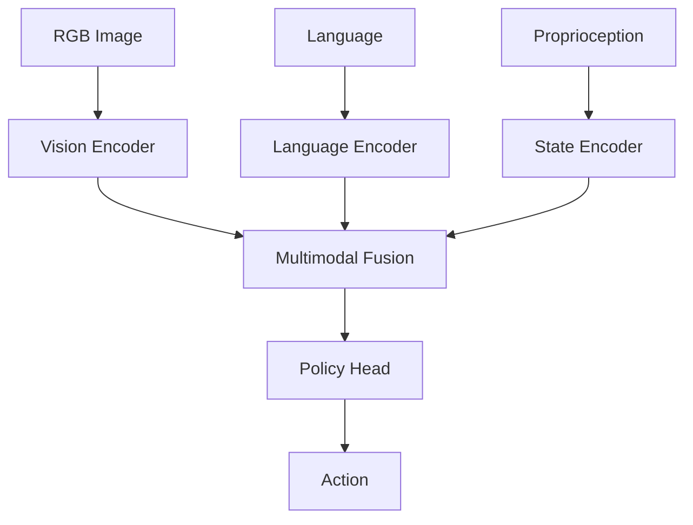

# 4.2 Action Policy Learning for Robot Control

## Overview

Action policy learning trains neural networks to map observations (vision, language, proprioception) to robot actions. This chapter covers modern approaches to learning manipulation and locomotion policies for humanoid robots.

## Learning Objectives

By the end of this chapter, you will be able to:

- Understand policy architectures for robotics
- Train imitation learning policies from demonstrations
- Implement behavior cloning and diffusion policies
- Use VLA models for language-conditioned control
- Deploy learned policies on robot hardware

## Prerequisites

- Completed Chapter 4.1 (Vision-Language Grounding)
- Understanding of reinforcement learning basics
- PyTorch proficiency
- Experience with robot control systems

## 4.2.1 Policy Learning Paradigms

### Comparison of Approaches

| Approach | Data | Pros | Cons |
|----------|------|------|------|
| Imitation Learning | Demonstrations | Sample efficient | Distribution shift |
| Reinforcement Learning | Sim interaction | Optimal policies | Sample inefficient |
| VLA Models | Large-scale data | Generalization | Compute intensive |

### Policy Architecture



## 4.2.2 Behavior Cloning

### Basic Implementation

```python
# behavior_cloning.py
import torch
import torch.nn as nn
from torch.utils.data import DataLoader
import numpy as np

class BCPolicy(nn.Module):
    """Behavior Cloning policy network"""

    def __init__(self, obs_dim, action_dim, hidden_dim=256):
        super().__init__()

        self.encoder = nn.Sequential(
            nn.Linear(obs_dim, hidden_dim),
            nn.ReLU(),
            nn.Linear(hidden_dim, hidden_dim),
            nn.ReLU()
        )

        self.policy_head = nn.Sequential(
            nn.Linear(hidden_dim, hidden_dim),
            nn.ReLU(),
            nn.Linear(hidden_dim, action_dim)
        )

    def forward(self, obs):
        features = self.encoder(obs)
        action = self.policy_head(features)
        return action

class BCTrainer:
    def __init__(self, policy, lr=1e-4):
        self.policy = policy
        self.optimizer = torch.optim.Adam(policy.parameters(), lr=lr)
        self.loss_fn = nn.MSELoss()

    def train_epoch(self, dataloader):
        self.policy.train()
        total_loss = 0

        for batch in dataloader:
            obs = batch['observation']
            action = batch['action']

            pred_action = self.policy(obs)
            loss = self.loss_fn(pred_action, action)

            self.optimizer.zero_grad()
            loss.backward()
            self.optimizer.step()

            total_loss += loss.item()

        return total_loss / len(dataloader)

# Usage
policy = BCPolicy(obs_dim=128, action_dim=7)  # 7-DOF arm
trainer = BCTrainer(policy)

for epoch in range(100):
    loss = trainer.train_epoch(demo_dataloader)
    print(f"Epoch {epoch}: Loss = {loss:.4f}")
```

### Vision-Based BC Policy

```python
# vision_bc_policy.py
import torch
import torch.nn as nn
import torchvision.models as models

class VisionBCPolicy(nn.Module):
    """Vision-based behavior cloning with ResNet encoder"""

    def __init__(self, action_dim, pretrained=True):
        super().__init__()

        # Vision encoder (ResNet18 without final layer)
        resnet = models.resnet18(pretrained=pretrained)
        self.vision_encoder = nn.Sequential(*list(resnet.children())[:-1])
        self.vision_dim = 512

        # Proprioception encoder
        self.proprio_encoder = nn.Sequential(
            nn.Linear(14, 64),  # Joint positions + velocities
            nn.ReLU(),
            nn.Linear(64, 64)
        )

        # Policy head
        self.policy = nn.Sequential(
            nn.Linear(self.vision_dim + 64, 256),
            nn.ReLU(),
            nn.Linear(256, 256),
            nn.ReLU(),
            nn.Linear(256, action_dim)
        )

    def forward(self, image, proprio):
        # Encode image
        vis_features = self.vision_encoder(image)
        vis_features = vis_features.flatten(1)

        # Encode proprioception
        proprio_features = self.proprio_encoder(proprio)

        # Concatenate and predict action
        features = torch.cat([vis_features, proprio_features], dim=1)
        action = self.policy(features)

        return action
```

## 4.2.3 Diffusion Policies

### Diffusion Policy Architecture

```python
# diffusion_policy.py
import torch
import torch.nn as nn
import numpy as np

class DiffusionPolicy(nn.Module):
    """
    Diffusion-based policy for multi-modal action distributions
    Based on "Diffusion Policy" (Chi et al., 2023)
    """

    def __init__(
        self,
        obs_dim,
        action_dim,
        action_horizon=16,
        num_diffusion_steps=100,
        hidden_dim=256
    ):
        super().__init__()

        self.action_dim = action_dim
        self.action_horizon = action_horizon
        self.num_steps = num_diffusion_steps

        # Observation encoder
        self.obs_encoder = nn.Sequential(
            nn.Linear(obs_dim, hidden_dim),
            nn.ReLU(),
            nn.Linear(hidden_dim, hidden_dim)
        )

        # Noise prediction network (U-Net style)
        self.noise_pred = NoisePredictor(
            action_dim=action_dim,
            action_horizon=action_horizon,
            cond_dim=hidden_dim,
            hidden_dim=hidden_dim
        )

        # Diffusion schedule
        self.register_buffer(
            'betas',
            torch.linspace(1e-4, 0.02, num_diffusion_steps)
        )
        alphas = 1 - self.betas
        self.register_buffer('alphas_cumprod', torch.cumprod(alphas, dim=0))

    def forward(self, obs, actions, timesteps):
        """Training forward pass: predict noise"""
        cond = self.obs_encoder(obs)
        noise_pred = self.noise_pred(actions, timesteps, cond)
        return noise_pred

    @torch.no_grad()
    def sample(self, obs, num_samples=1):
        """Sample actions using reverse diffusion"""
        device = obs.device
        batch_size = obs.shape[0] * num_samples

        # Encode observation
        cond = self.obs_encoder(obs)
        cond = cond.repeat(num_samples, 1)

        # Start from pure noise
        action_shape = (batch_size, self.action_horizon, self.action_dim)
        x = torch.randn(action_shape, device=device)

        # Reverse diffusion
        for t in reversed(range(self.num_steps)):
            timesteps = torch.full((batch_size,), t, device=device)

            # Predict noise
            noise_pred = self.noise_pred(x, timesteps, cond)

            # Denoise step
            alpha = self.alphas_cumprod[t]
            alpha_prev = self.alphas_cumprod[t-1] if t > 0 else torch.tensor(1.0)
            beta = self.betas[t]

            x = (1 / torch.sqrt(1 - beta)) * (
                x - (beta / torch.sqrt(1 - alpha)) * noise_pred
            )

            if t > 0:
                noise = torch.randn_like(x)
                x = x + torch.sqrt(beta) * noise

        return x


class NoisePredictor(nn.Module):
    """Noise prediction network for diffusion policy"""

    def __init__(self, action_dim, action_horizon, cond_dim, hidden_dim):
        super().__init__()

        self.action_dim = action_dim
        self.action_horizon = action_horizon

        # Time embedding
        self.time_embed = nn.Sequential(
            SinusoidalPosEmb(hidden_dim),
            nn.Linear(hidden_dim, hidden_dim),
            nn.ReLU(),
            nn.Linear(hidden_dim, hidden_dim)
        )

        # Main network
        self.net = nn.Sequential(
            nn.Linear(action_dim * action_horizon + cond_dim + hidden_dim, hidden_dim),
            nn.ReLU(),
            nn.Linear(hidden_dim, hidden_dim),
            nn.ReLU(),
            nn.Linear(hidden_dim, hidden_dim),
            nn.ReLU(),
            nn.Linear(hidden_dim, action_dim * action_horizon)
        )

    def forward(self, actions, timesteps, cond):
        batch_size = actions.shape[0]

        # Flatten actions
        actions_flat = actions.flatten(1)

        # Get time embedding
        time_emb = self.time_embed(timesteps)

        # Concatenate inputs
        x = torch.cat([actions_flat, cond, time_emb], dim=1)

        # Predict noise
        noise = self.net(x)
        noise = noise.view(batch_size, self.action_horizon, self.action_dim)

        return noise


class SinusoidalPosEmb(nn.Module):
    def __init__(self, dim):
        super().__init__()
        self.dim = dim

    def forward(self, x):
        half_dim = self.dim // 2
        emb = np.log(10000) / (half_dim - 1)
        emb = torch.exp(torch.arange(half_dim, device=x.device) * -emb)
        emb = x[:, None] * emb[None, :]
        emb = torch.cat([torch.sin(emb), torch.cos(emb)], dim=-1)
        return emb
```

### Training Diffusion Policy

```python
# train_diffusion.py
import torch
from torch.utils.data import DataLoader

def train_diffusion_policy(policy, dataset, epochs=100, lr=1e-4):
    optimizer = torch.optim.Adam(policy.parameters(), lr=lr)
    dataloader = DataLoader(dataset, batch_size=64, shuffle=True)

    for epoch in range(epochs):
        total_loss = 0

        for batch in dataloader:
            obs = batch['observation']
            actions = batch['actions']  # (B, horizon, action_dim)

            # Sample random timesteps
            timesteps = torch.randint(
                0, policy.num_steps,
                (obs.shape[0],),
                device=obs.device
            )

            # Add noise to actions
            noise = torch.randn_like(actions)
            alpha = policy.alphas_cumprod[timesteps][:, None, None]
            noisy_actions = torch.sqrt(alpha) * actions + torch.sqrt(1 - alpha) * noise

            # Predict noise
            noise_pred = policy(obs, noisy_actions, timesteps)

            # MSE loss on noise
            loss = torch.nn.functional.mse_loss(noise_pred, noise)

            optimizer.zero_grad()
            loss.backward()
            optimizer.step()

            total_loss += loss.item()

        print(f"Epoch {epoch}: Loss = {total_loss / len(dataloader):.4f}")
```

## 4.2.4 Vision-Language-Action (VLA) Models

### OpenVLA Architecture

```python
# openvla_policy.py
import torch
import torch.nn as nn
from transformers import AutoModel, AutoTokenizer

class OpenVLAPolicy(nn.Module):
    """
    Vision-Language-Action policy based on OpenVLA
    Uses pretrained VLM as backbone
    """

    def __init__(self, action_dim=7, action_horizon=1):
        super().__init__()

        # Load pretrained VLM backbone
        self.vlm = AutoModel.from_pretrained("openvla/openvla-7b")
        self.tokenizer = AutoTokenizer.from_pretrained("openvla/openvla-7b")

        # Freeze VLM initially
        for param in self.vlm.parameters():
            param.requires_grad = False

        # Action head
        hidden_dim = self.vlm.config.hidden_size
        self.action_head = nn.Sequential(
            nn.Linear(hidden_dim, 256),
            nn.ReLU(),
            nn.Linear(256, action_dim * action_horizon)
        )

        self.action_dim = action_dim
        self.action_horizon = action_horizon

    def forward(self, images, instructions):
        """
        Args:
            images: (B, C, H, W) RGB images
            instructions: List of text instructions

        Returns:
            actions: (B, horizon, action_dim)
        """
        # Tokenize instructions
        tokens = self.tokenizer(
            instructions,
            padding=True,
            return_tensors="pt"
        ).to(images.device)

        # Get VLM features
        outputs = self.vlm(
            pixel_values=images,
            input_ids=tokens.input_ids,
            attention_mask=tokens.attention_mask
        )

        # Use last hidden state
        features = outputs.last_hidden_state[:, -1, :]

        # Predict actions
        actions = self.action_head(features)
        actions = actions.view(-1, self.action_horizon, self.action_dim)

        return actions

    def predict(self, image, instruction):
        """Single inference"""
        self.eval()
        with torch.no_grad():
            image = image.unsqueeze(0)
            actions = self.forward(image, [instruction])
            return actions[0]
```

### Fine-tuning VLA on Robot Data

```python
# finetune_vla.py
import torch
from torch.utils.data import DataLoader
from peft import LoraConfig, get_peft_model

def finetune_vla(
    model,
    train_dataset,
    epochs=10,
    lr=1e-4,
    lora_rank=8
):
    """Fine-tune VLA with LoRA for efficiency"""

    # Add LoRA adapters
    lora_config = LoraConfig(
        r=lora_rank,
        lora_alpha=16,
        target_modules=["q_proj", "v_proj"],
        lora_dropout=0.1
    )
    model = get_peft_model(model, lora_config)

    # Unfreeze action head
    for param in model.action_head.parameters():
        param.requires_grad = True

    optimizer = torch.optim.AdamW(
        filter(lambda p: p.requires_grad, model.parameters()),
        lr=lr
    )

    dataloader = DataLoader(train_dataset, batch_size=8, shuffle=True)

    for epoch in range(epochs):
        model.train()
        total_loss = 0

        for batch in dataloader:
            images = batch['image']
            instructions = batch['instruction']
            target_actions = batch['action']

            pred_actions = model(images, instructions)
            loss = torch.nn.functional.mse_loss(pred_actions, target_actions)

            optimizer.zero_grad()
            loss.backward()
            optimizer.step()

            total_loss += loss.item()

        print(f"Epoch {epoch}: Loss = {total_loss / len(dataloader):.4f}")

    return model
```

## 4.2.5 Policy Deployment

### ROS 2 Policy Node

```python
# policy_node.py
import rclpy
from rclpy.node import Node
from sensor_msgs.msg import Image, JointState
from std_msgs.msg import String
from trajectory_msgs.msg import JointTrajectory, JointTrajectoryPoint
from cv_bridge import CvBridge
import torch
import numpy as np

class PolicyNode(Node):
    def __init__(self):
        super().__init__('policy_node')

        self.bridge = CvBridge()
        self.device = torch.device('cuda' if torch.cuda.is_available() else 'cpu')

        # Load policy
        self.policy = self.load_policy()

        # State
        self.current_image = None
        self.current_joints = None
        self.current_instruction = None

        # Subscribers
        self.image_sub = self.create_subscription(
            Image, '/camera/image', self.image_callback, 10
        )
        self.joint_sub = self.create_subscription(
            JointState, '/joint_states', self.joint_callback, 10
        )
        self.instruction_sub = self.create_subscription(
            String, '/instruction', self.instruction_callback, 10
        )

        # Publisher
        self.traj_pub = self.create_publisher(
            JointTrajectory, '/arm_controller/joint_trajectory', 10
        )

        # Control loop
        self.control_timer = self.create_timer(0.1, self.control_loop)  # 10 Hz

        self.get_logger().info('Policy node initialized')

    def load_policy(self):
        """Load trained policy"""
        policy = OpenVLAPolicy(action_dim=7)
        policy.load_state_dict(torch.load('policy_weights.pt'))
        policy.to(self.device)
        policy.eval()
        return policy

    def image_callback(self, msg):
        cv_image = self.bridge.imgmsg_to_cv2(msg, 'rgb8')
        self.current_image = self.preprocess_image(cv_image)

    def joint_callback(self, msg):
        self.current_joints = np.array(msg.position[:7])

    def instruction_callback(self, msg):
        self.current_instruction = msg.data
        self.get_logger().info(f'New instruction: {self.current_instruction}')

    def preprocess_image(self, image):
        """Preprocess image for policy"""
        # Resize, normalize, convert to tensor
        image = cv2.resize(image, (224, 224))
        image = image.astype(np.float32) / 255.0
        image = torch.from_numpy(image).permute(2, 0, 1)
        return image.to(self.device)

    def control_loop(self):
        """Main control loop"""
        if self.current_image is None or self.current_instruction is None:
            return

        # Get action from policy
        with torch.no_grad():
            action = self.policy.predict(
                self.current_image,
                self.current_instruction
            )

        action = action.cpu().numpy()

        # Convert to trajectory message
        traj_msg = JointTrajectory()
        traj_msg.header.stamp = self.get_clock().now().to_msg()
        traj_msg.joint_names = [
            'joint1', 'joint2', 'joint3', 'joint4',
            'joint5', 'joint6', 'joint7'
        ]

        point = JointTrajectoryPoint()
        point.positions = action.tolist()
        point.time_from_start.sec = 0
        point.time_from_start.nanosec = 100000000  # 100ms

        traj_msg.points = [point]
        self.traj_pub.publish(traj_msg)

def main():
    rclpy.init()
    node = PolicyNode()
    rclpy.spin(node)
    rclpy.shutdown()
```

## 4.2.6 Action Chunking

```python
# action_chunking.py
import torch
import numpy as np

class ActionChunkingExecutor:
    """
    Execute action chunks with temporal smoothing
    Handles action horizon > 1
    """

    def __init__(self, policy, action_horizon=16, execution_horizon=8):
        self.policy = policy
        self.action_horizon = action_horizon
        self.execution_horizon = execution_horizon

        self.action_buffer = None
        self.buffer_idx = 0

    def get_action(self, observation):
        """Get next action, re-planning when needed"""

        # Re-plan if buffer exhausted
        if self.action_buffer is None or self.buffer_idx >= self.execution_horizon:
            self.action_buffer = self.policy.sample(observation)
            self.buffer_idx = 0

        # Get current action
        action = self.action_buffer[0, self.buffer_idx]
        self.buffer_idx += 1

        return action.cpu().numpy()

    def reset(self):
        """Reset buffer for new episode"""
        self.action_buffer = None
        self.buffer_idx = 0
```

## Hands-On Exercise

1. Implement behavior cloning for a 7-DOF arm
2. Train a diffusion policy on demonstration data
3. Fine-tune OpenVLA on your robot's data
4. Deploy policy with ROS 2 control interface
5. Implement action chunking for smooth execution

## Summary

In this chapter, you learned:

- Policy architectures for vision-language-action
- Behavior cloning and its limitations
- Diffusion policies for multi-modal actions
- VLA model fine-tuning with LoRA
- ROS 2 deployment with action chunking

## Next Steps

Continue to [4.3 Sim-to-Real Transfer](4.3-sim2real) to learn techniques for transferring learned policies from simulation to real robots.
