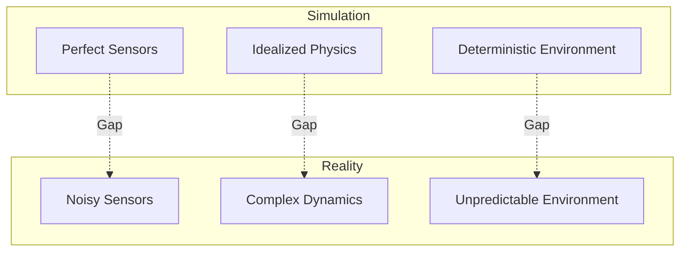

# 4.3 Sim-to-Real Transfer

## Overview

Sim-to-real transfer bridges the gap between simulated and real-world robot deployment. This chapter covers techniques to train robust policies in simulation that transfer successfully to physical humanoid robots.

## Learning Objectives

By the end of this chapter, you will be able to:

- Understand the sim-to-real gap and its causes
- Implement domain randomization strategies
- Apply system identification for accurate simulation
- Use domain adaptation techniques
- Deploy and fine-tune policies on real hardware

## Prerequisites

- Completed Chapter 4.2 (Action Policy Learning)
- Access to simulation environment (Isaac Sim or Gazebo)
- Understanding of robot dynamics
- Optional: Access to real robot hardware

## 4.3.1 The Sim-to-Real Gap

### Sources of Discrepancy



| Gap Type | Simulation | Reality |
|----------|------------|---------|
| Visual | Clean renders | Lighting variation, blur, occlusion |
| Dynamics | Rigid body physics | Deformable contacts, friction |
| Sensors | Perfect measurements | Noise, latency, dropout |
| Actuation | Instant response | Motor dynamics, backlash |

## 4.3.2 Domain Randomization

### Physics Randomization

```python
# physics_randomization.py
import numpy as np
from dataclasses import dataclass

@dataclass
class PhysicsRandomization:
    """Physics parameters to randomize"""

    # Mass properties
    mass_scale: tuple = (0.8, 1.2)
    com_offset: tuple = (-0.02, 0.02)  # meters
    inertia_scale: tuple = (0.8, 1.2)

    # Joint properties
    joint_damping_scale: tuple = (0.5, 2.0)
    joint_friction_scale: tuple = (0.5, 2.0)
    joint_stiffness_scale: tuple = (0.8, 1.2)

    # Contact properties
    ground_friction: tuple = (0.5, 1.5)
    restitution: tuple = (0.0, 0.3)

    # Motor properties
    motor_strength_scale: tuple = (0.8, 1.2)
    motor_damping_scale: tuple = (0.8, 1.2)

    # Delays
    action_delay_steps: tuple = (0, 3)
    observation_delay_steps: tuple = (0, 2)


class PhysicsRandomizer:
    def __init__(self, config: PhysicsRandomization):
        self.config = config

    def randomize_robot(self, robot):
        """Apply random physics parameters to robot"""

        # Randomize link masses
        for link in robot.get_links():
            mass_scale = np.random.uniform(*self.config.mass_scale)
            link.set_mass(link.get_mass() * mass_scale)

            # Randomize center of mass
            com = link.get_com()
            com_offset = np.random.uniform(
                self.config.com_offset[0],
                self.config.com_offset[1],
                size=3
            )
            link.set_com(com + com_offset)

        # Randomize joints
        for joint in robot.get_joints():
            damping_scale = np.random.uniform(*self.config.joint_damping_scale)
            friction_scale = np.random.uniform(*self.config.joint_friction_scale)

            joint.set_damping(joint.get_damping() * damping_scale)
            joint.set_friction(joint.get_friction() * friction_scale)

        # Randomize motors
        for motor in robot.get_motors():
            strength_scale = np.random.uniform(*self.config.motor_strength_scale)
            motor.set_max_torque(motor.get_max_torque() * strength_scale)

    def randomize_ground(self, ground):
        """Randomize ground contact properties"""
        friction = np.random.uniform(*self.config.ground_friction)
        restitution = np.random.uniform(*self.config.restitution)

        ground.set_friction(friction)
        ground.set_restitution(restitution)

    def get_action_delay(self):
        """Get random action delay in steps"""
        return np.random.randint(
            self.config.action_delay_steps[0],
            self.config.action_delay_steps[1] + 1
        )

    def get_observation_delay(self):
        """Get random observation delay in steps"""
        return np.random.randint(
            self.config.observation_delay_steps[0],
            self.config.observation_delay_steps[1] + 1
        )
```

### Visual Randomization

```python
# visual_randomization.py
import numpy as np
import cv2
from PIL import Image
import torch
import torchvision.transforms as T

class VisualRandomizer:
    """Randomize visual observations for robust perception"""

    def __init__(self):
        self.transforms = T.Compose([
            T.ColorJitter(
                brightness=0.3,
                contrast=0.3,
                saturation=0.3,
                hue=0.1
            ),
            T.GaussianBlur(kernel_size=5, sigma=(0.1, 2.0)),
        ])

    def randomize_image(self, image):
        """Apply random visual augmentations"""

        # Convert to PIL
        if isinstance(image, np.ndarray):
            image = Image.fromarray(image)

        # Color jitter and blur
        image = self.transforms(image)

        # Random noise
        if np.random.random() < 0.3:
            image = self.add_noise(image)

        # Random occlusion
        if np.random.random() < 0.2:
            image = self.add_occlusion(image)

        return image

    def add_noise(self, image, noise_level=0.05):
        """Add Gaussian noise"""
        arr = np.array(image).astype(np.float32) / 255.0
        noise = np.random.normal(0, noise_level, arr.shape)
        arr = np.clip(arr + noise, 0, 1)
        return Image.fromarray((arr * 255).astype(np.uint8))

    def add_occlusion(self, image, max_size=0.2):
        """Add random rectangular occlusion"""
        arr = np.array(image)
        h, w = arr.shape[:2]

        # Random rectangle
        rh = int(np.random.uniform(0.05, max_size) * h)
        rw = int(np.random.uniform(0.05, max_size) * w)
        rx = np.random.randint(0, w - rw)
        ry = np.random.randint(0, h - rh)

        # Random color or black
        color = np.random.randint(0, 256, 3) if np.random.random() < 0.5 else [0, 0, 0]
        arr[ry:ry+rh, rx:rx+rw] = color

        return Image.fromarray(arr)

    def randomize_lighting(self, scene):
        """Randomize scene lighting in simulation"""
        # Randomize light intensity
        for light in scene.get_lights():
            intensity = np.random.uniform(0.5, 2.0)
            light.set_intensity(intensity)

            # Randomize color temperature
            temp = np.random.uniform(3000, 7000)  # Kelvin
            light.set_color_temperature(temp)

        # Randomize ambient
        ambient = np.random.uniform(0.1, 0.4)
        scene.set_ambient_light(ambient)
```

### Dynamics Randomization During Training

```python
# randomized_env.py
import gymnasium as gym
import numpy as np

class RandomizedEnv(gym.Wrapper):
    """Gym wrapper with domain randomization"""

    def __init__(
        self,
        env,
        physics_randomizer,
        visual_randomizer,
        randomize_every_episode=True,
        randomize_every_step=False
    ):
        super().__init__(env)
        self.physics_rand = physics_randomizer
        self.visual_rand = visual_randomizer
        self.randomize_every_episode = randomize_every_episode
        self.randomize_every_step = randomize_every_step

        # Action/observation delay buffers
        self.action_buffer = []
        self.obs_buffer = []
        self.action_delay = 0
        self.obs_delay = 0

    def reset(self, **kwargs):
        obs, info = self.env.reset(**kwargs)

        if self.randomize_every_episode:
            self._randomize_physics()
            self._randomize_delays()

        # Clear buffers
        self.action_buffer = []
        self.obs_buffer = []

        return self._process_obs(obs), info

    def step(self, action):
        if self.randomize_every_step:
            self._randomize_physics()

        # Apply action delay
        delayed_action = self._delay_action(action)

        obs, reward, terminated, truncated, info = self.env.step(delayed_action)

        # Apply observation delay and visual randomization
        processed_obs = self._process_obs(obs)

        return processed_obs, reward, terminated, truncated, info

    def _randomize_physics(self):
        """Apply physics randomization"""
        robot = self.env.unwrapped.robot
        ground = self.env.unwrapped.ground

        self.physics_rand.randomize_robot(robot)
        self.physics_rand.randomize_ground(ground)

    def _randomize_delays(self):
        """Set random delays for episode"""
        self.action_delay = self.physics_rand.get_action_delay()
        self.obs_delay = self.physics_rand.get_observation_delay()

    def _delay_action(self, action):
        """Delay action by random steps"""
        self.action_buffer.append(action)

        if len(self.action_buffer) > self.action_delay:
            return self.action_buffer.pop(0)
        else:
            return np.zeros_like(action)

    def _process_obs(self, obs):
        """Process observation with delay and visual randomization"""
        # Delay observation
        self.obs_buffer.append(obs)
        if len(self.obs_buffer) > self.obs_delay:
            delayed_obs = self.obs_buffer.pop(0)
        else:
            delayed_obs = obs

        # Visual randomization (if image observation)
        if 'image' in delayed_obs:
            delayed_obs['image'] = self.visual_rand.randomize_image(
                delayed_obs['image']
            )

        return delayed_obs
```

## 4.3.3 System Identification

### Parameter Estimation

```python
# system_identification.py
import numpy as np
from scipy.optimize import minimize
from dataclasses import dataclass

@dataclass
class SystemParams:
    """Identified system parameters"""
    joint_damping: np.ndarray
    joint_friction: np.ndarray
    motor_torque_constant: np.ndarray
    link_masses: np.ndarray
    link_inertias: np.ndarray

class SystemIdentifier:
    """Identify robot parameters from real data"""

    def __init__(self, robot_model):
        self.robot = robot_model
        self.trajectory_data = []

    def collect_data(self, positions, velocities, torques, dt):
        """Collect trajectory data from real robot"""
        self.trajectory_data.append({
            'positions': positions,
            'velocities': velocities,
            'torques': torques,
            'dt': dt
        })

    def identify_parameters(self):
        """Estimate parameters by minimizing prediction error"""

        # Initial guess from CAD model
        x0 = self._get_initial_params()

        # Optimize
        result = minimize(
            self._prediction_error,
            x0,
            method='L-BFGS-B',
            bounds=self._get_param_bounds()
        )

        return self._params_from_vector(result.x)

    def _prediction_error(self, params):
        """Compute prediction error for given parameters"""
        total_error = 0

        for traj in self.trajectory_data:
            # Set simulation parameters
            self._set_params(params)

            # Simulate trajectory
            sim_velocities = self._simulate(
                traj['positions'],
                traj['torques'],
                traj['dt']
            )

            # Compare to real velocities
            error = np.sum((sim_velocities - traj['velocities'])**2)
            total_error += error

        return total_error

    def _simulate(self, positions, torques, dt):
        """Simulate robot with given parameters"""
        velocities = []
        q = positions[0]
        qd = np.zeros_like(q)

        for i, tau in enumerate(torques[:-1]):
            # Forward dynamics
            qdd = self.robot.forward_dynamics(q, qd, tau)

            # Integrate
            qd = qd + qdd * dt
            q = q + qd * dt

            velocities.append(qd.copy())

        return np.array(velocities)

    def _get_initial_params(self):
        """Get initial parameter guess from model"""
        # Extract current parameters as vector
        return np.concatenate([
            self.robot.joint_damping,
            self.robot.joint_friction,
            self.robot.motor_constants,
            self.robot.link_masses,
        ])

    def _get_param_bounds(self):
        """Get reasonable bounds for parameters"""
        n_joints = len(self.robot.joints)
        n_links = len(self.robot.links)

        bounds = []
        # Damping: [0.01, 10.0]
        bounds.extend([(0.01, 10.0)] * n_joints)
        # Friction: [0.0, 5.0]
        bounds.extend([(0.0, 5.0)] * n_joints)
        # Motor constants: [0.1, 2.0]
        bounds.extend([(0.1, 2.0)] * n_joints)
        # Masses: [0.1, 100.0]
        bounds.extend([(0.1, 100.0)] * n_links)

        return bounds
```

### Automatic Domain Adaptation

```python
# domain_adaptation.py
import torch
import torch.nn as nn

class DomainAdversarialNetwork(nn.Module):
    """
    Domain adversarial neural network for sim-to-real adaptation
    Learns domain-invariant features
    """

    def __init__(self, feature_dim, num_classes, hidden_dim=256):
        super().__init__()

        # Feature extractor (shared)
        self.feature_extractor = nn.Sequential(
            nn.Linear(feature_dim, hidden_dim),
            nn.ReLU(),
            nn.Linear(hidden_dim, hidden_dim),
            nn.ReLU()
        )

        # Task classifier
        self.classifier = nn.Sequential(
            nn.Linear(hidden_dim, hidden_dim // 2),
            nn.ReLU(),
            nn.Linear(hidden_dim // 2, num_classes)
        )

        # Domain discriminator
        self.domain_discriminator = nn.Sequential(
            GradientReversal(),
            nn.Linear(hidden_dim, hidden_dim // 2),
            nn.ReLU(),
            nn.Linear(hidden_dim // 2, 2)  # Sim vs Real
        )

    def forward(self, x, return_domain=False):
        features = self.feature_extractor(x)
        class_output = self.classifier(features)

        if return_domain:
            domain_output = self.domain_discriminator(features)
            return class_output, domain_output

        return class_output


class GradientReversal(torch.autograd.Function):
    """Gradient reversal layer for adversarial training"""

    @staticmethod
    def forward(ctx, x, lambda_=1.0):
        ctx.lambda_ = lambda_
        return x.view_as(x)

    @staticmethod
    def backward(ctx, grad_output):
        return -ctx.lambda_ * grad_output, None


def train_domain_adaptation(
    model,
    sim_loader,
    real_loader,
    epochs=100,
    lambda_domain=0.1
):
    """Train with domain adversarial loss"""
    optimizer = torch.optim.Adam(model.parameters(), lr=1e-4)
    task_criterion = nn.CrossEntropyLoss()
    domain_criterion = nn.CrossEntropyLoss()

    for epoch in range(epochs):
        for (sim_x, sim_y), (real_x, _) in zip(sim_loader, real_loader):
            # Forward pass
            sim_task, sim_domain = model(sim_x, return_domain=True)
            _, real_domain = model(real_x, return_domain=True)

            # Task loss (only on labeled sim data)
            task_loss = task_criterion(sim_task, sim_y)

            # Domain loss (sim=0, real=1)
            sim_domain_labels = torch.zeros(sim_x.size(0), dtype=torch.long)
            real_domain_labels = torch.ones(real_x.size(0), dtype=torch.long)

            domain_loss = (
                domain_criterion(sim_domain, sim_domain_labels) +
                domain_criterion(real_domain, real_domain_labels)
            )

            # Total loss
            loss = task_loss + lambda_domain * domain_loss

            optimizer.zero_grad()
            loss.backward()
            optimizer.step()

        print(f"Epoch {epoch}: Task={task_loss:.4f}, Domain={domain_loss:.4f}")
```

## 4.3.4 Real Robot Deployment

### Safety Wrapper

```python
# safety_wrapper.py
import numpy as np
import rclpy
from rclpy.node import Node

class SafetyWrapper:
    """Safety checks for real robot deployment"""

    def __init__(
        self,
        joint_limits,
        velocity_limits,
        torque_limits,
        workspace_bounds
    ):
        self.joint_limits = joint_limits
        self.velocity_limits = velocity_limits
        self.torque_limits = torque_limits
        self.workspace_bounds = workspace_bounds

        self.violation_count = 0
        self.max_violations = 5

    def check_action(self, action, current_state):
        """Check if action is safe"""
        violations = []

        # Check joint limits
        predicted_pos = current_state['position'] + action * 0.01  # Approximate
        for i, (pos, limits) in enumerate(zip(predicted_pos, self.joint_limits)):
            if pos < limits[0] or pos > limits[1]:
                violations.append(f"Joint {i} limit violation")

        # Check velocity limits
        for i, (vel, limit) in enumerate(zip(action, self.velocity_limits)):
            if abs(vel) > limit:
                violations.append(f"Joint {i} velocity limit violation")

        # Check workspace bounds
        ee_pos = self.forward_kinematics(predicted_pos)
        if not self._in_workspace(ee_pos):
            violations.append("Workspace violation")

        return len(violations) == 0, violations

    def safe_action(self, action, current_state):
        """Return safe version of action"""
        safe_act = action.copy()

        # Clip to velocity limits
        safe_act = np.clip(safe_act, -self.velocity_limits, self.velocity_limits)

        # Clip to avoid joint limits
        predicted_pos = current_state['position'] + safe_act * 0.01
        for i, limits in enumerate(self.joint_limits):
            margin = 0.1  # radians
            if predicted_pos[i] < limits[0] + margin:
                safe_act[i] = max(0, safe_act[i])
            if predicted_pos[i] > limits[1] - margin:
                safe_act[i] = min(0, safe_act[i])

        return safe_act

    def _in_workspace(self, position):
        """Check if position is in safe workspace"""
        for i, (pos, bounds) in enumerate(zip(position, self.workspace_bounds)):
            if pos < bounds[0] or pos > bounds[1]:
                return False
        return True

    def forward_kinematics(self, joint_positions):
        """Compute end-effector position (simplified)"""
        # Implement robot-specific FK
        pass
```

### Real Robot Control Node

```python
# real_robot_node.py
import rclpy
from rclpy.node import Node
from sensor_msgs.msg import JointState, Image
from trajectory_msgs.msg import JointTrajectory, JointTrajectoryPoint
from std_msgs.msg import Bool
import torch
import numpy as np

class RealRobotPolicyNode(Node):
    """Deploy policy on real robot with safety"""

    def __init__(self):
        super().__init__('real_robot_policy')

        # Load policy
        self.policy = self.load_policy()
        self.safety = self.load_safety_config()

        # State
        self.enabled = False
        self.current_joints = None
        self.current_image = None

        # Subscribers
        self.joint_sub = self.create_subscription(
            JointState, '/joint_states', self.joint_callback, 10
        )
        self.image_sub = self.create_subscription(
            Image, '/camera/image', self.image_callback, 10
        )
        self.enable_sub = self.create_subscription(
            Bool, '/policy/enable', self.enable_callback, 10
        )

        # Publisher
        self.cmd_pub = self.create_publisher(
            JointTrajectory, '/joint_trajectory_controller/command', 10
        )

        # Control loop at 20 Hz
        self.control_timer = self.create_timer(0.05, self.control_loop)

        self.get_logger().info('Real robot policy node ready')

    def load_policy(self):
        """Load trained policy with domain adaptation"""
        policy = torch.load('policy_adapted.pt')
        policy.eval()
        return policy

    def load_safety_config(self):
        """Load safety limits from config"""
        return SafetyWrapper(
            joint_limits=[(-2.0, 2.0)] * 7,
            velocity_limits=[1.0] * 7,
            torque_limits=[50.0] * 7,
            workspace_bounds=[(-1, 1), (-1, 1), (0, 2)]
        )

    def enable_callback(self, msg):
        self.enabled = msg.data
        state = "enabled" if self.enabled else "disabled"
        self.get_logger().info(f'Policy {state}')

    def joint_callback(self, msg):
        self.current_joints = {
            'position': np.array(msg.position[:7]),
            'velocity': np.array(msg.velocity[:7])
        }

    def image_callback(self, msg):
        # Process image
        pass

    def control_loop(self):
        """Main control loop"""
        if not self.enabled or self.current_joints is None:
            return

        try:
            # Get observation
            obs = self.get_observation()

            # Get action from policy
            with torch.no_grad():
                action = self.policy(obs)
                action = action.cpu().numpy().flatten()

            # Safety check
            is_safe, violations = self.safety.check_action(
                action, self.current_joints
            )

            if not is_safe:
                self.get_logger().warn(f'Safety violations: {violations}')
                action = self.safety.safe_action(action, self.current_joints)

            # Send command
            self.send_command(action)

        except Exception as e:
            self.get_logger().error(f'Control error: {e}')
            self.enabled = False

    def get_observation(self):
        """Prepare observation for policy"""
        obs = {
            'joint_positions': torch.tensor(
                self.current_joints['position'],
                dtype=torch.float32
            ),
            'joint_velocities': torch.tensor(
                self.current_joints['velocity'],
                dtype=torch.float32
            )
        }
        return obs

    def send_command(self, action):
        """Send joint command"""
        msg = JointTrajectory()
        msg.header.stamp = self.get_clock().now().to_msg()
        msg.joint_names = [f'joint_{i}' for i in range(7)]

        point = JointTrajectoryPoint()
        point.positions = (
            self.current_joints['position'] + action * 0.05
        ).tolist()
        point.time_from_start.nanosec = 50000000  # 50ms

        msg.points = [point]
        self.cmd_pub.publish(msg)

def main():
    rclpy.init()
    node = RealRobotPolicyNode()
    rclpy.spin(node)
    rclpy.shutdown()
```

## 4.3.5 Online Fine-tuning

```python
# online_finetuning.py
import torch
from collections import deque

class OnlineFineTuner:
    """Fine-tune policy online from real robot experience"""

    def __init__(self, policy, buffer_size=1000, batch_size=32, lr=1e-5):
        self.policy = policy
        self.optimizer = torch.optim.Adam(policy.parameters(), lr=lr)
        self.buffer = deque(maxlen=buffer_size)
        self.batch_size = batch_size

    def add_experience(self, obs, action, reward, next_obs, done):
        """Add real robot experience to buffer"""
        self.buffer.append({
            'obs': obs,
            'action': action,
            'reward': reward,
            'next_obs': next_obs,
            'done': done
        })

    def update(self):
        """Update policy from buffer"""
        if len(self.buffer) < self.batch_size:
            return None

        # Sample batch
        indices = np.random.choice(len(self.buffer), self.batch_size)
        batch = [self.buffer[i] for i in indices]

        # Prepare tensors
        obs = torch.stack([b['obs'] for b in batch])
        actions = torch.stack([b['action'] for b in batch])
        rewards = torch.tensor([b['reward'] for b in batch])

        # Simple behavior cloning loss on successful trajectories
        pred_actions = self.policy(obs)
        loss = torch.nn.functional.mse_loss(pred_actions, actions)

        # Weight by reward
        weighted_loss = (loss * rewards.clamp(min=0)).mean()

        self.optimizer.zero_grad()
        weighted_loss.backward()
        self.optimizer.step()

        return weighted_loss.item()
```

## Hands-On Exercise

1. Implement physics domain randomization for your robot
2. Add visual randomization to training pipeline
3. Collect data and run system identification
4. Implement safety wrapper with joint/velocity limits
5. Deploy policy with online fine-tuning capability

## Summary

In this chapter, you learned:

- Sources of the sim-to-real gap
- Physics and visual domain randomization
- System identification for accurate simulation
- Domain adversarial adaptation
- Safe deployment on real robots
- Online fine-tuning from real experience

## Next Steps

Proceed to [Module 5: Capstone Project](../module-5-capstone/intro) to integrate all modules into a complete humanoid robot system.
