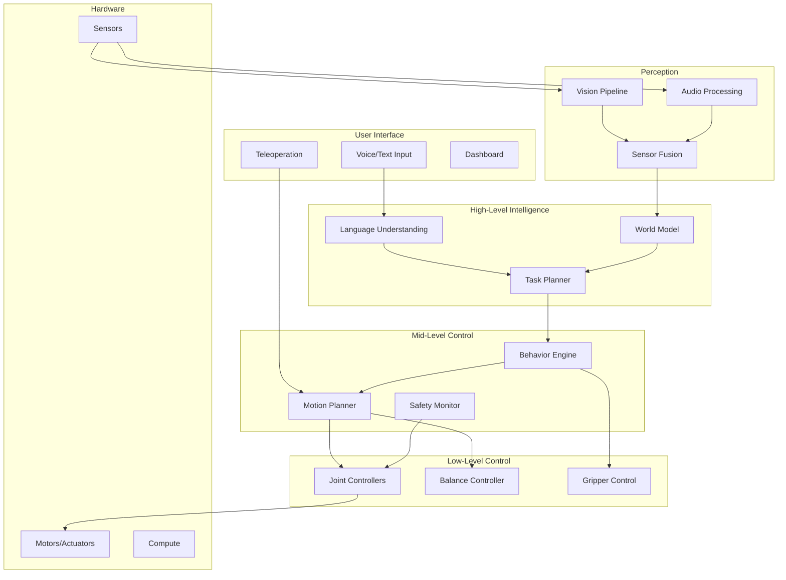

# 5.1 Humanoid System Architecture

## Overview

This chapter covers designing a complete software architecture for an intelligent humanoid robot. You'll learn to integrate perception, planning, and control systems into a cohesive architecture that enables natural language control and autonomous behavior.

## Learning Objectives

By the end of this chapter, you will be able to:

- Design modular robot software architectures
- Implement multi-level control hierarchies
- Create state machines for behavior management
- Build reliable communication between subsystems
- Monitor and debug complex robotic systems

## Prerequisites

- Completed Modules 1-4
- Strong understanding of ROS 2
- Experience with real-time systems

## 5.1.1 Architecture Overview

### Complete System Architecture



### Design Principles

| Principle | Description | Implementation |
|-----------|-------------|----------------|
| Modularity | Independent, replaceable components | ROS 2 nodes with defined interfaces |
| Hierarchy | Layered control abstraction | High/Mid/Low level separation |
| Safety First | Always maintain safe operation | Hardware limits, watchdogs, e-stops |
| Real-time | Deterministic control loops | Separate RT and non-RT processes |
| Observability | Full system state visibility | Logging, metrics, visualization |

## 5.1.2 Component Architecture

### Node Organization

```python
# humanoid_bringup/launch/humanoid_full.launch.py
from launch import LaunchDescription
from launch_ros.actions import Node, ComposableNodeContainer
from launch_ros.descriptions import ComposableNode
from launch.actions import IncludeLaunchDescription

def generate_launch_description():
    return LaunchDescription([
        # ============ Perception Layer ============
        IncludeLaunchDescription(
            'humanoid_perception/launch/perception.launch.py'
        ),

        # ============ Intelligence Layer ============
        Node(
            package='humanoid_nlp',
            executable='language_understanding_node',
            name='language_understanding',
            parameters=[{'model': 'llama-3-8b'}]
        ),
        Node(
            package='humanoid_planning',
            executable='task_planner_node',
            name='task_planner'
        ),
        Node(
            package='humanoid_world',
            executable='world_model_node',
            name='world_model'
        ),

        # ============ Control Layer ============
        Node(
            package='humanoid_behavior',
            executable='behavior_engine_node',
            name='behavior_engine'
        ),
        Node(
            package='humanoid_motion',
            executable='motion_planner_node',
            name='motion_planner'
        ),

        # ============ Safety Layer ============
        Node(
            package='humanoid_safety',
            executable='safety_monitor_node',
            name='safety_monitor',
            parameters=[{
                'joint_limits_file': 'config/joint_limits.yaml',
                'workspace_file': 'config/workspace.yaml'
            }]
        ),

        # ============ Low-Level Control ============
        IncludeLaunchDescription(
            'humanoid_controllers/launch/controllers.launch.py'
        ),
    ])
```

### Interface Definitions

```python
# humanoid_interfaces/msg/RobotCommand.msg
# High-level command from task planner to behavior engine

std_msgs/Header header
string command_type        # "manipulation", "locomotion", "speech"
string natural_language    # Original instruction
string[] target_objects    # Grounded object references
geometry_msgs/Pose[] target_poses  # Target poses for manipulation
float64 priority          # 0.0 (low) to 1.0 (high)
duration timeout
```

```python
# humanoid_interfaces/msg/BehaviorStatus.msg
# Status from behavior engine

std_msgs/Header header
string current_behavior    # Active behavior name
string[] active_skills     # Currently executing skills
float64 progress          # 0.0 to 1.0
string status             # "running", "succeeded", "failed", "preempted"
string failure_reason     # If failed
```

```python
# humanoid_interfaces/srv/ExecuteTask.srv
# Service to execute high-level task

string task_description
string[] constraints
---
bool accepted
string task_id
string rejection_reason
```

## 5.1.3 Control Hierarchy

### Multi-Level Control

```python
# control_hierarchy.py
import rclpy
from rclpy.node import Node
from rclpy.callback_groups import ReentrantCallbackGroup, MutuallyExclusiveCallbackGroup
from rclpy.executors import MultiThreadedExecutor
import threading

class ControlHierarchy:
    """
    Three-level control hierarchy:
    - Strategic: Task planning (1-10 Hz)
    - Tactical: Motion planning (10-100 Hz)
    - Reactive: Joint control (100-1000 Hz)
    """

    def __init__(self):
        self.strategic_rate = 5.0    # Hz
        self.tactical_rate = 50.0    # Hz
        self.reactive_rate = 500.0   # Hz

        self.current_task = None
        self.current_motion = None
        self.current_command = None

        # Thread-safe communication
        self.task_lock = threading.Lock()
        self.motion_lock = threading.Lock()

    def strategic_loop(self, world_state, user_command):
        """
        High-level task planning
        Runs at 5 Hz
        """
        with self.task_lock:
            # Plan task sequence
            if user_command:
                self.current_task = self.plan_task(user_command, world_state)

            # Check task progress
            if self.current_task:
                status = self.check_task_status()
                if status == 'completed':
                    self.current_task = None

            return self.current_task

    def tactical_loop(self, robot_state, obstacles):
        """
        Motion planning and obstacle avoidance
        Runs at 50 Hz
        """
        with self.motion_lock:
            if self.current_task is None:
                return None

            # Get current subtask
            subtask = self.current_task.get_current_subtask()

            # Plan motion
            self.current_motion = self.plan_motion(
                robot_state,
                subtask.target,
                obstacles
            )

            return self.current_motion

    def reactive_loop(self, joint_states, sensor_data):
        """
        Low-level joint control with reactive behaviors
        Runs at 500 Hz
        """
        # Get motion target
        with self.motion_lock:
            target = self.current_motion

        if target is None:
            return self.hold_position(joint_states)

        # Compute joint commands
        command = self.compute_joint_command(joint_states, target)

        # Apply reactive behaviors (collision avoidance, balance)
        command = self.apply_reactive_behaviors(command, sensor_data)

        # Safety limits
        command = self.apply_safety_limits(command, joint_states)

        return command
```

### Real-Time Control Node

```python
# rt_controller.py
import rclpy
from rclpy.node import Node
from rclpy.qos import QoSProfile, ReliabilityPolicy, HistoryPolicy
from sensor_msgs.msg import JointState
from std_msgs.msg import Float64MultiArray
import numpy as np

class RTController(Node):
    """Real-time joint controller at 500 Hz"""

    def __init__(self):
        super().__init__('rt_controller')

        # Real-time QoS
        rt_qos = QoSProfile(
            reliability=ReliabilityPolicy.BEST_EFFORT,
            history=HistoryPolicy.KEEP_LAST,
            depth=1
        )

        # Subscribers
        self.joint_sub = self.create_subscription(
            JointState, '/joint_states', self.joint_callback, rt_qos
        )
        self.target_sub = self.create_subscription(
            Float64MultiArray, '/joint_targets', self.target_callback, rt_qos
        )

        # Publisher
        self.cmd_pub = self.create_publisher(
            Float64MultiArray, '/joint_commands', rt_qos
        )

        # Control loop at 500 Hz
        self.control_timer = self.create_timer(0.002, self.control_loop)

        # State
        self.current_joints = None
        self.target_joints = None

        # PD gains
        self.kp = np.array([100.0] * 7)
        self.kd = np.array([10.0] * 7)

    def joint_callback(self, msg):
        self.current_joints = {
            'position': np.array(msg.position),
            'velocity': np.array(msg.velocity)
        }

    def target_callback(self, msg):
        self.target_joints = np.array(msg.data)

    def control_loop(self):
        if self.current_joints is None or self.target_joints is None:
            return

        # PD control
        pos_error = self.target_joints - self.current_joints['position']
        vel_error = -self.current_joints['velocity']

        torque = self.kp * pos_error + self.kd * vel_error

        # Publish command
        msg = Float64MultiArray()
        msg.data = torque.tolist()
        self.cmd_pub.publish(msg)
```

## 5.1.4 Behavior Engine

### Behavior Tree Implementation

```python
# behavior_engine.py
import py_trees
from py_trees.behaviour import Behaviour
from py_trees.common import Status
from py_trees.composites import Sequence, Selector, Parallel
from py_trees.decorators import Retry, Timeout
import rclpy

class HumanoidBehaviorTree:
    """Behavior tree for humanoid task execution"""

    def __init__(self, node):
        self.node = node
        self.blackboard = py_trees.blackboard.Client(name="Humanoid")
        self.blackboard.register_key(key="target_object", access=py_trees.common.Access.WRITE)
        self.blackboard.register_key(key="robot_state", access=py_trees.common.Access.WRITE)

        self.tree = self.create_tree()

    def create_tree(self):
        """Create the main behavior tree"""

        # Pick and place behavior
        pick_and_place = Sequence(
            name="PickAndPlace",
            memory=True,
            children=[
                # Perception
                Sequence(
                    name="Perceive",
                    children=[
                        GroundObject(self.node, "target"),
                        LocalizeObject(self.node, "target"),
                        CheckReachable(self.node, "target")
                    ]
                ),
                # Approach
                Selector(
                    name="Approach",
                    children=[
                        AlreadyAtTarget(self.node),
                        NavigateToTarget(self.node, "target")
                    ]
                ),
                # Grasp
                Retry(
                    name="RetryGrasp",
                    num_failures=3,
                    child=Sequence(
                        name="Grasp",
                        children=[
                            PlanGrasp(self.node, "target"),
                            OpenGripper(self.node),
                            MoveToPregrasp(self.node),
                            MoveToGrasp(self.node),
                            CloseGripper(self.node),
                            LiftObject(self.node)
                        ]
                    )
                ),
                # Place
                Sequence(
                    name="Place",
                    children=[
                        GetPlaceLocation(self.node),
                        MoveToPlace(self.node),
                        OpenGripper(self.node),
                        Retreat(self.node)
                    ]
                )
            ]
        )

        # Root with safety monitor
        root = Parallel(
            name="Root",
            policy=py_trees.common.ParallelPolicy.SuccessOnAll(),
            children=[
                SafetyMonitor(self.node),
                pick_and_place
            ]
        )

        return py_trees.trees.BehaviourTree(root)

    def tick(self):
        """Tick the behavior tree"""
        self.tree.tick()
        return self.tree.root.status


class GroundObject(Behaviour):
    """Ground language reference to object"""

    def __init__(self, node, object_key):
        super().__init__(name=f"Ground_{object_key}")
        self.node = node
        self.object_key = object_key
        self.grounding_client = None

    def setup(self, **kwargs):
        self.grounding_client = self.node.create_client(
            GroundExpression, '/ground_expression'
        )

    def update(self):
        # Get target from blackboard
        bb = py_trees.blackboard.Blackboard()
        instruction = bb.get(f"{self.object_key}_instruction")

        # Call grounding service
        request = GroundExpression.Request()
        request.expression = instruction

        future = self.grounding_client.call_async(request)
        rclpy.spin_until_future_complete(self.node, future, timeout_sec=5.0)

        if future.result() and future.result().success:
            bb.set(f"{self.object_key}_pose", future.result().pose)
            return Status.SUCCESS
        else:
            return Status.FAILURE


class SafetyMonitor(Behaviour):
    """Continuous safety monitoring"""

    def __init__(self, node):
        super().__init__(name="SafetyMonitor")
        self.node = node

    def update(self):
        bb = py_trees.blackboard.Blackboard()
        robot_state = bb.get("robot_state")

        # Check safety conditions
        if self.check_joint_limits(robot_state):
            return Status.RUNNING
        if self.check_balance(robot_state):
            return Status.RUNNING
        if self.check_collisions(robot_state):
            return Status.RUNNING

        # Safety violation
        self.node.get_logger().error("Safety violation detected!")
        return Status.FAILURE

    def check_joint_limits(self, state):
        # Check all joints within limits
        return True

    def check_balance(self, state):
        # Check CoM within support polygon
        return True

    def check_collisions(self, state):
        # Check for self-collision and obstacles
        return True
```

## 5.1.5 World Model

### Scene Graph Representation

```python
# world_model.py
import rclpy
from rclpy.node import Node
import networkx as nx
import numpy as np
from dataclasses import dataclass
from typing import Dict, List, Optional

@dataclass
class SceneObject:
    """Representation of an object in the world"""
    id: str
    class_name: str
    pose: np.ndarray  # 4x4 transform
    bbox: np.ndarray  # [x, y, z, w, h, d]
    confidence: float
    properties: Dict
    last_seen: float  # timestamp

class WorldModel(Node):
    """Maintains a scene graph of the world"""

    def __init__(self):
        super().__init__('world_model')

        # Scene graph
        self.graph = nx.DiGraph()
        self.objects: Dict[str, SceneObject] = {}

        # Spatial relations
        self.relations = ['on', 'in', 'next_to', 'left_of', 'right_of', 'above', 'below']

        # Subscribers
        self.detection_sub = self.create_subscription(
            Detection3DArray, '/detections_3d',
            self.detection_callback, 10
        )

        # Publishers
        self.scene_pub = self.create_publisher(
            SceneGraph, '/world_model/scene_graph', 10
        )

        # Update timer
        self.update_timer = self.create_timer(0.1, self.update_relations)

    def detection_callback(self, msg):
        """Update objects from detections"""
        current_time = self.get_clock().now().nanoseconds / 1e9

        for det in msg.detections:
            obj_id = det.id
            pose = self.pose_to_matrix(det.pose)

            if obj_id in self.objects:
                # Update existing object with EKF
                self.objects[obj_id] = self.update_object(
                    self.objects[obj_id], det, current_time
                )
            else:
                # Add new object
                self.objects[obj_id] = SceneObject(
                    id=obj_id,
                    class_name=det.class_name,
                    pose=pose,
                    bbox=np.array(det.bbox),
                    confidence=det.confidence,
                    properties={},
                    last_seen=current_time
                )
                self.graph.add_node(obj_id, object=self.objects[obj_id])

        # Remove stale objects
        self.prune_stale_objects(current_time, max_age=5.0)

    def update_relations(self):
        """Update spatial relations between objects"""
        for obj1_id, obj1 in self.objects.items():
            for obj2_id, obj2 in self.objects.items():
                if obj1_id == obj2_id:
                    continue

                # Compute relations
                relations = self.compute_relations(obj1, obj2)

                # Update graph edges
                for rel in relations:
                    self.graph.add_edge(obj1_id, obj2_id, relation=rel)

        # Publish scene graph
        self.publish_scene_graph()

    def compute_relations(self, obj1: SceneObject, obj2: SceneObject) -> List[str]:
        """Compute spatial relations between two objects"""
        relations = []
        pos1 = obj1.pose[:3, 3]
        pos2 = obj2.pose[:3, 3]

        # Horizontal relations
        dx = pos1[0] - pos2[0]
        dy = pos1[1] - pos2[1]
        dz = pos1[2] - pos2[2]

        threshold = 0.1  # meters

        if abs(dx) > threshold:
            relations.append('left_of' if dx < 0 else 'right_of')

        if abs(dy) > threshold:
            relations.append('in_front_of' if dy < 0 else 'behind')

        if abs(dz) > threshold:
            relations.append('below' if dz < 0 else 'above')

        # Contact relations
        if self.is_on(obj1, obj2):
            relations.append('on')

        if self.is_next_to(obj1, obj2):
            relations.append('next_to')

        return relations

    def query(self, query: str) -> List[SceneObject]:
        """Query world model with natural language"""
        # Parse query
        # e.g., "red cup on the table"

        # Find matching objects
        matches = []
        for obj in self.objects.values():
            if self.matches_query(obj, query):
                matches.append(obj)

        return matches

    def get_object_by_id(self, obj_id: str) -> Optional[SceneObject]:
        return self.objects.get(obj_id)

    def get_objects_by_class(self, class_name: str) -> List[SceneObject]:
        return [obj for obj in self.objects.values() if obj.class_name == class_name]

    def get_related_objects(self, obj_id: str, relation: str) -> List[SceneObject]:
        """Get objects related to given object"""
        related = []
        for _, neighbor, data in self.graph.edges(obj_id, data=True):
            if data.get('relation') == relation:
                related.append(self.objects[neighbor])
        return related
```

## 5.1.6 System Monitoring

### Diagnostics and Health Monitoring

```python
# system_monitor.py
import rclpy
from rclpy.node import Node
from diagnostic_msgs.msg import DiagnosticArray, DiagnosticStatus, KeyValue
from std_msgs.msg import Float64
import psutil
import time

class SystemMonitor(Node):
    """Monitor system health and performance"""

    def __init__(self):
        super().__init__('system_monitor')

        # Publishers
        self.diag_pub = self.create_publisher(
            DiagnosticArray, '/diagnostics', 10
        )
        self.cpu_pub = self.create_publisher(
            Float64, '/monitor/cpu_usage', 10
        )
        self.mem_pub = self.create_publisher(
            Float64, '/monitor/memory_usage', 10
        )

        # Timers
        self.diag_timer = self.create_timer(1.0, self.publish_diagnostics)

        # Component status tracking
        self.component_heartbeats = {}
        self.heartbeat_timeout = 2.0  # seconds

        # Subscribe to component heartbeats
        self.heartbeat_sub = self.create_subscription(
            Heartbeat, '/heartbeats', self.heartbeat_callback, 10
        )

    def publish_diagnostics(self):
        """Publish system diagnostics"""
        diag_array = DiagnosticArray()
        diag_array.header.stamp = self.get_clock().now().to_msg()

        # System resources
        diag_array.status.append(self.get_system_status())

        # Component status
        for component, last_beat in self.component_heartbeats.items():
            diag_array.status.append(
                self.get_component_status(component, last_beat)
            )

        self.diag_pub.publish(diag_array)

        # Individual metrics
        cpu_msg = Float64(data=psutil.cpu_percent())
        mem_msg = Float64(data=psutil.virtual_memory().percent)
        self.cpu_pub.publish(cpu_msg)
        self.mem_pub.publish(mem_msg)

    def get_system_status(self):
        """Get overall system status"""
        status = DiagnosticStatus()
        status.name = "System Resources"
        status.hardware_id = "main_computer"

        cpu = psutil.cpu_percent()
        mem = psutil.virtual_memory().percent
        disk = psutil.disk_usage('/').percent

        status.values = [
            KeyValue(key="CPU Usage", value=f"{cpu:.1f}%"),
            KeyValue(key="Memory Usage", value=f"{mem:.1f}%"),
            KeyValue(key="Disk Usage", value=f"{disk:.1f}%"),
            KeyValue(key="GPU Memory", value=self.get_gpu_memory())
        ]

        # Set level based on thresholds
        if cpu > 90 or mem > 90:
            status.level = DiagnosticStatus.ERROR
            status.message = "Critical resource usage"
        elif cpu > 70 or mem > 70:
            status.level = DiagnosticStatus.WARN
            status.message = "High resource usage"
        else:
            status.level = DiagnosticStatus.OK
            status.message = "Resources OK"

        return status

    def get_component_status(self, component, last_heartbeat):
        """Get component health status"""
        status = DiagnosticStatus()
        status.name = f"Component: {component}"

        current_time = time.time()
        time_since_heartbeat = current_time - last_heartbeat

        status.values = [
            KeyValue(key="Last Heartbeat", value=f"{time_since_heartbeat:.2f}s ago")
        ]

        if time_since_heartbeat > self.heartbeat_timeout:
            status.level = DiagnosticStatus.ERROR
            status.message = "No heartbeat received"
        else:
            status.level = DiagnosticStatus.OK
            status.message = "Component active"

        return status

    def get_gpu_memory(self):
        """Get GPU memory usage"""
        try:
            import pynvml
            pynvml.nvmlInit()
            handle = pynvml.nvmlDeviceGetHandleByIndex(0)
            info = pynvml.nvmlDeviceGetMemoryInfo(handle)
            return f"{info.used / info.total * 100:.1f}%"
        except:
            return "N/A"
```

## Hands-On Exercise

1. Design node architecture for your humanoid
2. Implement the three-level control hierarchy
3. Create a behavior tree for pick-and-place
4. Build a world model with scene graph
5. Set up system monitoring and diagnostics

## Summary

In this chapter, you learned:

- Modular architecture design for humanoids
- Multi-level control hierarchies
- Behavior tree implementation
- World model with scene graphs
- System monitoring and diagnostics

## Next Steps

Continue to [5.2 Sensor Fusion and State Estimation](5.2-sensor-fusion) to learn how to combine multiple sensors for robust perception.
