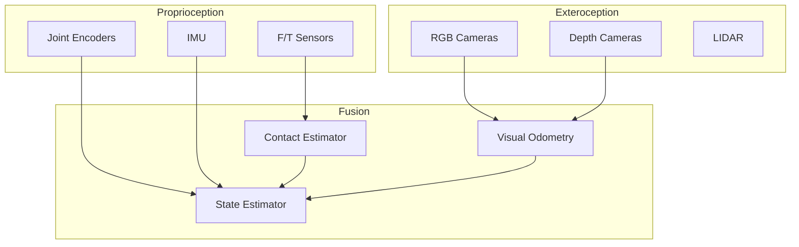

# 5.2 Sensor Fusion and State Estimation

## Overview

Robust humanoid robot operation requires fusing data from multiple sensors to estimate the robot's state and perceive its environment. This chapter covers sensor fusion techniques for combining IMU, camera, force/torque, and joint encoder data.

## Learning Objectives

By the end of this chapter, you will be able to:

- Implement Extended Kalman Filter for state estimation
- Fuse IMU and visual odometry for localization
- Estimate contact forces and center of pressure
- Combine multiple perception modalities
- Handle sensor failures gracefully

## Prerequisites

- Completed Chapter 5.1 (System Architecture)
- Understanding of probability and linear algebra
- Familiarity with Kalman filtering concepts

## 5.2.1 State Estimation Overview

### Humanoid State Vector

```python
# state_definition.py
import numpy as np
from dataclasses import dataclass

@dataclass
class HumanoidState:
    """Complete humanoid robot state"""

    # Base pose (world frame)
    base_position: np.ndarray      # [x, y, z]
    base_orientation: np.ndarray   # [qw, qx, qy, qz]
    base_linear_vel: np.ndarray    # [vx, vy, vz]
    base_angular_vel: np.ndarray   # [wx, wy, wz]

    # Joint state
    joint_positions: np.ndarray    # [q1, q2, ..., qn]
    joint_velocities: np.ndarray   # [dq1, dq2, ..., dqn]

    # Contact state
    contact_states: np.ndarray     # [left_foot, right_foot, left_hand, right_hand]
    contact_forces: np.ndarray     # Forces at each contact

    # Derived quantities
    center_of_mass: np.ndarray     # [x, y, z] in world frame
    angular_momentum: np.ndarray   # [Lx, Ly, Lz]

    @property
    def state_dim(self):
        return (
            3 +  # position
            4 +  # orientation
            3 +  # linear velocity
            3 +  # angular velocity
            len(self.joint_positions) +
            len(self.joint_velocities)
        )
```

### Sensor Suite



## 5.2.2 Extended Kalman Filter

### EKF Implementation

```python
# ekf_state_estimator.py
import numpy as np
from scipy.spatial.transform import Rotation

class EKFStateEstimator:
    """Extended Kalman Filter for humanoid state estimation"""

    def __init__(self, state_dim, num_joints):
        self.state_dim = state_dim
        self.num_joints = num_joints

        # State: [pos(3), quat(4), vel(3), omega(3), joints(n), joint_vels(n)]
        self.x = np.zeros(state_dim)
        self.x[3] = 1.0  # Initial quaternion w

        # Covariance
        self.P = np.eye(state_dim) * 0.1

        # Process noise
        self.Q = self.build_process_noise()

        # Measurement noise (updated per sensor)
        self.R_imu = np.diag([0.01, 0.01, 0.01, 0.001, 0.001, 0.001])
        self.R_encoder = np.eye(num_joints) * 0.0001
        self.R_visual = np.diag([0.05, 0.05, 0.05, 0.01, 0.01, 0.01])

    def build_process_noise(self):
        """Build process noise covariance"""
        Q = np.zeros((self.state_dim, self.state_dim))

        # Position noise
        Q[0:3, 0:3] = np.eye(3) * 0.001

        # Orientation noise
        Q[3:7, 3:7] = np.eye(4) * 0.0001

        # Velocity noise
        Q[7:10, 7:10] = np.eye(3) * 0.01

        # Angular velocity noise
        Q[10:13, 10:13] = np.eye(3) * 0.01

        # Joint noise
        joint_start = 13
        Q[joint_start:joint_start+self.num_joints,
          joint_start:joint_start+self.num_joints] = np.eye(self.num_joints) * 0.001

        return Q

    def predict(self, dt, control_input=None):
        """EKF prediction step"""
        # Extract state components
        pos = self.x[0:3]
        quat = self.x[3:7]
        vel = self.x[7:10]
        omega = self.x[10:13]

        # State transition
        # Position: p_new = p + v * dt
        pos_new = pos + vel * dt

        # Orientation: q_new = q * exp(omega * dt / 2)
        rot = Rotation.from_quat([quat[1], quat[2], quat[3], quat[0]])
        delta_rot = Rotation.from_rotvec(omega * dt)
        rot_new = rot * delta_rot
        quat_new = rot_new.as_quat()
        quat_new = np.array([quat_new[3], quat_new[0], quat_new[1], quat_new[2]])

        # Velocity (integrate acceleration if available)
        vel_new = vel  # Assume constant velocity model

        # Angular velocity
        omega_new = omega

        # Update state
        self.x[0:3] = pos_new
        self.x[3:7] = quat_new / np.linalg.norm(quat_new)
        self.x[7:10] = vel_new
        self.x[10:13] = omega_new

        # Jacobian of state transition
        F = self.compute_jacobian_F(dt)

        # Predict covariance
        self.P = F @ self.P @ F.T + self.Q

    def update_imu(self, accel, gyro, dt):
        """Update with IMU measurement"""
        # Measurement: [accel, gyro]
        z = np.concatenate([accel, gyro])

        # Predicted measurement
        quat = self.x[3:7]
        rot = Rotation.from_quat([quat[1], quat[2], quat[3], quat[0]])

        # Expected acceleration (gravity in body frame)
        gravity_world = np.array([0, 0, -9.81])
        accel_pred = rot.inv().apply(gravity_world) + self.x[7:10] / dt
        gyro_pred = self.x[10:13]

        z_pred = np.concatenate([accel_pred, gyro_pred])

        # Measurement Jacobian
        H = self.compute_jacobian_H_imu()

        # Kalman gain
        S = H @ self.P @ H.T + self.R_imu
        K = self.P @ H.T @ np.linalg.inv(S)

        # Update
        innovation = z - z_pred
        self.x = self.x + K @ innovation
        self.P = (np.eye(self.state_dim) - K @ H) @ self.P

        # Normalize quaternion
        self.x[3:7] = self.x[3:7] / np.linalg.norm(self.x[3:7])

    def update_encoders(self, joint_positions, joint_velocities):
        """Update with joint encoder measurements"""
        joint_start = 13
        n = self.num_joints

        z = np.concatenate([joint_positions, joint_velocities])
        z_pred = np.concatenate([
            self.x[joint_start:joint_start+n],
            self.x[joint_start+n:joint_start+2*n]
        ])

        H = np.zeros((2*n, self.state_dim))
        H[:n, joint_start:joint_start+n] = np.eye(n)
        H[n:, joint_start+n:joint_start+2*n] = np.eye(n)

        R = np.block([
            [self.R_encoder, np.zeros((n, n))],
            [np.zeros((n, n)), self.R_encoder * 10]
        ])

        S = H @ self.P @ H.T + R
        K = self.P @ H.T @ np.linalg.inv(S)

        self.x = self.x + K @ (z - z_pred)
        self.P = (np.eye(self.state_dim) - K @ H) @ self.P

    def update_visual_odometry(self, vo_pose):
        """Update with visual odometry measurement"""
        # vo_pose: [x, y, z, roll, pitch, yaw]
        z = vo_pose

        # Predicted measurement
        pos = self.x[0:3]
        quat = self.x[3:7]
        rot = Rotation.from_quat([quat[1], quat[2], quat[3], quat[0]])
        euler = rot.as_euler('xyz')

        z_pred = np.concatenate([pos, euler])

        H = np.zeros((6, self.state_dim))
        H[0:3, 0:3] = np.eye(3)  # Position
        H[3:6, 3:7] = self.euler_jacobian(quat)  # Orientation

        S = H @ self.P @ H.T + self.R_visual
        K = self.P @ H.T @ np.linalg.inv(S)

        self.x = self.x + K @ (z - z_pred)
        self.P = (np.eye(self.state_dim) - K @ H) @ self.P

        # Normalize quaternion
        self.x[3:7] = self.x[3:7] / np.linalg.norm(self.x[3:7])

    def get_state(self):
        """Return current state estimate"""
        return HumanoidState(
            base_position=self.x[0:3],
            base_orientation=self.x[3:7],
            base_linear_vel=self.x[7:10],
            base_angular_vel=self.x[10:13],
            joint_positions=self.x[13:13+self.num_joints],
            joint_velocities=self.x[13+self.num_joints:13+2*self.num_joints],
            contact_states=None,
            contact_forces=None,
            center_of_mass=None,
            angular_momentum=None
        )
```

## 5.2.3 Contact Estimation

### Contact Force Estimation

```python
# contact_estimator.py
import numpy as np

class ContactEstimator:
    """Estimate contact forces and center of pressure"""

    def __init__(self, robot_model):
        self.robot = robot_model
        self.contact_threshold = 10.0  # N

        # Contact state history for filtering
        self.left_foot_history = []
        self.right_foot_history = []
        self.history_size = 5

    def estimate_contacts(self, ft_left, ft_right, joint_positions):
        """
        Estimate contact state from F/T sensor readings

        Args:
            ft_left: WrenchStamped from left foot
            ft_right: WrenchStamped from right foot
            joint_positions: Current joint positions

        Returns:
            ContactState with forces and CoP
        """
        # Extract forces
        f_left = np.array([
            ft_left.wrench.force.x,
            ft_left.wrench.force.y,
            ft_left.wrench.force.z
        ])
        f_right = np.array([
            ft_right.wrench.force.x,
            ft_right.wrench.force.y,
            ft_right.wrench.force.z
        ])

        # Extract torques
        t_left = np.array([
            ft_left.wrench.torque.x,
            ft_left.wrench.torque.y,
            ft_left.wrench.torque.z
        ])
        t_right = np.array([
            ft_right.wrench.torque.x,
            ft_right.wrench.torque.y,
            ft_right.wrench.torque.z
        ])

        # Detect contacts
        left_contact = np.linalg.norm(f_left) > self.contact_threshold
        right_contact = np.linalg.norm(f_right) > self.contact_threshold

        # Filter contacts
        left_contact = self.filter_contact(
            left_contact, self.left_foot_history
        )
        right_contact = self.filter_contact(
            right_contact, self.right_foot_history
        )

        # Compute local CoP for each foot
        cop_left = self.compute_local_cop(f_left, t_left) if left_contact else None
        cop_right = self.compute_local_cop(f_right, t_right) if right_contact else None

        # Get foot poses in world frame
        left_foot_pose = self.robot.get_link_pose('left_foot', joint_positions)
        right_foot_pose = self.robot.get_link_pose('right_foot', joint_positions)

        # Transform CoP to world frame
        cop_world_left = self.transform_cop(cop_left, left_foot_pose) if cop_left is not None else None
        cop_world_right = self.transform_cop(cop_right, right_foot_pose) if cop_right is not None else None

        # Compute combined CoP
        cop_combined = self.compute_combined_cop(
            f_left, f_right,
            cop_world_left, cop_world_right,
            left_contact, right_contact
        )

        return ContactState(
            left_contact=left_contact,
            right_contact=right_contact,
            left_force=f_left if left_contact else np.zeros(3),
            right_force=f_right if right_contact else np.zeros(3),
            left_cop=cop_world_left,
            right_cop=cop_world_right,
            combined_cop=cop_combined
        )

    def compute_local_cop(self, force, torque):
        """Compute center of pressure in sensor frame"""
        fz = force[2]
        if abs(fz) < 1.0:  # Avoid division by small numbers
            return np.zeros(2)

        cop_x = -torque[1] / fz
        cop_y = torque[0] / fz

        return np.array([cop_x, cop_y])

    def compute_combined_cop(self, f_left, f_right, cop_left, cop_right,
                             left_contact, right_contact):
        """Compute combined center of pressure"""
        if not left_contact and not right_contact:
            return None

        total_fz = 0.0
        cop = np.zeros(2)

        if left_contact and cop_left is not None:
            fz_left = f_left[2]
            cop += fz_left * cop_left[:2]
            total_fz += fz_left

        if right_contact and cop_right is not None:
            fz_right = f_right[2]
            cop += fz_right * cop_right[:2]
            total_fz += fz_right

        if total_fz > 1.0:
            cop /= total_fz
            return cop

        return None

    def filter_contact(self, contact, history):
        """Filter contact detection with history"""
        history.append(contact)
        if len(history) > self.history_size:
            history.pop(0)

        # Require majority for state change
        return sum(history) > len(history) / 2

    def estimate_external_wrench(self, ft_left, ft_right, expected_wrench):
        """Estimate external forces on the robot"""
        measured_wrench = self.combine_wrenches(ft_left, ft_right)
        external_wrench = measured_wrench - expected_wrench
        return external_wrench


@dataclass
class ContactState:
    left_contact: bool
    right_contact: bool
    left_force: np.ndarray
    right_force: np.ndarray
    left_cop: np.ndarray
    right_cop: np.ndarray
    combined_cop: np.ndarray
```

## 5.2.4 Visual-Inertial Odometry

### VIO Integration

```python
# vio_fusion.py
import numpy as np
from collections import deque

class VisualInertialOdometry:
    """Fuse visual odometry with IMU for robust localization"""

    def __init__(self):
        # State: [position, velocity, orientation, accel_bias, gyro_bias]
        self.state_dim = 15
        self.x = np.zeros(self.state_dim)
        self.x[6] = 1.0  # Quaternion w

        self.P = np.eye(self.state_dim) * 0.01

        # IMU buffer for pre-integration
        self.imu_buffer = deque(maxlen=100)

        # Visual keyframes
        self.keyframes = []
        self.max_keyframes = 10

        # Pre-integration
        self.delta_R = np.eye(3)
        self.delta_v = np.zeros(3)
        self.delta_p = np.zeros(3)
        self.delta_t = 0.0

    def process_imu(self, accel, gyro, timestamp):
        """Process IMU measurement with pre-integration"""
        self.imu_buffer.append({
            'accel': accel,
            'gyro': gyro,
            'timestamp': timestamp
        })

        # Get biases
        accel_bias = self.x[9:12]
        gyro_bias = self.x[12:15]

        # Correct measurements
        accel_corrected = accel - accel_bias
        gyro_corrected = gyro - gyro_bias

        # Compute dt
        if len(self.imu_buffer) < 2:
            return
        dt = timestamp - self.imu_buffer[-2]['timestamp']

        # Pre-integrate
        self.preintegrate(accel_corrected, gyro_corrected, dt)

    def preintegrate(self, accel, gyro, dt):
        """Pre-integrate IMU measurements between keyframes"""
        # Update rotation
        theta = gyro * dt
        dR = self.exp_so3(theta)
        self.delta_R = self.delta_R @ dR

        # Update velocity
        self.delta_v += self.delta_R @ accel * dt

        # Update position
        self.delta_p += self.delta_v * dt + 0.5 * self.delta_R @ accel * dt**2

        self.delta_t += dt

    def process_visual(self, visual_pose, timestamp):
        """Process visual odometry measurement"""
        # Check if new keyframe
        if self.is_new_keyframe(visual_pose):
            self.add_keyframe(visual_pose, timestamp)

            # Apply pre-integrated IMU
            self.apply_preintegration()

            # Update with visual measurement
            self.update_visual(visual_pose)

            # Reset pre-integration
            self.reset_preintegration()

    def is_new_keyframe(self, pose):
        """Check if pose qualifies as new keyframe"""
        if len(self.keyframes) == 0:
            return True

        last_pose = self.keyframes[-1]['pose']

        # Distance threshold
        dist = np.linalg.norm(pose[:3] - last_pose[:3])
        if dist > 0.3:  # 30cm
            return True

        # Rotation threshold
        rot_diff = np.linalg.norm(pose[3:] - last_pose[3:])
        if rot_diff > 0.2:  # ~11 degrees
            return True

        return False

    def apply_preintegration(self):
        """Apply pre-integrated IMU to state"""
        # Current state
        p = self.x[0:3]
        v = self.x[3:6]
        q = self.x[6:9]  # Simplified: using euler

        # Gravity
        g = np.array([0, 0, -9.81])

        # Update position
        self.x[0:3] = p + v * self.delta_t + 0.5 * g * self.delta_t**2 + \
                      self.delta_R @ self.delta_p

        # Update velocity
        self.x[3:6] = v + g * self.delta_t + self.delta_R @ self.delta_v

        # Update orientation
        R = self.euler_to_rotation(q)
        R_new = R @ self.delta_R
        self.x[6:9] = self.rotation_to_euler(R_new)

    def update_visual(self, visual_pose):
        """EKF update with visual measurement"""
        # Measurement: [x, y, z, roll, pitch, yaw]
        z = visual_pose

        # Predicted measurement
        z_pred = np.concatenate([self.x[0:3], self.x[6:9]])

        # Measurement Jacobian
        H = np.zeros((6, self.state_dim))
        H[0:3, 0:3] = np.eye(3)
        H[3:6, 6:9] = np.eye(3)

        # Measurement noise
        R = np.diag([0.02, 0.02, 0.02, 0.01, 0.01, 0.02])

        # Kalman update
        S = H @ self.P @ H.T + R
        K = self.P @ H.T @ np.linalg.inv(S)

        innovation = z - z_pred
        self.x = self.x + K @ innovation
        self.P = (np.eye(self.state_dim) - K @ H) @ self.P

    def reset_preintegration(self):
        """Reset pre-integration values"""
        self.delta_R = np.eye(3)
        self.delta_v = np.zeros(3)
        self.delta_p = np.zeros(3)
        self.delta_t = 0.0
        self.imu_buffer.clear()

    def exp_so3(self, omega):
        """Exponential map for SO(3)"""
        theta = np.linalg.norm(omega)
        if theta < 1e-10:
            return np.eye(3)

        axis = omega / theta
        K = self.skew(axis)
        return np.eye(3) + np.sin(theta) * K + (1 - np.cos(theta)) * K @ K

    def skew(self, v):
        """Skew-symmetric matrix"""
        return np.array([
            [0, -v[2], v[1]],
            [v[2], 0, -v[0]],
            [-v[1], v[0], 0]
        ])
```

## 5.2.5 ROS 2 Sensor Fusion Node

```python
# sensor_fusion_node.py
import rclpy
from rclpy.node import Node
from sensor_msgs.msg import Imu, JointState, Image
from geometry_msgs.msg import PoseStamped, WrenchStamped
from nav_msgs.msg import Odometry
from tf2_ros import TransformBroadcaster
import numpy as np

class SensorFusionNode(Node):
    """ROS 2 node for multi-sensor fusion"""

    def __init__(self):
        super().__init__('sensor_fusion')

        # Initialize estimators
        num_joints = 20
        state_dim = 13 + 2 * num_joints
        self.ekf = EKFStateEstimator(state_dim, num_joints)
        self.contact_estimator = ContactEstimator(robot_model)
        self.vio = VisualInertialOdometry()

        # TF broadcaster
        self.tf_broadcaster = TransformBroadcaster(self)

        # Subscribers
        self.imu_sub = self.create_subscription(
            Imu, '/imu/data', self.imu_callback, 10
        )
        self.joint_sub = self.create_subscription(
            JointState, '/joint_states', self.joint_callback, 10
        )
        self.ft_left_sub = self.create_subscription(
            WrenchStamped, '/ft/left_ankle', self.ft_left_callback, 10
        )
        self.ft_right_sub = self.create_subscription(
            WrenchStamped, '/ft/right_ankle', self.ft_right_callback, 10
        )
        self.vo_sub = self.create_subscription(
            PoseStamped, '/visual_odometry/pose', self.vo_callback, 10
        )

        # Publishers
        self.odom_pub = self.create_publisher(
            Odometry, '/odom', 10
        )
        self.state_pub = self.create_publisher(
            HumanoidStateMsg, '/humanoid_state', 10
        )

        # Storage for latest measurements
        self.last_imu = None
        self.last_joints = None
        self.last_ft_left = None
        self.last_ft_right = None

        # Main fusion loop at 200 Hz
        self.fusion_timer = self.create_timer(0.005, self.fusion_loop)

        self.get_logger().info('Sensor fusion node initialized')

    def imu_callback(self, msg):
        self.last_imu = msg
        accel = np.array([
            msg.linear_acceleration.x,
            msg.linear_acceleration.y,
            msg.linear_acceleration.z
        ])
        gyro = np.array([
            msg.angular_velocity.x,
            msg.angular_velocity.y,
            msg.angular_velocity.z
        ])
        timestamp = msg.header.stamp.sec + msg.header.stamp.nanosec * 1e-9
        self.vio.process_imu(accel, gyro, timestamp)

    def joint_callback(self, msg):
        self.last_joints = msg

    def ft_left_callback(self, msg):
        self.last_ft_left = msg

    def ft_right_callback(self, msg):
        self.last_ft_right = msg

    def vo_callback(self, msg):
        pose = np.array([
            msg.pose.position.x,
            msg.pose.position.y,
            msg.pose.position.z,
            0, 0, 0  # Simplified: extract euler from quaternion
        ])
        timestamp = msg.header.stamp.sec + msg.header.stamp.nanosec * 1e-9
        self.vio.process_visual(pose, timestamp)

    def fusion_loop(self):
        """Main sensor fusion loop"""
        dt = 0.005

        # Predict step
        self.ekf.predict(dt)

        # Update with available measurements
        if self.last_imu is not None:
            accel = np.array([
                self.last_imu.linear_acceleration.x,
                self.last_imu.linear_acceleration.y,
                self.last_imu.linear_acceleration.z
            ])
            gyro = np.array([
                self.last_imu.angular_velocity.x,
                self.last_imu.angular_velocity.y,
                self.last_imu.angular_velocity.z
            ])
            self.ekf.update_imu(accel, gyro, dt)

        if self.last_joints is not None:
            positions = np.array(self.last_joints.position)
            velocities = np.array(self.last_joints.velocity)
            self.ekf.update_encoders(positions, velocities)

        # Estimate contacts
        if self.last_ft_left is not None and self.last_ft_right is not None:
            contact_state = self.contact_estimator.estimate_contacts(
                self.last_ft_left,
                self.last_ft_right,
                self.last_joints.position if self.last_joints else None
            )

        # Get fused state
        state = self.ekf.get_state()

        # Publish state
        self.publish_state(state)
        self.broadcast_tf(state)

    def publish_state(self, state):
        """Publish fused state"""
        # Odometry message
        odom = Odometry()
        odom.header.stamp = self.get_clock().now().to_msg()
        odom.header.frame_id = 'odom'
        odom.child_frame_id = 'base_link'

        odom.pose.pose.position.x = state.base_position[0]
        odom.pose.pose.position.y = state.base_position[1]
        odom.pose.pose.position.z = state.base_position[2]

        odom.pose.pose.orientation.w = state.base_orientation[0]
        odom.pose.pose.orientation.x = state.base_orientation[1]
        odom.pose.pose.orientation.y = state.base_orientation[2]
        odom.pose.pose.orientation.z = state.base_orientation[3]

        odom.twist.twist.linear.x = state.base_linear_vel[0]
        odom.twist.twist.linear.y = state.base_linear_vel[1]
        odom.twist.twist.linear.z = state.base_linear_vel[2]

        self.odom_pub.publish(odom)

    def broadcast_tf(self, state):
        """Broadcast transform"""
        from geometry_msgs.msg import TransformStamped

        t = TransformStamped()
        t.header.stamp = self.get_clock().now().to_msg()
        t.header.frame_id = 'odom'
        t.child_frame_id = 'base_link'

        t.transform.translation.x = state.base_position[0]
        t.transform.translation.y = state.base_position[1]
        t.transform.translation.z = state.base_position[2]

        t.transform.rotation.w = state.base_orientation[0]
        t.transform.rotation.x = state.base_orientation[1]
        t.transform.rotation.y = state.base_orientation[2]
        t.transform.rotation.z = state.base_orientation[3]

        self.tf_broadcaster.sendTransform(t)


def main():
    rclpy.init()
    node = SensorFusionNode()
    rclpy.spin(node)
    rclpy.shutdown()
```

## Hands-On Exercise

1. Implement EKF for position and orientation estimation
2. Add contact force estimation from F/T sensors
3. Integrate visual odometry with IMU pre-integration
4. Create ROS 2 fusion node with all sensors
5. Test with sensor dropout scenarios

## Summary

In this chapter, you learned:

- Extended Kalman Filter implementation for humanoids
- Contact force and center of pressure estimation
- Visual-inertial odometry fusion
- Multi-sensor ROS 2 integration
- Handling sensor failures

## Next Steps

Continue to [5.3 End-to-End Integration and Testing](5.3-integration-testing) to bring all components together into a working system.
