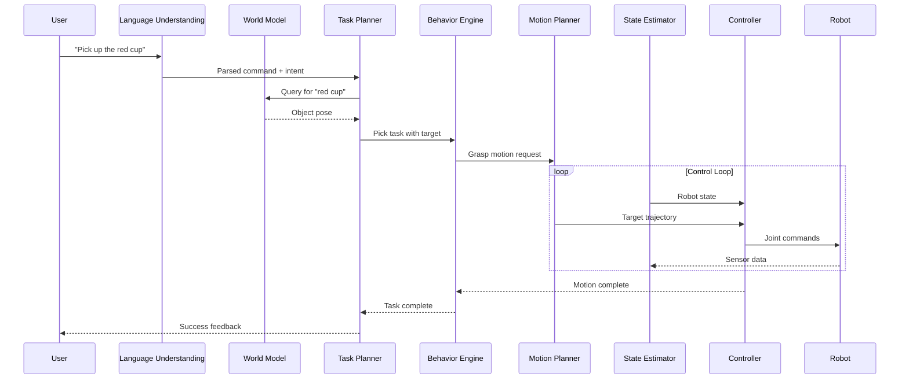

# 5.3 End-to-End Integration and Testing

## Overview

This final chapter brings together all modules into a complete, working humanoid system. You'll learn to integrate perception, planning, and control components, test the system thoroughly, and prepare for real-world deployment.

## Learning Objectives

By the end of this chapter, you will be able to:

- Integrate all system components into a unified pipeline
- Write comprehensive integration tests
- Perform hardware-in-the-loop testing
- Debug complex multi-component systems
- Document and deploy the complete system

## Prerequisites

- Completed Chapters 5.1 and 5.2
- All previous modules completed
- Access to simulation environment

## 5.3.1 Integration Architecture

### Complete Pipeline



### Integration Launch File

```python
# humanoid_integration/launch/full_system.launch.py
from launch import LaunchDescription
from launch_ros.actions import Node, ComposableNodeContainer
from launch.actions import IncludeLaunchDescription, DeclareLaunchArgument
from launch.substitutions import LaunchConfiguration
from launch.conditions import IfCondition

def generate_launch_description():
    # Launch arguments
    use_sim = LaunchConfiguration('use_sim', default='true')
    debug = LaunchConfiguration('debug', default='false')

    return LaunchDescription([
        # Arguments
        DeclareLaunchArgument('use_sim', default_value='true'),
        DeclareLaunchArgument('debug', default_value='false'),

        # ========== Simulation ==========
        IncludeLaunchDescription(
            'humanoid_sim/launch/isaac_sim.launch.py',
            condition=IfCondition(use_sim)
        ),

        # ========== Perception Pipeline ==========
        IncludeLaunchDescription(
            'humanoid_perception/launch/full_perception.launch.py'
        ),

        # ========== State Estimation ==========
        Node(
            package='humanoid_estimation',
            executable='sensor_fusion_node',
            name='sensor_fusion',
            parameters=['config/estimator_params.yaml']
        ),

        # ========== World Model ==========
        Node(
            package='humanoid_world',
            executable='world_model_node',
            name='world_model'
        ),

        # ========== Language Understanding ==========
        Node(
            package='humanoid_nlp',
            executable='language_node',
            name='language_understanding',
            parameters=[{
                'model': 'llama-3-8b',
                'device': 'cuda'
            }]
        ),

        # ========== Task Planning ==========
        Node(
            package='humanoid_planning',
            executable='task_planner_node',
            name='task_planner'
        ),

        # ========== Behavior Engine ==========
        Node(
            package='humanoid_behavior',
            executable='behavior_engine_node',
            name='behavior_engine',
            parameters=['config/behaviors.yaml']
        ),

        # ========== Motion Planning ==========
        Node(
            package='humanoid_motion',
            executable='motion_planner_node',
            name='motion_planner',
            parameters=['config/motion_params.yaml']
        ),

        # ========== Controllers ==========
        IncludeLaunchDescription(
            'humanoid_control/launch/controllers.launch.py'
        ),

        # ========== Safety Monitor ==========
        Node(
            package='humanoid_safety',
            executable='safety_node',
            name='safety_monitor',
            parameters=['config/safety_limits.yaml']
        ),

        # ========== System Monitor ==========
        Node(
            package='humanoid_monitor',
            executable='system_monitor_node',
            name='system_monitor'
        ),

        # ========== User Interface ==========
        Node(
            package='humanoid_ui',
            executable='voice_interface_node',
            name='voice_interface'
        ),
    ])
```

## 5.3.2 Integration Test Suite

### Test Framework

```python
# test_integration.py
import pytest
import rclpy
from rclpy.node import Node
from rclpy.executors import MultiThreadedExecutor
import threading
import time

class IntegrationTestBase:
    """Base class for integration tests"""

    @classmethod
    def setup_class(cls):
        rclpy.init()
        cls.node = Node('test_node')
        cls.executor = MultiThreadedExecutor()
        cls.executor.add_node(cls.node)

        # Start executor in background
        cls.spin_thread = threading.Thread(target=cls.executor.spin)
        cls.spin_thread.start()

        # Wait for system to initialize
        time.sleep(5.0)

    @classmethod
    def teardown_class(cls):
        cls.executor.shutdown()
        cls.node.destroy_node()
        rclpy.shutdown()
        cls.spin_thread.join()

    def wait_for_topic(self, topic, msg_type, timeout=10.0):
        """Wait for message on topic"""
        received = {'msg': None}

        def callback(msg):
            received['msg'] = msg

        sub = self.node.create_subscription(msg_type, topic, callback, 10)

        start = time.time()
        while received['msg'] is None and time.time() - start < timeout:
            time.sleep(0.1)

        self.node.destroy_subscription(sub)
        return received['msg']

    def call_service(self, srv_name, srv_type, request, timeout=10.0):
        """Call service and wait for response"""
        client = self.node.create_client(srv_type, srv_name)

        if not client.wait_for_service(timeout_sec=timeout):
            return None

        future = client.call_async(request)
        rclpy.spin_until_future_complete(self.node, future, timeout_sec=timeout)

        return future.result()
```

### Perception Integration Tests

```python
# test_perception_integration.py
import pytest
from sensor_msgs.msg import Image
from vision_msgs.msg import Detection3DArray
from geometry_msgs.msg import PoseStamped

class TestPerceptionIntegration(IntegrationTestBase):
    """Test perception pipeline integration"""

    def test_camera_to_detection_pipeline(self):
        """Test that camera images produce detections"""
        # Wait for detections
        detections = self.wait_for_topic(
            '/detections_3d',
            Detection3DArray,
            timeout=15.0
        )

        assert detections is not None, "No detections received"
        assert len(detections.detections) > 0, "Empty detections"

    def test_grounding_service(self):
        """Test language grounding service"""
        from humanoid_interfaces.srv import GroundExpression

        request = GroundExpression.Request()
        request.expression = "the red cube"

        response = self.call_service(
            '/ground_expression',
            GroundExpression,
            request
        )

        assert response is not None, "Grounding service unavailable"
        assert response.success, f"Grounding failed: {response.error}"
        assert response.confidence > 0.5, "Low confidence grounding"

    def test_world_model_update(self):
        """Test world model updates from perception"""
        from humanoid_interfaces.msg import SceneGraph

        scene = self.wait_for_topic(
            '/world_model/scene_graph',
            SceneGraph,
            timeout=10.0
        )

        assert scene is not None, "No scene graph received"
        assert len(scene.objects) > 0, "Empty scene graph"

    def test_perception_latency(self):
        """Test perception pipeline latency"""
        import statistics

        latencies = []

        def detection_callback(msg):
            # Compute latency from header timestamp
            now = self.node.get_clock().now()
            msg_time = rclpy.time.Time.from_msg(msg.header.stamp)
            latency = (now - msg_time).nanoseconds / 1e6  # ms
            latencies.append(latency)

        sub = self.node.create_subscription(
            Detection3DArray, '/detections_3d',
            detection_callback, 10
        )

        # Collect samples
        time.sleep(5.0)
        self.node.destroy_subscription(sub)

        assert len(latencies) > 0, "No latency samples collected"
        avg_latency = statistics.mean(latencies)
        assert avg_latency < 100, f"High perception latency: {avg_latency}ms"
```

### Control Integration Tests

```python
# test_control_integration.py
import pytest
import numpy as np
from trajectory_msgs.msg import JointTrajectory, JointTrajectoryPoint
from sensor_msgs.msg import JointState
from std_msgs.msg import Bool

class TestControlIntegration(IntegrationTestBase):
    """Test control pipeline integration"""

    def test_joint_command_execution(self):
        """Test that joint commands are executed"""
        # Get current joint state
        initial_state = self.wait_for_topic(
            '/joint_states',
            JointState,
            timeout=5.0
        )
        assert initial_state is not None

        # Send trajectory command
        traj_pub = self.node.create_publisher(
            JointTrajectory,
            '/arm_controller/command',
            10
        )

        traj = JointTrajectory()
        traj.joint_names = ['joint_1', 'joint_2', 'joint_3']

        point = JointTrajectoryPoint()
        point.positions = [0.5, 0.3, 0.1]
        point.time_from_start.sec = 2

        traj.points = [point]
        traj_pub.publish(traj)

        # Wait and check final state
        time.sleep(3.0)

        final_state = self.wait_for_topic(
            '/joint_states',
            JointState,
            timeout=5.0
        )

        # Verify movement
        moved = False
        for i, name in enumerate(initial_state.name[:3]):
            if abs(final_state.position[i] - initial_state.position[i]) > 0.01:
                moved = True
                break

        assert moved, "Robot did not move"

    def test_safety_stop(self):
        """Test emergency stop functionality"""
        # Trigger e-stop
        estop_pub = self.node.create_publisher(Bool, '/emergency_stop', 10)
        estop_pub.publish(Bool(data=True))

        time.sleep(0.5)

        # Try to send command
        traj_pub = self.node.create_publisher(
            JointTrajectory,
            '/arm_controller/command',
            10
        )

        traj = JointTrajectory()
        traj.joint_names = ['joint_1']
        point = JointTrajectoryPoint()
        point.positions = [1.0]
        point.time_from_start.sec = 1
        traj.points = [point]
        traj_pub.publish(traj)

        # Verify command was blocked (robot should not move)
        initial = self.wait_for_topic('/joint_states', JointState)
        time.sleep(2.0)
        final = self.wait_for_topic('/joint_states', JointState)

        movement = abs(final.position[0] - initial.position[0])
        assert movement < 0.01, "Robot moved during e-stop"

        # Release e-stop
        estop_pub.publish(Bool(data=False))

    def test_control_loop_frequency(self):
        """Test control loop runs at expected frequency"""
        timestamps = []

        def callback(msg):
            timestamps.append(time.time())

        sub = self.node.create_subscription(
            JointState, '/joint_states', callback, 10
        )

        time.sleep(2.0)
        self.node.destroy_subscription(sub)

        # Compute frequency
        if len(timestamps) > 10:
            dts = np.diff(timestamps)
            avg_freq = 1.0 / np.mean(dts)
            assert avg_freq > 400, f"Low control frequency: {avg_freq}Hz"
```

### End-to-End Task Tests

```python
# test_e2e_tasks.py
import pytest
from humanoid_interfaces.srv import ExecuteTask
from humanoid_interfaces.msg import TaskStatus

class TestEndToEndTasks(IntegrationTestBase):
    """Test complete task execution"""

    def test_pick_task(self):
        """Test pick up task from speech to completion"""
        # Send task request
        request = ExecuteTask.Request()
        request.task_description = "pick up the red cube"

        response = self.call_service(
            '/execute_task',
            ExecuteTask,
            request,
            timeout=30.0
        )

        assert response is not None, "Task service unavailable"
        assert response.accepted, f"Task rejected: {response.rejection_reason}"

        # Wait for task completion
        final_status = None
        timeout = 60.0  # 60 seconds max
        start = time.time()

        while time.time() - start < timeout:
            status = self.wait_for_topic(
                '/task_status',
                TaskStatus,
                timeout=5.0
            )

            if status and status.task_id == response.task_id:
                if status.status in ['succeeded', 'failed']:
                    final_status = status
                    break

            time.sleep(0.5)

        assert final_status is not None, "Task did not complete"
        assert final_status.status == 'succeeded', \
            f"Task failed: {final_status.failure_reason}"

    def test_navigation_task(self):
        """Test navigation to location"""
        request = ExecuteTask.Request()
        request.task_description = "go to the kitchen"

        response = self.call_service(
            '/execute_task',
            ExecuteTask,
            request,
            timeout=30.0
        )

        assert response.accepted

        # Monitor progress
        final_status = self.wait_for_task_completion(
            response.task_id,
            timeout=120.0
        )

        assert final_status.status == 'succeeded'

    def test_task_cancellation(self):
        """Test cancelling an ongoing task"""
        from humanoid_interfaces.srv import CancelTask

        # Start long task
        request = ExecuteTask.Request()
        request.task_description = "patrol the room"

        response = self.call_service('/execute_task', ExecuteTask, request)
        assert response.accepted

        # Wait briefly then cancel
        time.sleep(2.0)

        cancel_request = CancelTask.Request()
        cancel_request.task_id = response.task_id

        cancel_response = self.call_service(
            '/cancel_task',
            CancelTask,
            cancel_request
        )

        assert cancel_response.success, "Failed to cancel task"

        # Verify task was cancelled
        status = self.wait_for_topic('/task_status', TaskStatus)
        assert status.status == 'cancelled'

    def wait_for_task_completion(self, task_id, timeout):
        """Wait for task to complete"""
        start = time.time()

        while time.time() - start < timeout:
            status = self.wait_for_topic('/task_status', TaskStatus, timeout=5.0)

            if status and status.task_id == task_id:
                if status.status in ['succeeded', 'failed', 'cancelled']:
                    return status

            time.sleep(0.5)

        return None
```

## 5.3.3 Hardware-in-the-Loop Testing

### HIL Test Framework

```python
# hil_test_framework.py
import rclpy
from rclpy.node import Node
import yaml
from dataclasses import dataclass
from typing import List, Dict

@dataclass
class HILTestCase:
    name: str
    description: str
    setup_commands: List[str]
    test_steps: List[Dict]
    expected_outcomes: List[Dict]
    timeout: float
    safety_checks: List[str]

class HILTestRunner(Node):
    """Run hardware-in-the-loop tests"""

    def __init__(self, config_path):
        super().__init__('hil_test_runner')

        with open(config_path) as f:
            self.config = yaml.safe_load(f)

        self.test_cases = self.load_test_cases()
        self.results = []

        # Safety monitoring
        self.safety_active = True
        self.estop_pub = self.create_publisher(Bool, '/emergency_stop', 10)

    def load_test_cases(self):
        """Load test cases from config"""
        cases = []
        for tc in self.config['test_cases']:
            cases.append(HILTestCase(**tc))
        return cases

    def run_all_tests(self):
        """Run all HIL tests"""
        for test_case in self.test_cases:
            self.get_logger().info(f"Running: {test_case.name}")

            try:
                result = self.run_test(test_case)
                self.results.append({
                    'name': test_case.name,
                    'result': result,
                    'passed': result['passed']
                })
            except Exception as e:
                self.get_logger().error(f"Test failed with exception: {e}")
                self.trigger_estop()
                self.results.append({
                    'name': test_case.name,
                    'result': {'error': str(e)},
                    'passed': False
                })

        return self.results

    def run_test(self, test_case: HILTestCase):
        """Run single HIL test"""
        # Setup
        for cmd in test_case.setup_commands:
            self.execute_setup_command(cmd)

        # Run test steps
        step_results = []
        for step in test_case.test_steps:
            # Check safety before each step
            if not self.check_safety(test_case.safety_checks):
                self.trigger_estop()
                return {'passed': False, 'reason': 'Safety check failed'}

            result = self.execute_step(step)
            step_results.append(result)

            if not result['success']:
                return {'passed': False, 'reason': result['error']}

        # Verify outcomes
        for expected in test_case.expected_outcomes:
            if not self.verify_outcome(expected):
                return {'passed': False, 'reason': f"Outcome not met: {expected}"}

        return {'passed': True, 'steps': step_results}

    def check_safety(self, checks):
        """Perform safety checks"""
        for check in checks:
            if check == 'joint_limits':
                if not self.check_joint_limits():
                    return False
            elif check == 'torque_limits':
                if not self.check_torque_limits():
                    return False
            elif check == 'collision':
                if not self.check_collision():
                    return False
        return True

    def trigger_estop(self):
        """Trigger emergency stop"""
        self.get_logger().error("EMERGENCY STOP TRIGGERED")
        self.estop_pub.publish(Bool(data=True))
        self.safety_active = False

    def execute_step(self, step):
        """Execute single test step"""
        step_type = step['type']

        if step_type == 'move_to':
            return self.execute_move(step['target'])
        elif step_type == 'grasp':
            return self.execute_grasp(step['object'])
        elif step_type == 'wait':
            time.sleep(step['duration'])
            return {'success': True}
        elif step_type == 'verify_state':
            return self.verify_state(step['conditions'])

        return {'success': False, 'error': f'Unknown step type: {step_type}'}
```

## 5.3.4 Debugging Tools

### System Debugger

```python
# system_debugger.py
import rclpy
from rclpy.node import Node
from diagnostic_msgs.msg import DiagnosticArray
import json
from datetime import datetime

class SystemDebugger(Node):
    """Debug tools for complex system issues"""

    def __init__(self):
        super().__init__('system_debugger')

        # Subscribe to all relevant topics
        self.subscriptions = {}
        self.message_log = []
        self.max_log_size = 10000

        # Topic patterns to monitor
        self.monitor_patterns = [
            '/joint_states',
            '/tf',
            '/diagnostics',
            '/task_status',
            '/behavior_status',
            '*/error',
            '*/status'
        ]

        self.setup_monitoring()

        # Debug commands service
        self.debug_srv = self.create_service(
            DebugCommand, '/debug_command', self.debug_callback
        )

    def setup_monitoring(self):
        """Set up monitoring for all relevant topics"""
        # Get all topics
        topic_list = self.get_topic_names_and_types()

        for topic, types in topic_list:
            for pattern in self.monitor_patterns:
                if self.matches_pattern(topic, pattern):
                    self.add_subscription(topic, types[0])

    def add_subscription(self, topic, msg_type):
        """Add subscription for topic"""
        def callback(msg, topic=topic):
            self.log_message(topic, msg)

        # Dynamic message type import
        module_name, class_name = msg_type.rsplit('/', 1)
        # ... import and create subscription

    def log_message(self, topic, msg):
        """Log message with timestamp"""
        entry = {
            'timestamp': datetime.now().isoformat(),
            'topic': topic,
            'message': self.msg_to_dict(msg)
        }

        self.message_log.append(entry)

        if len(self.message_log) > self.max_log_size:
            self.message_log.pop(0)

    def debug_callback(self, request, response):
        """Handle debug commands"""
        cmd = request.command

        if cmd == 'dump_log':
            response.result = json.dumps(self.message_log[-100:])
        elif cmd == 'get_state':
            response.result = self.get_system_state()
        elif cmd == 'trace_message':
            response.result = self.trace_message_flow(request.args)
        elif cmd == 'find_bottleneck':
            response.result = self.find_bottleneck()

        return response

    def trace_message_flow(self, topic):
        """Trace message flow through system"""
        # Find messages related to topic
        relevant = [m for m in self.message_log if topic in m['topic']]

        # Build flow graph
        flow = []
        for msg in relevant[-50:]:
            flow.append({
                'time': msg['timestamp'],
                'topic': msg['topic'],
                'summary': self.summarize_message(msg['message'])
            })

        return json.dumps(flow, indent=2)

    def find_bottleneck(self):
        """Find system bottlenecks from timing data"""
        latencies = {}

        for msg in self.message_log:
            topic = msg['topic']
            if topic not in latencies:
                latencies[topic] = []

            # Extract latency if available
            if 'header' in msg['message']:
                # Compute latency
                pass

        # Find highest latency topics
        avg_latencies = {k: sum(v)/len(v) if v else 0
                        for k, v in latencies.items()}
        sorted_latencies = sorted(avg_latencies.items(),
                                  key=lambda x: x[1], reverse=True)

        return json.dumps(sorted_latencies[:10], indent=2)

    def get_system_state(self):
        """Get complete system state snapshot"""
        state = {
            'timestamp': datetime.now().isoformat(),
            'nodes': self.get_node_list(),
            'topics': self.get_topic_info(),
            'diagnostics': self.get_diagnostics(),
            'recent_errors': self.get_recent_errors()
        }
        return json.dumps(state, indent=2)
```

## 5.3.5 Documentation and Deployment

### System Documentation Generator

```python
# doc_generator.py
import rclpy
from rclpy.node import Node
import yaml
import os

class DocumentationGenerator(Node):
    """Generate system documentation automatically"""

    def __init__(self):
        super().__init__('doc_generator')

    def generate_api_docs(self, output_dir):
        """Generate API documentation"""
        # Get all services
        services = self.get_service_names_and_types()

        service_docs = []
        for srv, types in services:
            doc = {
                'name': srv,
                'type': types[0],
                'description': self.get_service_description(srv)
            }
            service_docs.append(doc)

        # Get all topics
        topics = self.get_topic_names_and_types()

        topic_docs = []
        for topic, types in topics:
            doc = {
                'name': topic,
                'type': types[0],
                'publishers': self.count_publishers(topic),
                'subscribers': self.count_subscribers(topic)
            }
            topic_docs.append(doc)

        # Write documentation
        with open(f'{output_dir}/api_reference.yaml', 'w') as f:
            yaml.dump({
                'services': service_docs,
                'topics': topic_docs
            }, f)

    def generate_architecture_diagram(self, output_file):
        """Generate Mermaid architecture diagram"""
        # Get node graph
        nodes = self.get_node_names()
        connections = self.get_topic_connections()

        mermaid = "graph TB\n"

        # Add nodes
        for node in nodes:
            mermaid += f"    {node}[{node}]\n"

        # Add connections
        for pub, topic, sub in connections:
            mermaid += f"    {pub} -->|{topic}| {sub}\n"

        with open(output_file, 'w') as f:
            f.write(mermaid)
```

## 5.3.6 Capstone Project Checklist

### Final Verification

```markdown
## Capstone Project Verification Checklist

### 1. Perception System
- [ ] Cameras calibrated and publishing
- [ ] Object detection working with >80% accuracy
- [ ] Language grounding responding in <200ms
- [ ] World model updating at 10Hz+

### 2. State Estimation
- [ ] IMU calibrated and fused
- [ ] Joint encoders accurate to 0.001 rad
- [ ] Contact detection working
- [ ] Full state estimate at 200Hz+

### 3. Planning and Control
- [ ] Task planner accepting natural language
- [ ] Behavior tree executing correctly
- [ ] Motion planner avoiding collisions
- [ ] Joint controllers stable

### 4. Safety
- [ ] E-stop working immediately
- [ ] Joint limits enforced
- [ ] Torque limits enforced
- [ ] Self-collision avoided

### 5. Integration
- [ ] All nodes launching correctly
- [ ] End-to-end latency <500ms
- [ ] System stable for >1 hour
- [ ] Recovery from failures

### 6. Documentation
- [ ] API documented
- [ ] Architecture diagrams current
- [ ] Setup instructions tested
- [ ] Troubleshooting guide complete
```

## Hands-On Exercise

1. Create integration launch file for your system
2. Write perception and control integration tests
3. Run HIL tests with safety monitoring
4. Debug a complex multi-component issue
5. Generate system documentation

## Summary

In this chapter, you learned:

- Integration architecture for humanoid systems
- Comprehensive integration testing
- Hardware-in-the-loop testing
- System debugging techniques
- Documentation and deployment

## Congratulations!

You have completed the Physical AI & Humanoid Robotics textbook. You now have the knowledge to build intelligent humanoid robots that can understand natural language, perceive their environment, and interact safely with the world.

### Next Steps

1. **Build Your Own**: Apply these concepts to your own humanoid project
2. **Contribute**: Share your improvements with the robotics community
3. **Stay Updated**: Follow the latest research in embodied AI
4. **Experiment**: Try new VLA models and control approaches

Good luck on your humanoid robotics journey!
