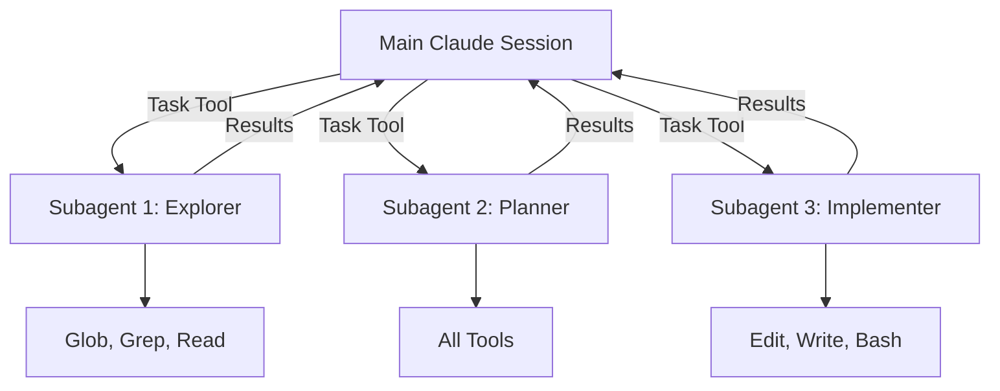
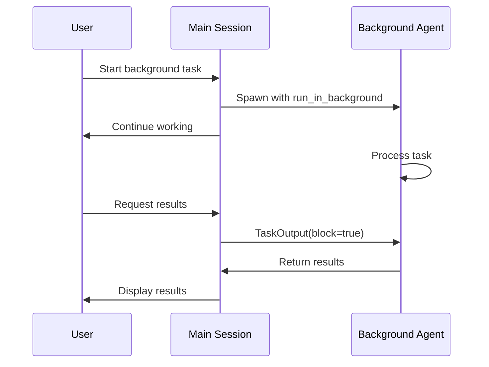
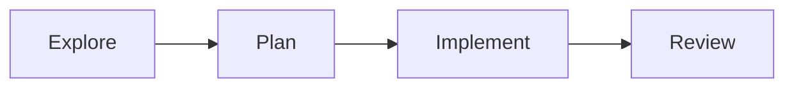
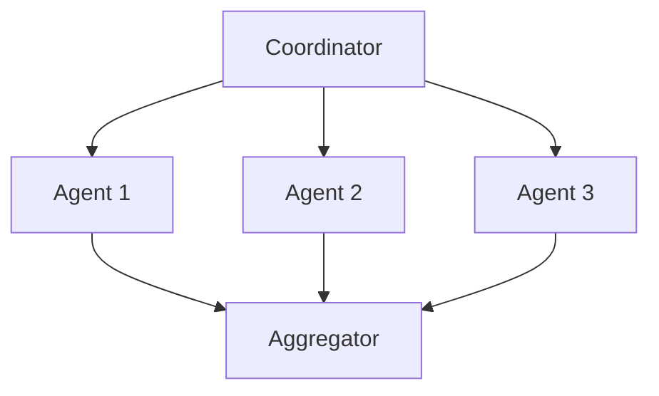
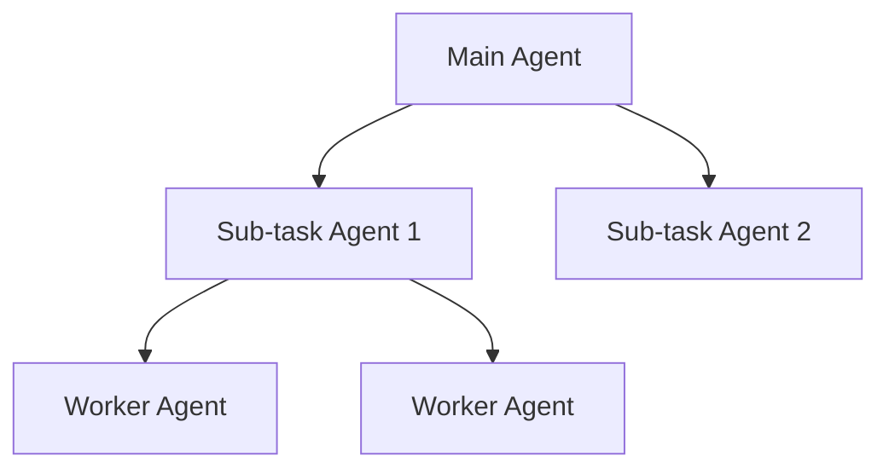

# 6.1 Claude Code Subagents

## Overview

Claude Code Subagents are specialized AI agents that can be spawned to handle complex, multi-step tasks autonomously. They operate as child processes with full access to tools and maintain their own context while working on delegated tasks.

## Learning Objectives

By the end of this chapter, you will be able to:

- Understand the subagent architecture and lifecycle
- Use the Task tool to spawn different agent types
- Run agents in parallel for improved performance
- Manage agent context and resume interrupted work
- Design effective prompts for agent delegation

## 6.1.1 Understanding Subagent Architecture

Subagents are independent Claude instances that receive a task, work autonomously, and return results to the parent conversation.



### Key Characteristics

| Feature | Description |
|---------|-------------|
| **Autonomy** | Work independently without constant supervision |
| **Tool Access** | Each agent type has specific tools available |
| **Context Isolation** | Separate context from parent, can access conversation history |
| **Resumability** | Can be resumed with full context using agent ID |

## 6.1.2 Available Agent Types

Claude Code provides several specialized agent types:

### General Purpose Agent

Best for complex, multi-step tasks requiring various tools.

```javascript
// Spawning a general-purpose agent
Task({
  subagent_type: "general-purpose",
  description: "Analyze ROS2 codebase",
  prompt: "Search for all ROS 2 node definitions in this workspace and summarize their publishers and subscribers."
})
```

**Tools Available**: All tools (Read, Write, Edit, Bash, Glob, Grep, etc.)

**Use Cases**:
- Complex code analysis
- Multi-file refactoring
- Research tasks requiring multiple searches

### Explore Agent

Fast, lightweight agent optimized for codebase exploration.

```javascript
// Spawning an explore agent
Task({
  subagent_type: "Explore",
  description: "Find sensor handlers",
  prompt: "Find all files that handle IMU sensor data. Thoroughness: medium"
})
```

**Tools Available**: Glob, Grep, Read

**Thoroughness Levels**:
- `quick`: Basic pattern matching, first results
- `medium`: Moderate exploration, multiple patterns
- `very thorough`: Comprehensive search across naming conventions

**Use Cases**:
- Finding files by pattern
- Searching for keywords
- Understanding codebase structure

### Plan Agent

Software architect agent for designing implementation strategies.

```javascript
// Spawning a plan agent
Task({
  subagent_type: "Plan",
  description: "Design sensor fusion module",
  prompt: "Design an implementation plan for adding LiDAR-camera fusion to the perception stack."
})
```

**Tools Available**: All tools

**Use Cases**:
- Architecture design
- Implementation planning
- Identifying critical files and dependencies

## 6.1.3 Parallel Agent Execution

Multiple agents can run simultaneously for improved performance:

```javascript
// Running multiple agents in parallel (single message, multiple tool calls)
Task({
  subagent_type: "Explore",
  description: "Find motor controllers",
  prompt: "Find all motor controller implementations"
})

Task({
  subagent_type: "Explore",
  description: "Find sensor drivers",
  prompt: "Find all sensor driver implementations"
})

Task({
  subagent_type: "Explore",
  description: "Find navigation code",
  prompt: "Find all navigation and path planning code"
})
```

### Best Practices for Parallel Execution

1. **Independent Tasks**: Only parallelize tasks without dependencies
2. **Resource Awareness**: Don't spawn too many agents simultaneously
3. **Result Aggregation**: Plan how to combine results from multiple agents

## 6.1.4 Background Agents

Run agents in the background while continuing other work:

```javascript
// Start a background agent
Task({
  subagent_type: "general-purpose",
  description: "Run comprehensive tests",
  prompt: "Run all unit tests and integration tests, report failures",
  run_in_background: true
})

// Later, retrieve results
TaskOutput({
  task_id: "agent_abc123",
  block: true,  // Wait for completion
  timeout: 60000
})
```

### Background Agent Workflow



## 6.1.5 Resuming Agents

Agents can be resumed to continue work with preserved context:

```javascript
// Resume a previous agent
Task({
  subagent_type: "general-purpose",
  resume: "agent_abc123",
  prompt: "Now implement the changes you identified"
})
```

### When to Resume vs. Start Fresh

| Scenario | Action |
|----------|--------|
| Follow-up on previous analysis | Resume |
| New, unrelated task | Start fresh |
| Continuing interrupted work | Resume |
| Different task, same files | Start fresh with context |

## 6.1.6 Effective Agent Prompts

Write clear prompts that help agents work autonomously:

### Good Prompt Structure

```markdown
## Task
[Clear, specific objective]

## Context
[Relevant background information]

## Constraints
[Limitations, requirements, boundaries]

## Expected Output
[What should be returned]
```

### Example: ROS 2 Node Analysis

```javascript
Task({
  subagent_type: "Explore",
  description: "Analyze ROS2 nodes",
  prompt: `
## Task
Find and analyze all ROS 2 node implementations in this workspace.

## Context
This is a humanoid robotics project using ROS 2 Humble.
Nodes may be written in Python (rclpy) or C++ (rclcpp).

## Constraints
- Focus on src/ directory
- Ignore test files
- Thoroughness: very thorough

## Expected Output
For each node found:
1. File path
2. Node name
3. Publishers (topic, message type)
4. Subscribers (topic, message type)
5. Services offered
`
})
```

## 6.1.7 Practical Example: Robotics Code Review Agent

Create a specialized agent workflow for reviewing robotics code:

```javascript
// Step 1: Explore the codebase
const explorationResult = await Task({
  subagent_type: "Explore",
  description: "Map codebase structure",
  prompt: "Map the complete structure of this ROS 2 workspace. Identify packages, nodes, launch files, and configuration."
});

// Step 2: Plan the review
const reviewPlan = await Task({
  subagent_type: "Plan",
  description: "Plan code review",
  prompt: `Based on this codebase structure:
${explorationResult}

Design a code review plan focusing on:
1. Safety-critical components
2. Real-time performance concerns
3. ROS 2 best practices compliance`
});

// Step 3: Execute review (parallel agents)
Task({
  subagent_type: "general-purpose",
  description: "Review safety code",
  prompt: "Review safety-critical components identified in the plan"
});

Task({
  subagent_type: "general-purpose",
  description: "Review performance code",
  prompt: "Review real-time performance concerns identified in the plan"
});
```

## 6.1.8 Agent Communication Patterns

### Sequential Pipeline



### Fan-Out/Fan-In



### Hierarchical Delegation



## Summary

- Subagents enable autonomous task execution with specialized capabilities
- Choose agent type based on task requirements (Explore, Plan, general-purpose)
- Parallelize independent tasks for better performance
- Use background agents for long-running operations
- Resume agents to continue work with preserved context
- Write clear, structured prompts for reliable results

## Exercises

1. **Basic Exploration**: Use an Explore agent to map your ROS 2 workspace structure
2. **Parallel Analysis**: Run three parallel agents to analyze different subsystems
3. **Planning Pipeline**: Create a Plan agent workflow for a new feature
4. **Background Testing**: Run tests in background while continuing development

## Next Steps

Continue to [6.2 Agent Skills](./6.2-agent-skills) to learn about creating reusable skill packages.
