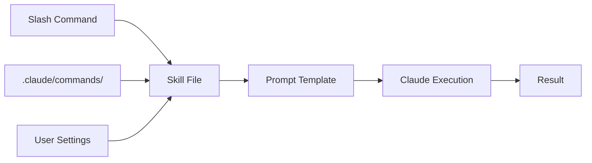

# 6.2 Agent Skills

## Overview

Agent Skills are reusable, shareable capabilities that extend Claude Code's functionality. They package common operations into custom slash commands that can be invoked across projects, enabling consistent workflows and team collaboration.

## Learning Objectives

By the end of this chapter, you will be able to:

- Create custom slash commands for robotics workflows
- Design effective skill templates with prompts
- Organize skills in project and user-level configurations
- Compose complex workflows from multiple skills
- Share skills across teams and projects

## 6.2.1 Understanding Agent Skills

Skills are markdown files that define reusable prompts and workflows:



### Skill Anatomy

A skill consists of:

1. **Command Name**: The slash command trigger (e.g., `/ros-node`)
2. **Prompt Template**: Instructions for Claude to execute
3. **Arguments**: Optional parameters passed to the skill
4. **Context**: Access to project files and conversation history

## 6.2.2 Creating Your First Skill

### Project-Level Skills

Create skills in `.claude/commands/` for project-specific workflows:

```bash
# Create the commands directory
mkdir -p .claude/commands
```

**Example: ROS 2 Node Generator**

Create `.claude/commands/ros-node.md`:

```markdown
# ROS 2 Node Generator

Generate a new ROS 2 node with the specified name and type.

## Arguments
- `$ARGUMENTS`: Node name and type (e.g., "sensor_processor publisher")

## Instructions

Create a new ROS 2 Python node with the following:

1. **Node Setup**
   - Use rclpy for Python implementation
   - Follow ROS 2 Humble conventions
   - Include proper logging

2. **Based on Type**
   - If "publisher": Create a timer-based publisher
   - If "subscriber": Create a subscription callback
   - If "service": Create a service server
   - If "action": Create an action server

3. **Output Location**
   - Place in `src/<package_name>/` directory
   - Create package if it doesn't exist

4. **Include**
   - Type hints
   - Docstrings
   - Error handling
   - Graceful shutdown

Node specification: $ARGUMENTS
```

**Usage:**
```bash
/ros-node sensor_processor publisher
```

### Skill with Multiple Sections

Create `.claude/commands/ros-test.md`:

```markdown
# ROS 2 Test Generator

Generate comprehensive tests for a ROS 2 node.

## Arguments
- `$ARGUMENTS`: Path to the node file to test

## Analysis Phase

First, read and analyze the node at `$ARGUMENTS`:
- Identify all publishers and their message types
- Identify all subscribers and their callbacks
- Identify services and actions
- Note any parameters

## Test Generation

Generate tests using pytest and launch_testing:

### Unit Tests
- Test node initialization
- Test message creation
- Test callback logic in isolation

### Integration Tests
- Test pub/sub communication
- Test service call/response
- Test action goal/feedback/result

### Launch Tests
- Test node startup
- Test parameter loading
- Test lifecycle transitions

## Output

Create test files in:
- `test/test_<node_name>.py` for unit tests
- `test/test_<node_name>_integration.py` for integration tests
- `test/test_<node_name>.launch.py` for launch tests
```

## 6.2.3 Skill Templates and Variables

### Available Variables

| Variable | Description |
|----------|-------------|
| `$ARGUMENTS` | User-provided arguments after command |
| `$FILE` | Currently open file (if applicable) |
| `$SELECTION` | Selected text (in IDE integrations) |

### Conditional Logic in Prompts

You can use template-style conditional logic in your prompts:

```text
# Smart Analyzer

Analyze the specified target.

## Arguments
- $ARGUMENTS: File path or "all" for full project

## Instructions

[IF $ARGUMENTS equals "all"]
Perform a comprehensive project analysis:
1. Scan all source files
2. Build dependency graph
3. Identify patterns and anti-patterns
[ELSE]
Analyze the specific file at $ARGUMENTS:
1. Read the file contents
2. Identify structure and purpose
3. Suggest improvements
[END IF]
```

## 6.2.4 Robotics Skill Library

Build a library of robotics-specific skills:

### `/ros-launch` - Launch File Generator

```markdown
# ROS 2 Launch File Generator

Generate a launch file for the specified nodes and configuration.

## Arguments
- `$ARGUMENTS`: Comma-separated list of nodes to launch

## Instructions

Create a Python launch file that:

1. **Imports**
   ```python
   from launch import LaunchDescription
   from launch_ros.actions import Node
   from launch.actions import DeclareLaunchArgument
   from launch.substitutions import LaunchConfiguration
   ```

2. **For each node in `$ARGUMENTS`**:
   - Add Node action with proper package and executable
   - Include standard remappings
   - Add parameter files if they exist

3. **Add launch arguments** for:
   - Namespace
   - Use simulation time
   - Log level

4. **Output** to `launch/<descriptive_name>.launch.py`
```

### `/ros-msg` - Custom Message Generator

```markdown
# ROS 2 Message Definition Generator

Create custom message, service, or action definitions.

## Arguments
- `$ARGUMENTS`: Type (msg/srv/action) and name (e.g., "msg SensorReading")

## Instructions

Parse arguments to determine:
- Definition type: msg, srv, or action
- Name: PascalCase name

Generate appropriate definition file:

### For Messages (.msg)
- Place in `msg/` directory
- Include common fields (header, timestamp)
- Add documentation comments

### For Services (.srv)
- Place in `srv/` directory
- Define request and response sections
- Include status/error fields

### For Actions (.action)
- Place in `action/` directory
- Define goal, result, and feedback
- Include progress indicators

Update CMakeLists.txt and package.xml for message generation.
```

### `/ros-debug` - Debug Helper

```markdown
# ROS 2 Debug Assistant

Help debug a ROS 2 issue.

## Arguments
- `$ARGUMENTS`: Description of the issue

## Instructions

Based on the issue description `$ARGUMENTS`:

1. **Identify Issue Category**
   - Communication (topics not connecting)
   - Timing (messages delayed/dropped)
   - Configuration (parameters not loading)
   - Build (compilation errors)
   - Runtime (crashes, exceptions)

2. **Diagnostic Steps**
   - Suggest relevant ros2 CLI commands
   - Identify log files to check
   - Propose code inspection points

3. **Common Solutions**
   - QoS mismatch fixes
   - Namespace resolution
   - Dependency issues
   - Clock synchronization

4. **If code changes needed**
   - Show before/after
   - Explain the fix
```

## 6.2.5 Composing Skills

Chain multiple skills for complex workflows:

### `/ros-feature` - Full Feature Workflow

```markdown
# ROS 2 Feature Generator

Generate a complete feature with node, tests, launch file, and documentation.

## Arguments
- `$ARGUMENTS`: Feature name and description

## Workflow

Execute the following sequence:

### Step 1: Plan
Design the feature architecture:
- Required nodes
- Message types
- Service interfaces
- Parameters

### Step 2: Generate Messages
For each custom message type identified:
- Create .msg/.srv/.action files
- Update build configuration

### Step 3: Create Nodes
For each node in the design:
- Generate node implementation
- Follow project conventions

### Step 4: Write Tests
For each node:
- Unit tests
- Integration tests

### Step 5: Create Launch File
- Include all nodes
- Configure parameters
- Set up remappings

### Step 6: Document
- Update README
- Add usage examples
- Document parameters
```

## 6.2.6 MCP Server Integration

Skills can leverage MCP (Model Context Protocol) servers:

```markdown
# GitHub-Integrated Code Review

Review code and create GitHub issues for findings.

## Arguments
- `$ARGUMENTS`: Directory or file to review

## Instructions

1. **Analyze Code**
   Use file tools to read and analyze the target

2. **For each issue found**
   Use the GitHub MCP server to create an issue with:
   - owner: repository owner
   - repo: repository name
   - title: "Code Review: issue summary"
   - body: detailed description
   - labels: code-review, automated

3. **Summary**
   Provide a summary of all created issues
```

## 6.2.7 Skill Organization

### Directory Structure

```
project/
├── .claude/
│   └── commands/
│       ├── ros-node.md
│       ├── ros-test.md
│       ├── ros-launch.md
│       └── robotics/
│           ├── sensor.md
│           ├── motor.md
│           └── navigation.md
```

### Naming Conventions

| Pattern | Example | Use Case |
|---------|---------|----------|
| `ros-<action>` | `/ros-node` | ROS-specific operations |
| `test-<scope>` | `/test-unit` | Testing workflows |
| `gen-<type>` | `/gen-docs` | Generation tasks |
| `fix-<issue>` | `/fix-lint` | Fix/repair operations |

## 6.2.8 Sharing Skills

### Team Sharing

1. **Version Control**: Include `.claude/commands/` in git
2. **Documentation**: Add README explaining each skill
3. **Examples**: Provide usage examples in skill files

### Skill Packages

Create shareable skill packages:

```yaml
# skills-manifest.yaml
name: ros2-skill-pack
version: 1.0.0
description: ROS 2 development skills for Claude Code
skills:
  - ros-node
  - ros-test
  - ros-launch
  - ros-msg
  - ros-debug
dependencies:
  - ros2-humble
  - python3.10+
```

## 6.2.9 Best Practices

### Skill Design

1. **Single Responsibility**: Each skill does one thing well
2. **Clear Arguments**: Document expected arguments
3. **Error Handling**: Include guidance for edge cases
4. **Idempotency**: Skills should be safe to run multiple times

### Prompt Engineering

1. **Be Specific**: Provide clear, unambiguous instructions
2. **Show Examples**: Include example outputs when helpful
3. **Set Constraints**: Define boundaries and limitations
4. **Request Format**: Specify desired output format

### Testing Skills

```bash
# Test skill execution
/ros-node test_node publisher

# Verify output
ls src/*/test_node.py

# Run generated code
ros2 run <package> test_node
```

## Summary

- Skills package reusable workflows as slash commands
- Place skills in `.claude/commands/` for project-level access
- Use variables like `$ARGUMENTS` for dynamic behavior
- Compose skills for complex multi-step workflows
- Share skills through version control and documentation

## Exercises

1. **Basic Skill**: Create a `/ros-param` skill that generates parameter YAML files
2. **Composite Skill**: Create a `/ros-package` skill that scaffolds a complete ROS 2 package
3. **Debug Skill**: Create a `/ros-diagnose` skill that analyzes common ROS 2 issues
4. **Documentation Skill**: Create a `/ros-docs` skill that generates API documentation

## Next Steps

Continue to [6.3 Integrating AI Agents with Robotics](./6.3-robotics-integration) to connect these capabilities with real robot systems.
