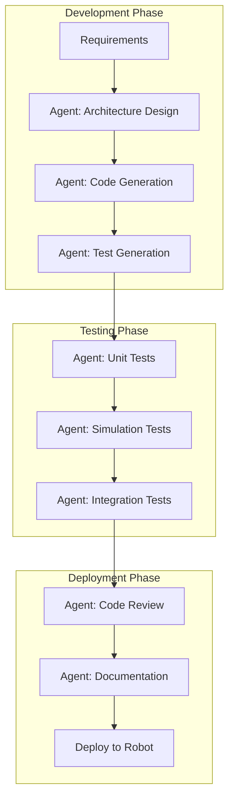
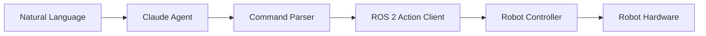
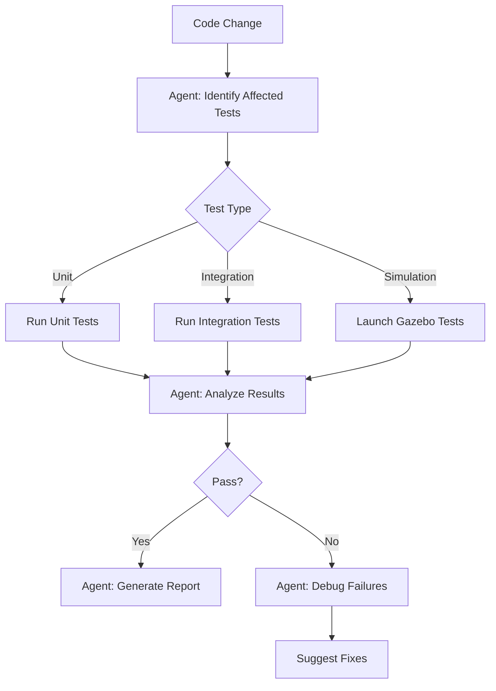
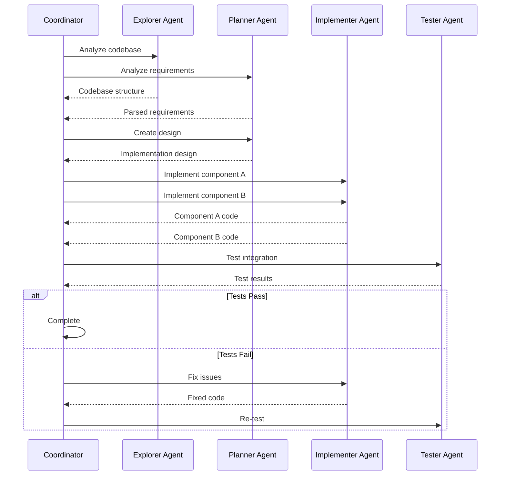

# 6.3 Integrating AI Agents with Robotics

## Overview

This chapter bridges Claude Code's AI capabilities with real robotics systems. You'll learn to create intelligent development workflows, natural language interfaces for robot control, and automated testing pipelines for robotics applications.

## Learning Objectives

By the end of this chapter, you will be able to:

- Design agent-driven development workflows for robotics
- Create natural language interfaces for robot control
- Build automated testing pipelines with AI agents
- Implement multi-agent coordination for complex tasks
- Debug robotics systems with AI assistance

## 6.3.1 Agent-Driven Robotics Development

### Development Workflow Architecture



### Practical Example: Sensor Driver Development

```javascript
// Step 1: Analyze requirements
Task({
  subagent_type: "Plan",
  description: "Design IMU driver",
  prompt: `
Design a ROS 2 driver for a BNO055 IMU sensor.

Requirements:
- Publish IMU data at 100Hz
- Support calibration mode
- Include temperature compensation
- Handle sensor disconnection gracefully

Provide:
1. Node architecture
2. Message types needed
3. Parameter definitions
4. Error handling strategy
`
});

// Step 2: Generate implementation
Task({
  subagent_type: "general-purpose",
  description: "Implement IMU driver",
  prompt: `
Based on the design, implement the BNO055 IMU driver:

1. Create the node in Python using rclpy
2. Use sensor_msgs/Imu for output
3. Add diagnostic publishers
4. Implement calibration service
5. Add parameter for I2C address
`
});

// Step 3: Generate tests
Task({
  subagent_type: "general-purpose",
  description: "Generate IMU tests",
  prompt: `
Create comprehensive tests for the IMU driver:

1. Unit tests for data conversion
2. Mock tests for I2C communication
3. Integration tests with fake hardware
4. Launch tests for node lifecycle
`
});
```

## 6.3.2 Natural Language Robot Control Interface

Create a natural language interface that translates commands to ROS 2 actions:

### Architecture



### Implementation: NL Command Skill

Create `.claude/commands/robot-command.md`:

```markdown
# Natural Language Robot Commander

Translate natural language commands to ROS 2 actions.

## Arguments
- `$ARGUMENTS`: Natural language command (e.g., "move forward 2 meters")

## Command Translation

Parse the natural language input and identify:

1. **Action Type**
   - Movement: "move", "go", "drive", "walk"
   - Manipulation: "pick", "place", "grab", "release"
   - Navigation: "navigate", "go to", "find"
   - Perception: "look", "scan", "find", "detect"

2. **Parameters**
   - Distance/magnitude
   - Direction/target
   - Speed/duration
   - Object identifiers

3. **Generate ROS 2 Command**

### Movement Commands
```python
# For "move forward 2 meters"
goal = NavigateToPose.Goal()
goal.pose.pose.position.x = current_x + 2.0
goal.pose.header.frame_id = "base_link"
```

### Manipulation Commands
```python
# For "pick up the red cube"
goal = PickObject.Goal()
goal.object_id = "red_cube"
goal.grasp_type = "top"
```

## Safety Checks

Before executing, verify:
- [ ] Command is within robot capabilities
- [ ] Target is in reachable workspace
- [ ] No collision risks detected
- [ ] Emergency stop is accessible

## Output

Provide:
1. Interpreted command summary
2. Generated ROS 2 code
3. Safety assessment
4. Execution instructions
```

### ROS 2 Integration Node

```python
#!/usr/bin/env python3
"""
Natural Language Command Interface for ROS 2
Bridges Claude Code commands to robot actions
"""

import rclpy
from rclpy.node import Node
from rclpy.action import ActionClient
from std_msgs.msg import String
from geometry_msgs.msg import PoseStamped
from nav2_msgs.action import NavigateToPose
import json

class NLCommandInterface(Node):
    def __init__(self):
        super().__init__('nl_command_interface')

        # Subscribers
        self.command_sub = self.create_subscription(
            String,
            '/nl_commands',
            self.command_callback,
            10
        )

        # Action clients
        self.nav_client = ActionClient(
            self,
            NavigateToPose,
            'navigate_to_pose'
        )

        # Publishers
        self.status_pub = self.create_publisher(
            String,
            '/nl_command_status',
            10
        )

        self.get_logger().info('NL Command Interface ready')

    def command_callback(self, msg):
        """Process parsed command from Claude agent"""
        try:
            command = json.loads(msg.data)
            self.execute_command(command)
        except json.JSONDecodeError:
            self.get_logger().error(f'Invalid command format: {msg.data}')

    def execute_command(self, command):
        """Execute the appropriate ROS 2 action"""
        cmd_type = command.get('type')

        if cmd_type == 'navigate':
            self.execute_navigation(command)
        elif cmd_type == 'manipulate':
            self.execute_manipulation(command)
        else:
            self.get_logger().warn(f'Unknown command type: {cmd_type}')

    def execute_navigation(self, command):
        """Execute navigation command"""
        goal = NavigateToPose.Goal()
        goal.pose.header.frame_id = 'map'
        goal.pose.pose.position.x = command['target']['x']
        goal.pose.pose.position.y = command['target']['y']

        self.nav_client.wait_for_server()
        future = self.nav_client.send_goal_async(goal)
        future.add_done_callback(self.navigation_response_callback)

    def navigation_response_callback(self, future):
        """Handle navigation result"""
        goal_handle = future.result()
        if goal_handle.accepted:
            self.publish_status('Navigation goal accepted')
        else:
            self.publish_status('Navigation goal rejected')

    def publish_status(self, status):
        """Publish status update"""
        msg = String()
        msg.data = status
        self.status_pub.publish(msg)

def main():
    rclpy.init()
    node = NLCommandInterface()
    rclpy.spin(node)
    node.destroy_node()
    rclpy.shutdown()

if __name__ == '__main__':
    main()
```

## 6.3.3 Automated Testing Pipeline

### Test Orchestration with Agents



### Test Runner Skill

Create `.claude/commands/ros-test-suite.md`:

```markdown
# ROS 2 Test Suite Runner

Run and analyze ROS 2 tests with intelligent reporting.

## Arguments
- `$ARGUMENTS`: Package name or "all" for full test suite

## Execution Steps

### 1. Discover Tests
```bash
colcon list --packages-select $ARGUMENTS
colcon test --packages-select $ARGUMENTS --return-code-on-test-failure
```

### 2. Collect Results
```bash
colcon test-result --verbose
```

### 3. Analyze Failures

For each failed test:
1. Read the test file
2. Analyze the failure message
3. Identify potential causes:
   - Timing issues (increase timeouts)
   - Missing dependencies
   - Incorrect assertions
   - Environment issues

### 4. Generate Report

Provide structured report:
- Total tests: X
- Passed: Y
- Failed: Z
- Skipped: W

For failures:
- Test name
- Error message
- Likely cause
- Suggested fix

### 5. If failures detected

Spawn a debug agent to:
1. Analyze failure patterns
2. Check for flaky tests
3. Suggest code changes
```

### Simulation Test Integration

```python
#!/usr/bin/env python3
"""
Gazebo Simulation Test Harness
Integrates with Claude Code for intelligent test analysis
"""

import unittest
import launch
import launch_ros
import launch_testing
from launch_testing.actions import ReadyToTest
import rclpy
from geometry_msgs.msg import Twist
from nav_msgs.msg import Odometry
import time

def generate_test_description():
    """Generate launch description for simulation tests"""

    # Launch Gazebo with test world
    gazebo = launch.actions.ExecuteProcess(
        cmd=['gz', 'sim', '-r', 'test_world.sdf'],
        output='screen'
    )

    # Launch robot state publisher
    robot_state_pub = launch_ros.actions.Node(
        package='robot_state_publisher',
        executable='robot_state_publisher',
        parameters=[{'robot_description': robot_urdf}]
    )

    # Launch controller
    controller = launch_ros.actions.Node(
        package='humanoid_controller',
        executable='velocity_controller',
        output='screen'
    )

    return launch.LaunchDescription([
        gazebo,
        robot_state_pub,
        controller,
        ReadyToTest()
    ])

class TestRobotMovement(unittest.TestCase):
    """Test robot movement in simulation"""

    @classmethod
    def setUpClass(cls):
        rclpy.init()
        cls.node = rclpy.create_node('test_movement')
        cls.cmd_pub = cls.node.create_publisher(Twist, '/cmd_vel', 10)
        cls.odom_received = False
        cls.last_odom = None

        cls.odom_sub = cls.node.create_subscription(
            Odometry,
            '/odom',
            cls.odom_callback,
            10
        )

    @classmethod
    def odom_callback(cls, msg):
        cls.odom_received = True
        cls.last_odom = msg

    def test_forward_movement(self):
        """Test robot moves forward when commanded"""
        # Record initial position
        initial_x = self.wait_for_odom().pose.pose.position.x

        # Send forward command
        cmd = Twist()
        cmd.linear.x = 0.5
        self.cmd_pub.publish(cmd)

        # Wait for movement
        time.sleep(2.0)

        # Stop robot
        cmd.linear.x = 0.0
        self.cmd_pub.publish(cmd)

        # Verify movement
        final_x = self.last_odom.pose.pose.position.x
        self.assertGreater(final_x, initial_x + 0.5,
                          "Robot should have moved forward at least 0.5m")

    def wait_for_odom(self, timeout=5.0):
        """Wait for odometry message"""
        start = time.time()
        while not self.odom_received and (time.time() - start) < timeout:
            rclpy.spin_once(self.node, timeout_sec=0.1)
        return self.last_odom

    @classmethod
    def tearDownClass(cls):
        cls.node.destroy_node()
        rclpy.shutdown()
```

## 6.3.4 Multi-Agent Coordination

### Coordinated Development Workflow

```javascript
// Coordinator agent manages the workflow
async function developFeature(featureSpec) {
    // Phase 1: Parallel analysis
    const [codebaseAnalysis, requirementsAnalysis] = await Promise.all([
        Task({
            subagent_type: "Explore",
            description: "Analyze codebase",
            prompt: "Map existing architecture relevant to: " + featureSpec
        }),
        Task({
            subagent_type: "Plan",
            description: "Analyze requirements",
            prompt: "Break down requirements for: " + featureSpec
        })
    ]);

    // Phase 2: Design
    const design = await Task({
        subagent_type: "Plan",
        description: "Create design",
        prompt: `
Based on:
- Codebase: ${codebaseAnalysis}
- Requirements: ${requirementsAnalysis}

Create detailed implementation design.
`
    });

    // Phase 3: Parallel implementation
    const components = parseComponents(design);
    const implementations = await Promise.all(
        components.map(component =>
            Task({
                subagent_type: "general-purpose",
                description: `Implement ${component.name}`,
                prompt: `Implement: ${component.spec}`
            })
        )
    );

    // Phase 4: Integration and testing
    const integrationResult = await Task({
        subagent_type: "general-purpose",
        description: "Integrate components",
        prompt: `
Integrate these implementations:
${implementations.join('\n')}

Create integration tests and verify functionality.
`
    });

    return integrationResult;
}
```

### Agent Communication Protocol



## 6.3.5 Debugging with AI Assistance

### Intelligent Debug Workflow

Create `.claude/commands/ros-debug-assist.md`:

```markdown
# ROS 2 Intelligent Debugger

AI-assisted debugging for ROS 2 systems.

## Arguments
- `$ARGUMENTS`: Error description or log file path

## Debug Process

### 1. Error Classification

Analyze the error and classify:
- **Communication**: Topic/service connection issues
- **Timing**: Rate, latency, synchronization problems
- **Configuration**: Parameter, launch, URDF issues
- **Logic**: Algorithm, state machine bugs
- **Hardware**: Driver, sensor, actuator failures

### 2. Information Gathering

Based on classification, gather:

#### For Communication Issues
```bash
ros2 topic list
ros2 topic info <topic> --verbose
ros2 node list
ros2 node info <node>
```

#### For Timing Issues
```bash
ros2 topic hz <topic>
ros2 topic delay <topic>
ros2 doctor --report
```

#### For Configuration Issues
```bash
ros2 param list
ros2 param dump <node>
ros2 launch <package> <launch> --print-description
```

### 3. Root Cause Analysis

Cross-reference:
- Error messages with known issues
- Configuration with expected values
- Timing data with requirements
- Network topology with expected connections

### 4. Solution Generation

Provide ranked solutions:
1. **Quick Fix**: Immediate workaround
2. **Proper Fix**: Correct solution
3. **Prevention**: How to avoid in future

### 5. Verification Steps

After applying fix:
1. Restart affected nodes
2. Verify communication restored
3. Check for cascading issues
4. Monitor for recurrence
```

### Debug Session Example

```javascript
// Start debug session
Task({
  subagent_type: "general-purpose",
  description: "Debug navigation failure",
  prompt: `
The robot stops navigating after 30 seconds with this error:
"[nav2_controller]: Failed to find valid control. Aborting."

Debug this issue:
1. Check controller configuration
2. Analyze costmap updates
3. Verify TF tree
4. Check velocity limits
5. Suggest fixes
`
});
```

## 6.3.6 Complete Integration Example

### Humanoid Robot Development Assistant

```python
#!/usr/bin/env python3
"""
Humanoid Robot Development Assistant
Integrates Claude Code agents with ROS 2 development
"""

import os
import subprocess
import json

class RoboticsDevelopmentAssistant:
    """AI-powered development assistant for humanoid robotics"""

    def __init__(self, workspace_path):
        self.workspace = workspace_path
        self.skills_path = os.path.join(workspace_path, '.claude/commands')

    def analyze_workspace(self):
        """Use Explore agent to analyze workspace structure"""
        return self._run_agent(
            agent_type="Explore",
            description="Analyze ROS2 workspace",
            prompt=f"""
Analyze the ROS 2 workspace at {self.workspace}:
1. List all packages
2. Identify node types (publishers, subscribers, services)
3. Map topic connections
4. Find configuration files
Thoroughness: very thorough
"""
        )

    def generate_component(self, component_type, name, spec):
        """Generate a new robotics component"""
        return self._run_agent(
            agent_type="general-purpose",
            description=f"Generate {component_type}",
            prompt=f"""
Generate a ROS 2 {component_type} named '{name}':

Specification:
{spec}

Requirements:
- Follow ROS 2 Humble conventions
- Include comprehensive error handling
- Add unit tests
- Create launch file entry
- Update CMakeLists.txt and package.xml
"""
        )

    def run_tests(self, package=None):
        """Run tests with intelligent analysis"""
        target = package or "all packages"
        return self._run_agent(
            agent_type="general-purpose",
            description="Run and analyze tests",
            prompt=f"""
Run tests for {target} in workspace {self.workspace}:

1. Execute: colcon test --packages-select {package or ''}
2. Collect results: colcon test-result --verbose
3. For any failures:
   - Analyze error messages
   - Identify root cause
   - Suggest fixes
4. Generate test coverage report
"""
        )

    def debug_issue(self, issue_description):
        """AI-assisted debugging"""
        return self._run_agent(
            agent_type="general-purpose",
            description="Debug robotics issue",
            prompt=f"""
Debug this ROS 2 issue:
{issue_description}

Steps:
1. Classify the error type
2. Gather relevant system information
3. Analyze logs and configurations
4. Identify root cause
5. Provide solution with code changes
"""
        )

    def _run_agent(self, agent_type, description, prompt):
        """Execute a Claude Code agent task"""
        # This would integrate with Claude Code CLI or API
        # Placeholder for actual implementation
        pass

# Usage example
if __name__ == '__main__':
    assistant = RoboticsDevelopmentAssistant('/home/user/humanoid_ws')

    # Analyze workspace
    structure = assistant.analyze_workspace()
    print("Workspace Structure:", structure)

    # Generate new sensor driver
    driver = assistant.generate_component(
        component_type="sensor_driver",
        name="force_torque_sensor",
        spec="""
        - Interface: I2C
        - Publish rate: 1000Hz
        - Message type: geometry_msgs/WrenchStamped
        - Include calibration service
        """
    )

    # Run tests
    results = assistant.run_tests(package="humanoid_perception")

    # Debug an issue
    fix = assistant.debug_issue("""
    Robot arm oscillates when holding position.
    PID gains: P=100, I=10, D=5
    Motor: Dynamixel MX-106
    """)
```

## Summary

- Agent-driven development accelerates robotics workflows
- Natural language interfaces enable intuitive robot control
- Automated testing pipelines catch issues early
- Multi-agent coordination handles complex tasks
- AI-assisted debugging reduces troubleshooting time

## Exercises

1. **NL Interface**: Build a natural language interface for your robot
2. **Test Pipeline**: Create an automated test pipeline with agent analysis
3. **Debug Assistant**: Implement a debug skill for your most common issues
4. **Full Workflow**: Design a multi-agent workflow for a new feature

## Project: AI-Powered Robotics IDE

Combine all concepts to build an intelligent development environment:

1. Workspace analysis on startup
2. Code generation from natural language
3. Continuous testing with AI analysis
4. Intelligent debugging suggestions
5. Automated documentation generation

## Next Steps

You've completed Module 6! You now have the tools to build intelligent, reusable AI components for robotics development. Apply these patterns to accelerate your work on the capstone project in Module 5.
