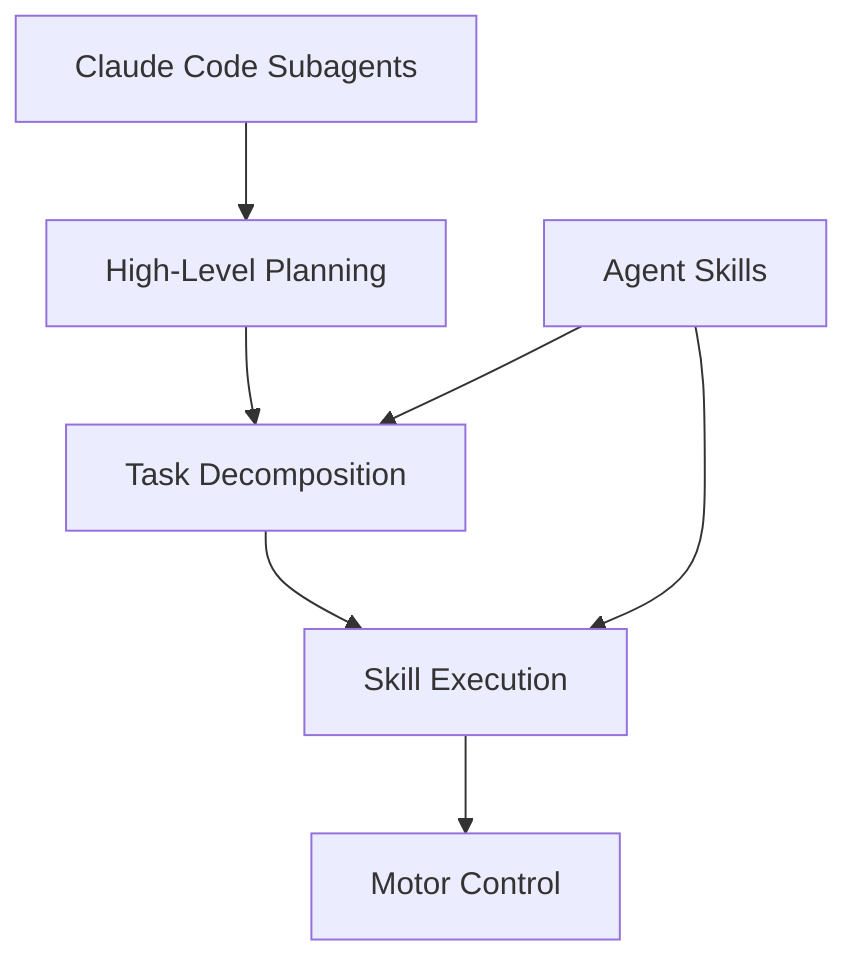

# Module 6: Reusable Intelligence with Claude Code

## Overview

This module introduces **Claude Code Subagents** and **Agent Skills** - powerful patterns for building reusable, composable AI intelligence that can be integrated into robotics systems. You'll learn to create specialized agents that handle complex tasks autonomously and build skill libraries that can be shared across projects.

## Learning Objectives

By the end of this module, you will be able to:

- Understand the architecture of Claude Code subagents
- Create specialized agents for robotics tasks (code review, testing, exploration)
- Build reusable Agent Skills with custom slash commands
- Integrate AI agents with ROS 2 systems
- Design multi-agent workflows for complex robotics applications

## Prerequisites

- Completed Module 1-5 (ROS 2, Digital Twin, Isaac, VLA, Capstone basics)
- Claude Code CLI installed and configured
- Basic understanding of AI/LLM concepts
- Familiarity with markdown and YAML

## Why Reusable Intelligence?

Modern robotics systems require intelligence at multiple levels:

Traditional approaches hard-code behaviors. With Claude Code, you can:

1. **Delegate Complex Tasks**: Spawn subagents for code analysis, testing, documentation
2. **Reuse Skills**: Package common operations as shareable skills
3. **Compose Workflows**: Chain agents and skills for sophisticated pipelines
4. **Maintain Context**: Agents preserve conversation history and project understanding

## Chapter Structure

### 6.1 Claude Code Subagents

Deep dive into the Task tool and subagent architecture. Learn to spawn specialized agents for:

- Code exploration and analysis
- Implementation planning
- Automated testing
- Documentation generation

**Topics**: Task tool, agent types, parallel execution, context management

### 6.2 Agent Skills

Create reusable skills that extend Claude Code's capabilities:

- Custom slash commands
- Skill templates and prompts
- MCP server integration
- Skill composition patterns

**Topics**: Skill tool, command files, prompt engineering, skill libraries

### 6.3 Integrating AI Agents with Robotics

Connect Claude Code intelligence to ROS 2 systems:

- Agent-driven code generation for ROS nodes
- Automated testing of robot behaviors
- Natural language robot control interfaces
- Multi-agent coordination for complex tasks

**Topics**: ROS 2 integration, behavior trees, natural language interfaces

## Hands-On Project

**Goal**: Build an AI-powered robotics development assistant that can:

1. Analyze ROS 2 codebases and suggest improvements
2. Generate test cases for robot behaviors
3. Create documentation from code comments
4. Debug common robotics issues

**Deliverables**:
1. Custom subagent configurations for robotics tasks
2. Skill library with 5+ reusable robotics skills
3. Integration example with a ROS 2 workspace
4. Documentation of your agent architecture

## Resources

- [Claude Code Documentation](https://docs.anthropic.com/claude-code)
- [Agent SDK Reference](https://github.com/anthropics/claude-code)
- [MCP Protocol Specification](https://modelcontextprotocol.io/)

## Next Steps

After completing this module, you'll have the tools to build intelligent, reusable AI components that accelerate robotics development and enable sophisticated human-robot collaboration.
